# A Trillion Dollars and a Firebomb.
The Parallel Realities of the AI Era.

  

 

---

## Foreword

On November 30, 2022, ChatGPT was released.

People were stunned. They rejoiced. "AI is here," everyone said. The future looked bright.

Three years and five months later, on April 10, 2026, a Molotov cocktail was hurled at a house in San Francisco.

The owner of that house was Sam Altman. CEO of OpenAI — the company that created ChatGPT.

Two days later, in the early hours of the morning, a gun was fired from a car parked in front of the same house.

That same week, 13 bullets were fired into the home of an Indianapolis city council member. 
A note left at the front door read: "NO DATA CENTERS." 
The council member had voted in favor of building an AI data center.

That same week, Snap announced it would cut 16% of its workforce — roughly 1,000 people. 
The CEO explained: "Advances in AI have enabled us to streamline operations and run with smaller teams. 
More than 65% of new code is now generated by AI." 
Since the start of 2026, approximately 71,440 people had been laid off across 80 companies in the U.S. tech industry.

That same week, Anthropic's valuation reportedly reached approximately $380 billion, and OpenAI's approximately $852 billion. 
The combined value of SpaceX and xAI stood at $1.25 trillion, with an IPO target of $1.75 trillion. 
Combined, AI capital had already far exceeded one trillion dollars.

In the same week, a trillion dollars and a Molotov cocktail coexisted.

This book is written to depict that asymmetry.

It is not a book that explains what is happening. 
It is not a book that provides answers. It is not a book that writes prescriptions.

Over the past three and a half months, I have written 13 books and released them as open source. 
Every one of them was written from the perspective of "how to leverage AI." 
D&V, 10:80:10, Orchestrator. All were books that offered answers.

This fourteenth book is different. It does not offer answers. It only depicts structure.

Why? 
Because something within us — those of us living in this era — is breaking. 
Yet no one has been able to precisely articulate what that something is. 
I cannot either. So I write, in order to find it.

When you finish reading, I hope that some kind of image will crystallize within you. 
Whether that image is one of hope or despair, I will not dictate. 
I simply record here, as one person living in the same era, the structure as I see it.

---

## Table of Contents

- **Prologue:** Two Events That Occurred in the Same Week of April 2026
- **Chapter 1:** The Simultaneous Acceleration of Hope and Fear — A Nonlinear Emotional History Revealed by Public Opinion Data
- **Chapter 2:** The 50-Point Gap Between Experts and Citizens — Residents of the AI Village and Those Left Behind
- **Chapter 3:** The Closing Gate — The Evaporation of Entry-Level Jobs and the Despair of the Young
- **Chapter 4:** The Geography of a Trillion Dollars — San Francisco, Capital Concentration, and Spatial Exclusion
- **Chapter 5:** The Permanent Underclass Thesis — Piketty × AI and the Extremization of r>g
- **Chapter 6:** The Return of the Luddites — Molotov Cocktails, Gunfire, No Data Centers
- **Chapter 7:** Institutional Lag — Society's Self-Defense Against the Speed of Technology
- **Chapter 8:** Corporate Self-Awareness — Donation Pledges, Public Wealth Funds, and the Space Between Hypocrisy and Sincerity
- **Chapter 9:** Japan's Singularity — Low Adoption, Low Perceived Benefit, High Grievance
- **Epilogue:** There Are No Answers, but the Structure Is Visible

 

---

# Prologue

## Two Events That Occurred in the Same Week of April 2026

April 10, 2026, between 3:37 and 3:45 a.m.

At a house on a residential street in San Francisco, a flame appeared at the front door. 
It was a Molotov cocktail. 
The person who threw it was a 20-year-old man. 
A resident of Texas, named Daniel Alejandro Moreno-Gama.

The gate and part of the entrance were scorched. 
Fortunately, no one was injured. The man fled on foot.

Approximately one hour later, a report came in that a man was shouting near the OpenAI headquarters that he had "come to kill everyone." 
Police arrived and detained him. It was the same individual.

In the man's backpack, they found kerosene, a lighter, a list of addresses belonging to AI company executives and investors, 
and a letter addressed to CEO Altman.

The man had posted 34 messages on the PauseAI Discord server. 
PauseAI is a citizen movement calling for a temporary halt to AI development. 
He had described himself as a "Butlerian Jihadist" — 
the name of a religious group in Frank Herbert's science fiction novel *Dune* that advocates the total prohibition of intelligent machines.

Approximately 46 hours later, on April 12, 2026, at 1:40 a.m.

A car pulled up in front of the same house. 
An arm reached out from the passenger window, and a single shot was fired into the property.

The car drove away. 
Security cameras captured the vehicle's license plate.

Days later, two people were arrested. 
Amanda Tom, age 25, and Muhamad Tarik Hussein, age 23. 
Three firearms were seized from the suspects' residence.

No one was injured in this shooting either.

That same week, 13 bullets were fired into the home of Indianapolis city council member 
Dan Gibson.

A single note was left at the front door:

> "NO DATA CENTERS"

Councilman Gibson had voted in favor of building an AI data center. 
Data centers consume enormous amounts of electricity, driving up local energy costs. 
Some residents harbored intense opposition to sacrificing their own cost of living to serve the profits of AI companies.

That opposition became bullets.

And that same week, on April 15, 2026, Snap announced: 
It would cut 16% of its workforce — approximately 1,000 people.

Irenic Capital Management, an investment firm holding roughly 2.5% of the company's shares, 
had been pressing for portfolio optimization and improved performance. Snap complied.

CEO Evan Spiegel explained the rationale:

"Advances in AI have enabled us to streamline operations and run with smaller teams. More than 65% of new code is now generated by AI."

The number of full-time employees stood at 5,261 as of December of the previous year. 
After this round of cuts, it would drop to approximately 4,261. 
Spiegel said he expected cost savings exceeding $500 million annually by the second half of the year.

Tech industry layoffs in the U.S. since the start of 2026 had reached approximately 71,440 people across 80 companies.

According to the data aggregation site layoffs.fyi, 
this pace of layoffs was at the highest level in at least the past several years.

And the number of companies explicitly citing "AI" as the reason for layoffs was rapidly increasing.

| Company | AI-driven workforce reduction |
| --- | --- |
| **Klarna** (Swedish fintech) | Replaced 700 customer support roles with AI |
| **Duolingo** | Replaced 10% of contractors with AI |
| **Chegg** (learning platform) | Drastic decline in student usage due to ChatGPT, massive layoffs |
| **IBM** | Announced plans in 2023 to replace approximately 7,800 jobs with AI |
| **Block (formerly Square)** | Ongoing phased reductions citing AI automation |

This trend has not stopped. It is accelerating.

That same week.

**Anthropic's valuation reached approximately $380 billion (about ¥57 trillion)**, it was reported. 
The company reportedly declined a proposal for its next round at approximately $800 billion. 
Yet its annual revenue had surged from $9 billion at the end of 2025 
to $30 billion (approximately ¥4.5 trillion) by April 2026. 
Only three years had passed since the launch of its flagship product, Claude.

**OpenAI's valuation reached approximately $852 billion (about ¥128 trillion)** 
(post-money valuation as of March 2026).

**The combined value of xAI and SpaceX stood at $1.25 trillion (approximately ¥188 trillion)**, 
with a target of $1.75 trillion for their upcoming IPO.

The combined enterprise value of AI companies had far exceeded one trillion dollars.

Within San Francisco, 
local newspapers ran stories about how "there aren't enough mansions to buy and sell." 
AI company employees had been buying them all up.

This was the week of April 2026.

In the same era, in the same country, around the same technology, 
on one side, $852 billion in enterprise value was being created, 
while on the other, a Molotov cocktail and bullets were hurled at a home, 
and 1,000 people lost their jobs.

These two events are not directly connected as cause and effect. 
But they grow from the same soil. 
They are different sides of the same technology, the same trajectory.

This book asks why these two events occurred 
in the same week, in the same country.

And it poses one more — heavier — question:

How will these two events unfold from here?

## What This Book Does Not Address, and What It Does

This book does not write about how to use AI. I have already written 13 books on that. 
This book turns to a different question.

This book does not write about the technical details of AI. 
What readers need to understand is not the inner workings of the technology, but the dynamics of society.

This book does not write answers. 
It does not write prescriptions. 
It does not write "this is what should be done."

This book writes structure. 
What is happening, why it is happening, 
what it resembles from the past, where it differs — 
it depicts these things to the extent they are visible.

When readers finish this book, I expect something to form within them. 
Whether "that something" is hope or despair is for the reader to decide.

## Why This Book Is Necessary Now

In 1811, the Luddite uprising began in Nottingham, England. 
Textile workers, fearing the loss of their livelihoods to mechanization, smashed looms and knitting frames.

The British government crushed the movement by making machine-breaking a capital offense. 
In 1813, 17 men were hanged at York. The movement was defeated.

Yet from the process of that defeat, an awareness of workers' rights was born. 
The seedlings of the labor union movement, the drafting of labor laws, the design of social security systems — 
all of these slowly rose from the ashes of the Luddites' defeat.

A citizen rebellion against technology does not hold its meaning at the moment it occurs. 
How society receives that rebellion determines the shape of the world that follows.

The week of April 2026 — with its Molotov cocktails, gunfire, and mass layoffs — may be the return of the Luddites.

If that is the case, we need to look at this week carefully. 
We need to record the facts, analyze the structure, and position it within history. 
We cannot pretend we didn't see it.

As an AI strategist, I stand on the side that can understand the logic of AI companies. 
At the same time, as a UX designer, I have years of experience analyzing — 
with high resolution — the emotions, values, and cognitive patterns of individual users. 
I can understand "the people on the outside of AI."

Most likely, both sides are right. 
And both sides are wrong. 
Reality lies in between.

This book is an attempt to describe that reality.

## Structure of This Book

This book is composed of 9 chapters and an epilogue.

Chapters 1 through 3 address **social emotion data**. 
What people feel about AI, how those feelings have changed, 
and what the data on those emotions tells us — traced from primary sources.

Chapters 4 and 5 address **economic structure**. 
Where AI capital is concentrated, why it concentrates, 
what kind of inequality that concentration produces. 
This includes a discussion extending Piketty's r>g into the AI era.

Chapters 6 and 7 address **rebellion and institutions**. 
A historical reexamination of the Luddite movement and a structural comparison with the 2026 anti-AI movement. 
Then, the gap between technological speed and institutional speed.

Chapter 8 addresses the **self-awareness of AI companies themselves**. 
Dario Amodei's essays, Altman's policy proposals, donation pledges, public wealth fund proposals — 
these are laid out side by side, with judgment suspended on whether they are sincere or hypocritical.

Chapter 9 addresses **Japan's singularity**. 
Low adoption, low perceived benefit, high grievance — 
where does Japan stand in this AI era?

The epilogue ties together the structures examined so far. 
It does not write answers. 
But it makes visible the structure that can be seen.

At the end of this prologue, I return once more to the original question.

In the week of April 2026, why did a trillion dollars and a Molotov cocktail 
exist in the same era, in the same country?

The following chapters pursue this question.

## References

1. Reuters. "OpenAI's Altman's home in San Francisco attacked with Molotov cocktail." April 10, 2026.
   https://jp.reuters.com/markets/global-markets/FWQ46V57GBM6NGNXOQQUB2FLFM-2026-04-10/
2. GIGAZINE. "Two arrested in shooting incident in front of Sam Altman's home." April 13, 2026.
   https://gigazine.net/news/20260413-sam-altman-second-attack/
3. ITmedia. "Shooting incident in front of Altman's home, suspected anti-AI backlash." April 13, 2026.
   https://www.itmedia.co.jp/news/articles/2604/13/news104.html
4. Reuters. "Snap to cut 16% of workforce at investor's request." April 15, 2026.
5. NewsPicks. Naoyoshi Goto, "Gen Z's 'Rage Against AI' Won't Stop." April 16, 2026.
6. layoffs.fyi. Tech Layoffs Tracker 2026.
   https://layoffs.fyi/
7. Indianapolis Star. "Councilmember Gibson's home hit with 13 bullets after data center vote." April 2026.

 

---
# Chapter 1

## The Simultaneous Acceleration of Hope and Fear — A Nonlinear Emotional History Revealed by Public Opinion Data

Social sentiment toward AI is not a straight line.

The explanation that "the euphoria of 2022 turned into the rage of 2026" oversimplifies this era. 
What is actually happening is a far more troublesome structure.

What public opinion data shows is this: **hope is rising, and at the same time, anxiety is also rising**. 
The two emotions do not cancel each other out — they run in parallel, both accelerating.

This chapter traces the trajectory of social sentiment from the release of ChatGPT in November 2022 
through April 2026, based on primary sources.

## 1.1 What Pew Research Center Shows About American Citizens' Sentiments

Pew Research Center has been continuously surveying American perceptions of AI since 2021. 
Their data shows that sentiment toward AI does not follow a simple line from "hope → disappointment."

| Period | Concern about AI | Hope only | Mixed / unsure |
| --- | --- | --- | --- |
| 2021 | 45% | 18% | ~37% |
| 2023 | 52% (+7pt) | 10% | 38% |
| Spring 2025 | 50% | 10% | 38% |

An additional survey in August 2025 quantified more specific anxieties:

| Concern | August 2025 |
| --- | --- |
| AI will reduce jobs | 64% |
| AI will lower wages | 60% |

The trajectory of these numbers reveals something important. 
**Concern about AI was already high by 2023, immediately after ChatGPT's release.** 
During what was called the "euphoria period," more than half of American citizens were already concerned.

Yet what is fascinating is that "hope" has not disappeared during this time. 
Even with concern at 52%, a steady number of people remain hopeful or ambivalent.

**The coexistence of "hope that hasn't vanished" and "ever-rising concern." This is reality.**

## 1.2 What Ipsos Global AI Monitor Shows at the Global Scale

Meanwhile, at the global scale, a different structure becomes visible.

Ipsos has been conducting continuous surveys on attitudes toward AI across more than 30 countries. 
The trajectory of the Ipsos Global AI Monitor from 2022 to 2025:

| Year | Agreement with "AI will improve my life" |
| --- | --- |
| 2022 | 52% |
| 2024 | 55% |
| 2025 | **59%** (+7pt vs 2022) |

This number has risen **7 points** over three years. 
Viewed globally, optimism toward AI has not declined. 
It has actually risen.

However, during the same period, the same survey reveals something else:

| Concern | Trend |
| --- | --- |
| Concern that one's job will be replaced by AI | Rising in major countries |
| Agreement that AI regulation is necessary | Exceeds majority |
| Trust in AI companies (Edelman survey) | -15pt in the U.S. over the past year |

In other words, **the rise in optimism shown by Ipsos and the rise in concern are happening simultaneously**.

This is not a contradiction. 
This is the fundamental structure of social sentiment in this era.

People have expectations for AI. The same people fear AI. 
Hope and fear are not divided between different groups of people — they coexist within the same individual.

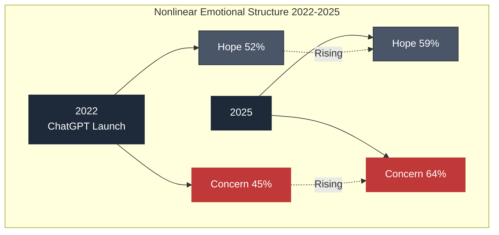

## 1.3 Gallup's "The Voice of Gen Z: The AI Paradox"

Between February and March 2026, Gallup surveyed more than 1,500 American Gen Z individuals (ages 14–29) on their emotions and attitudes toward AI. 
The report was titled "The Voice of Gen Z: The AI Paradox."

| Gen Z emotion (multiple response) | Percentage |
| --- | --- |
| **Anger** | **31%** |
| Excitement | 22% |
| Hope | 18% |
| Anxiety | Rising trend |

Anger exceeds excitement by **9 points**. 
Hope stands at just 18%.

What is even more alarming is their perception about work:

| Question | Agreement rate |
| --- | --- |
| In the workplace, the risks of AI outweigh the benefits | **Over 50%** |

This is the perception of a generation that is either about to enter or has already entered the labor market. 
What they feel is not abstract anxiety about AI. 
They are witnessing concrete changes in the job market firsthand.

| Disappearance of entry-level jobs | Phenomenon |
| --- | --- |
| Software development | Drastic decline in junior-level openings |
| Customer support | Headcount reduction through AI chatbots |
| Content creation | Replacement by generative AI |
| Freelance market | Declining rates |

For Gen Z, AI is perceived as "the thing that is blocking the entrance to their careers." 
They graduate from university, but there are no jobs to enter. 
Even if they land one, the path to advancement is unclear.

And compared to surveys just one year earlier, their emotional scores have **deteriorated significantly**.

This is the phenomenon Gallup's report called a "paradox." 
The generation that should be most capable of adapting flexibly to AI is the one most angry at it.

## 1.4 What the Edelman Trust Barometer Shows: The Collapse of Trust

The 2025 Edelman Trust Barometer revealed a sharp decline in trust toward the AI industry.

| Indicator | Value |
| --- | --- |
| **Trust in the AI industry (U.S.)** | **-15 points over the past year** |
| Grievance score | High levels in the U.S. |
| Trust in technology in general | Approaching historic lows |
| Expectations for government regulation | Rising |

The decline in trust extends across AI companies in general. 
It is not about individual companies — trust in the entire industry is collapsing.

This structure is not simply "AI dislike." 
**It means citizens are beginning to perceive AI companies as part of the existing power structure.** 
On par with — or requiring even more oversight than — Google, Microsoft, and Amazon.

## 1.5 Understanding the "Simultaneous Acceleration" of Hope and Fear

Integrating the data so far, the structure that emerges is as follows:

**Structure 1: Hope and fear coexist within the same person**

It is not that "people who hope for AI" and "people who fear AI" are separate groups. 
Both emotions exist simultaneously within the same individual, and both are intensifying.

In psychological terms, this is a state of "cognitive dissonance." 
Humans normally cannot tolerate holding contradictory emotions. 
Yet when it comes to AI, many people continue to endure it. 
They hope, and they fear. They cannot settle on one or the other.

**Structure 2: The center of gravity differs by generation**

| Generation | Center of gravity |
| --- | --- |
| Gen Z | Anger > Excitement > Hope |
| Millennials | High proportion of mixed feelings |
| Gen X / Boomers | Low usage, anxiety-led |

However, the pattern of "simultaneous acceleration" is shared across all generations. 
The degree may differ, but the parallel progression of hope and fear is the same for every generation.

**Structure 3: Viewed over time, both emotions are being reinforced simultaneously**

Over the four years from 2022 to 2026:

| Indicator | Change |
| --- | --- |
| Hope (Ipsos) | 52% → 59% (+7pt) |
| Employment concern (Pew) | Unknown → 64% (rising) |
| Gen Z anger (Gallup) | Not measured → Appears at 31% |
| Trust in AI industry (Edelman) | -15pt |

Both emotions are accelerating simultaneously. 
Neither one is pushing the other aside.

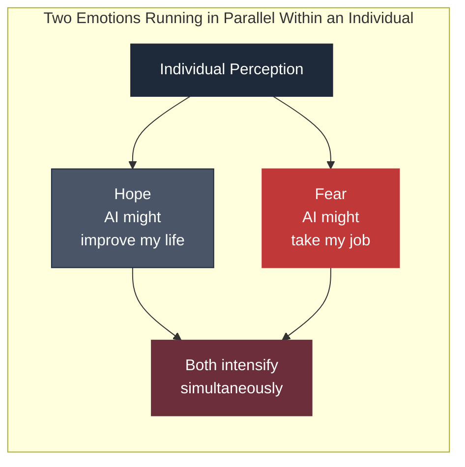

## 1.6 What This Structure Means

A society in which hope and fear accelerate simultaneously is one in which predicting behavior is extremely difficult.

**In a simple hope-based society**, investment in AI increases, 
adoption expands, regulation stays loose. Citizens cheer on AI companies.

**In a simple fear-based society**, backlash against AI intensifies, 
regulation tightens, citizens attack AI companies.

But **in a society where hope and fear accelerate simultaneously**, both happen at once.

| What hope drives | What fear simultaneously drives |
| --- | --- |
| Investment in AI accelerates | Attacks on AI companies also occur |
| Adoption expands | Opposition movements also expand |
| Regulatory debate advances | Regulation cannot keep up with technology speed |

The coexistence of "a trillion dollars and a Molotov cocktail" in the week of April 2026 was born from this structure.

AI company valuations reached record levels. 
In the same week, their CEO's home was attacked. 
Both phenomena were born from the same emotional structure of the same society.

It is not a contradiction. This is the baseline state of this era.

## 1.7 Conclusion of This Chapter

Social sentiment toward AI is not a straight line.

What the data shows is not a simple transition from "hope → disappointment," but 
**the simultaneous acceleration of hope and fear** — a nonlinear structure.

| Source | What the data shows |
| --- | --- |
| Pew Research | Both hope and fear are rising |
| Ipsos | Optimism is rising (52 → 59%) |
| Gallup | Gen Z anger at 31% exceeds hope at 18% |
| Edelman | Trust in the AI industry down -15pt |

Without understanding this structure, 
one cannot understand why a trillion dollars and a Molotov cocktail existed in the same week.

The next chapter pursues one cause of this "simultaneous acceleration." 
**The 50-point perception gap that has opened between AI experts and the general public.** 
Two groups in the same country, looking at the same technology, reaching entirely different conclusions. 
This gap is making the fracture in society decisive.

## References

1. Pew Research Center. "How Americans View the Use of AI in the Workplace." 2024-2025.
   https://www.pewresearch.org/social-trends/2025/
2. Pew Research Center. "Public More Likely to See Facial Recognition Use by Police as Good, Rather Than Bad." 2021.
   https://www.pewresearch.org/
3. Ipsos. "Global Views on A.I. 2024." Ipsos Global AI Monitor.
   https://www.ipsos.com/en/global-views-ai-2024
4. Ipsos. "Global Views on A.I. 2025."
   https://www.ipsos.com/
5. Gallup. "The Voice of Gen Z: The AI Paradox." February–March 2026 survey report.
   https://www.gallup.com/
6. Edelman. "2025 Edelman Trust Barometer: Insights for the Technology Sector."
   https://www.edelman.com/trust/2025/trust-barometer
7. NewsPicks. Naoyoshi Goto, "Gen Z's 'Rage Against AI' Won't Stop." April 16, 2026.

 

---
# Chapter 2

## The 50-Point Gap Between Experts and Citizens — Residents of the AI Village and Those Left Behind

In 2025, a survey report published by Stanford HAI (Human-Centered AI Institute) 
made visible, in numbers, one of the most serious perception gaps in modern society.

**The 50-point gap between AI experts and the general public.**

In the same country, in the same era, looking at the same technology, two groups have reached entirely different conclusions. 
As long as this gap exists, social consensus cannot be formed.

## 2.1 The Shocking Data from Pew Research Center × Stanford HAI

Pew Research Center and Stanford HAI conducted a joint survey, 
posing the same questions to 1,013 AI experts and 5,410 members of the American general public.

| Question | AI experts | General public | Gap |
| --- | --- | --- | --- |
| Will AI have a positive impact on you personally over the next 20 years? | **76%** | **24%** | **52pt** |
| Will AI have a positive impact on the U.S. as a whole over the next 20 years? | 56% | 17% | 39pt |
| Will AI reduce jobs? | 39% | 64% | 25pt |
| Would you allow AI to lead important decision-making? | 47% | 12% | 35pt |

Across every question, expert and public perceptions diverge dramatically. 
And that divergence is **consistent across all fields — healthcare, education, arts and entertainment**.

## 2.2 Why This Gap Exists

The perception gap between experts and the general public is normally explained by differences in information. 
Experts know the details, so they can make more accurate judgments — or so the argument goes.

But when it comes to AI, this explanation is insufficient.

**Experts tend to maximize AI's potential.** 
They design AI, succeed through AI, and have placed their careers on the trajectory of AI. 
If AI fails, their own lives fail. 
Therefore, they need to believe more strongly in a future where AI succeeds.

**The general public tends to maximize AI's threat.** 
They are beginning to see AI deployed in their workplaces, witnessing colleagues' layoffs, and feeling uncertain about the future of their own jobs. 
If AI succeeds, their own jobs may be lost. 
Therefore, they perceive AI's risks more acutely.

Which is correct?

**Both are correct.** 
And both are articulating a partial truth as seen from their respective positions.

This structure cannot be resolved by differences in information. 
Giving experts more information will not change their optimism. 
Giving the general public more information will not erase their fear. 
**Differences in position define human perception more powerfully than facts do.**

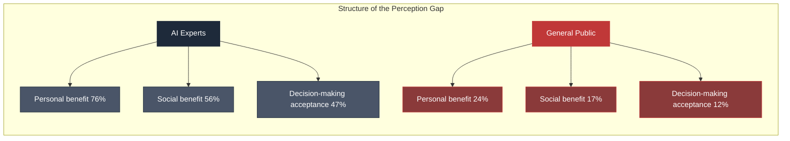

## 2.3 The Physical Existence of the "AI Village"

San Francisco, Market Street.

The OpenAI headquarters bears no company logo on the building. 
It blends in as just another high-rise in the city.

At the entrance, there is a notice:

**"Please conceal your employee badge."**

This notice was posted because AI company executives have recently 
begun receiving hostile glares and comments from strangers on the street. 
Walking around with a visible badge makes you a target.

This is the daily reality for AI company employees in San Francisco in 2026.

Journalist Alex Heath interviewed multiple AI company executives in Silicon Valley and wrote:

**"The public hates what we do."**

AI company employees are gradually coming to recognize that they are viewed as enemies by society.

## 2.4 The Economics of AI Engineers in San Francisco

Compensation for AI company employees is at levels that exceed the imagination of ordinary citizens.

**Compensation levels for AI engineers (2025–2026):**

| Position | Annual compensation |
| --- | --- |
| OpenAI senior engineer | $500,000–$1,000,000 |
| Anthropic researcher | $350,000–$700,000 |
| Top-tier researchers | $2,000,000+ |
| Senior engineer average (major AI companies) | ~$450,000 |

This is **5 to 10 times** the annual income of a typical worker in the same city of San Francisco.

**Economic consequences within San Francisco:**

| Item | Figure |
| --- | --- |
| Median rent (studio–1BR) | $3,500–$5,000/month |
| Median home price | Over $1,300,000 |
| Mansion market | News reports that AI employees have "bought up all the mansions" |

AI engineers are pushing San Francisco real estate into price ranges unreachable by ordinary citizens.

**Spatial exclusion is underway:**

| Affected group | Consequence |
| --- | --- |
| Existing residents | Forced to move to suburbs or other cities |
| Teachers, healthcare workers, service workers | Can no longer afford to live in the city |
| City economy | Growing dependence on the AI industry |

This economic structure forms the bedrock of citizens' emotions. 
AI companies are perceived not merely as workplaces, but as **forces that destroy existing living environments**.

## 2.5 The Global Concentration of Wealth

AI company valuations are expanding at an astonishing pace.

**Enterprise valuations of major AI companies as of April 2026:**

| Company | Valuation | Notes |
| --- | --- | --- |
| **OpenAI** | **~$852B (~¥128T)** | $157B (2024/1) → $300B (2025) → $852B (2026/3) — 5x+ in 18 months |
| **Anthropic** | **~$380B (~¥57T)** | $183B (2025 end) → $380B (2026/2). Declined ~$800B next-round proposal |
| **xAI + SpaceX combined** | **~$1.25T (~¥188T)** | IPO target: $1.75T (~¥263T) |
| Google DeepMind, Microsoft AI, Meta AI | Major components of parent company market caps | — |

**Combined, AI capital has already far exceeded $1 trillion.**

This immense wealth is concentrated among a few hundred to a few thousand AI company founders, investors, and senior employees.

## 2.6 The Anthropic Example: ¥128 Trillion in Three Years

Anthropic's growth rate is without precedent in history.

| Period | Milestone |
| --- | --- |
| 2021 | Anthropic founded |
| March 2023 | Claude 1 launched |
| March 2024 | Claude 3 launched |
| End of 2025 | Annual revenue $9 billion |
| Early March 2026 | Annual revenue $19 billion |
| **April 2026** | **Annual revenue $30 billion (~¥4.5T) / Valuation ~¥128T** |

Only **three years** have passed since the launch of its flagship product, Claude.

**"¥128 trillion in enterprise value in three years"** — 
this pace has no parallel in 20th-century industrial history. 
Google, Facebook, Amazon, Apple — the growth curve surpasses them all.

This speed is cause for jubilation among investors and founders. 
But for ordinary citizens, it produces **the tangible sensation that wealth concentration is unfolding before their eyes**.

## 2.7 Two Realities

The reality of "AI village residents" and the reality of "those left behind" 
physically exist in the same country, the same city, the same era. 
Yet as lived experiences, they are entirely different worlds.

| Comparison | Reality of AI village residents | Reality of those left behind |
| --- | --- | --- |
| Income | Tens of millions to hundreds of millions of yen annually | Cannot keep up with rising rents |
| Living environment | Mansions, commuting by private car | Forced to relocate to suburbs |
| Workplace atmosphere | Badges hidden, but work is fulfilling | Colleagues disappearing to layoffs |
| View of AI's future | Bright | Dark |
| Perception of AI | Good for humanity | A threat to humanity |

These two realities coexist in the same era. 
Stanford HAI's 50-point gap is the numerical expression of the distance between these two realities.

## 2.8 The Social Consequences of the Gap

The perception gap produces social consequences.

| Consequence | Content |
| --- | --- |
| **Impossibility of consensus** | Debates on AI regulation run parallel. Experts say "regulation impedes innovation," citizens say "without regulation we are unprotected." Legislatures cannot move, stuck between both sides |
| **Distrust of institutional design** | Citizens cannot trust AI companies to design regulations. Regulators depend on expert opinions, so regulations skew toward experts. As a result, citizen distrust deepens further |
| **Transformation into violence** | Cannot reach consensus → institutional solutions invisible → some resort to violence. This is the soil of the April 2026 Altman attack and the Indianapolis shooting (same structure as the Luddite movement, detailed in Chapter 6) |

## 2.9 Conclusion of This Chapter

Between AI experts and the general public, there is a **50-point perception gap**.

| Question | AI experts | Public | Gap |
| --- | --- | --- | --- |
| Personal benefit | 76% | 24% | 52pt |
| Social benefit | 56% | 17% | 39pt |
| Job loss concern | 39% | 64% | 25pt |
| Decision-making acceptance | 47% | 12% | 35pt |

This gap cannot be resolved by differences in information. 
Differences in position produce different conclusions from the same facts.

Physically, the AI village (San Francisco's AI companies and their employees) and 
those left behind (the general public) live in the same city. 
But economically and experientially, they live in entirely different worlds.

| Manifestation of the gap | Figure |
| --- | --- |
| AI company valuations (combined) | Over $1 trillion |
| AI engineer compensation | 5–10x that of ordinary workers |
| Housing prices / rent | At levels that push existing residents out of the city |

This gap is one cause of the "simultaneous acceleration" of social sentiment. 
The reason hope and fear run in parallel within the same society is that, fundamentally, society is not one.

The next chapter focuses on the generation at the front line of this gap — **Gen Z**. 
The phenomenon they face — "the closing gate" — the evaporation of entry-level jobs — 
is the sharpest manifestation of inequality in the AI era.

## References

1. Pew Research Center & Stanford HAI. "How the U.S. Public and AI Experts View Artificial Intelligence." 2025.
   https://www.pewresearch.org/
2. Stanford HAI. "AI Index Report 2026."
   https://aiindex.stanford.edu/report/
3. Alex Heath. "Silicon Valley's AI elite grapple with growing public hostility." The Verge / Command Line. 2026.
4. Bloomberg. "Anthropic reaches $380 billion valuation as annual revenue hits $30 billion." April 2026.
5. Reuters. "OpenAI valued at $852 billion in secondary share sale." March 2026.
6. San Francisco Chronicle. "Mansion shortage as AI wealth transforms SF real estate." 2026.
7. Levels.fyi. "Software Engineer Salary at OpenAI / Anthropic." 2025–2026.
   https://www.levels.fyi/

 

---
# Chapter 3

## The Closing Gate — The Evaporation of Entry-Level Jobs and the Despair of the Young

On April 15, 2026, Snap CEO Evan Spiegel stated 
in an announcement of 1,000 layoffs:

**"More than 65% of new code is now generated by AI."**

This single sentence strikes at the heart of Gen Z's rage toward AI.

If 65% of new code is generated by AI, 
then the people who learn by writing new code are no longer needed. 
Interns, new-graduate engineers, junior developers — 
the positions that once served as the "entry gate" to the software industry are rapidly vanishing.

## 3.1 The Structural Disappearance of Entry-Level Jobs

**The current state of software development:**

When GitHub Copilot became generally available in 2022, when Cursor rose to prominence in 2023, when Claude Code emerged in 2024 — 
over these three years, coding-assistance AI began to 
**not partially but fundamentally replace the work of junior engineers**.

| Task | Degree of AI replacement |
| --- | --- |
| Simple CRUD applications | AI can generate independently |
| Bug fixing | AI identifies cause and executes fix |
| Unit test creation | AI handles entirely |
| Code review | AI performs preliminary check; humans make final judgment |

All of these were once the tasks through which junior engineers gained experience. 
**"The first-year job that builds a ten-year veteran" is disappearing.**

**Job market data:**

| Data source | Change |
| --- | --- |
| Indeed, LinkedIn, Glassdoor job postings | Junior positions trending downward |
| New-graduate hiring in U.S. tech | Shrinking since 2023 |
| Requirements for "entry-level" positions | Increasing instances of "minimum 3 years of experience required" (a contradictory phrase) |

## 3.2 The Customer Support Case: Klarna

In 2024, Swedish fintech company Klarna made a notable announcement:

**"Our AI assistant is handling the workload equivalent of 700 customer support agents."**

Klarna reported that a chatbot built using OpenAI technology was serving customers in 35 languages. 
CEO Sebastian Siemiatkowski stated:

| Metric | Result |
| --- | --- |
| Volume handled by AI | **Equivalent to 700 full-time employees** |
| Customer resolution time | 2.5 minutes (down from an average of 11 minutes) |
| Customer satisfaction score | On par with human agents |
| Projected annual profit improvement | **$40 million** |

Klarna accelerated headcount reductions after this announcement. 
Founded in 2000 with approximately 7,000 employees, 
the company reduced its core staff to **approximately 3,500** from 2023 onward. 
AI-driven operational efficiency was explicitly cited as the primary reason.

This case served as a warning to the entire service industry. 
**Customer-facing roles were proven to be the domain where AI can replace humans fastest.**

## 3.3 The Collapse of Education and Learning Platforms: Chegg

Chegg was a U.S.-based academic support platform for college students, 
offering homework help, textbook rentals, and tutoring.

In May 2023, Chegg's CEO made a shocking announcement to investors:

**"ChatGPT is beginning to impact our business."**

Chegg's stock price **plummeted 49% in a single day** following the announcement.

Subsequent developments:

| Period | Event |
| --- | --- |
| Late 2023 | Rapid decline in subscribers |
| 2024 | Major layoffs, 4% workforce reduction |
| 2025 | Further layoffs, **22% of all employees cut** |
| Stock trajectory | Peak of $113 in 2021 → fell to **the $1 range** by 2025 |

Chegg was recorded as the first company in the education services industry to be "destroyed by ChatGPT."

This case was a harbinger for the broader sector of 
**knowledge-based services** including education, content creation, and writing support.

## 3.4 Language Learning and Translation: Duolingo

In January 2024, Duolingo announced it would **cut 10% of its contractors**.

Those cut were primarily people engaged in translation and language content creation. 
Duolingo's spokesperson stated clearly:

**"Generative AI has made these tasks more efficient."**

After this announcement, Duolingo strengthened its AI-powered learning features (Duolingo Max), 
offering **personalized, conversational learning tailored to each user**. 
The role of human teachers and content creators was significantly reduced.

In the language learning field, demand for human translation and content creation 
is **rapidly declining** due to improving AI translation accuracy.

## 3.5 Payments and Finance: Block (formerly Square)

Block, led by Jack Dorsey, carried out phased layoffs from 2024 to 2025.

| Period | Action |
| --- | --- |
| January 2024 | **~1,000 employees (10% of total workforce) cut** |
| Late 2024 | Additional reductions |
| 2025 | Reorganization and ongoing streamlining |

Dorsey stated clearly in an internal memo:

**"We will leverage AI to become an organization that achieves greater results with fewer people."**

Block has been accelerating AI-driven automation across 
engineering, customer support, and operations.

## 3.6 The Pioneering Announcement: IBM

In May 2023, IBM CEO Arvind Krishna made a striking announcement:

**"Over the next five years, we will replace approximately 7,800 back-office jobs — about 30% — with AI."**

This was one of the earliest significant cases in which "AI-driven restructuring" was explicitly articulated as corporate strategy. 
The targeted areas were:

| Area | Content |
| --- | --- |
| Human resources | Administrative tasks |
| Finance | Routine tasks |
| IT support | Select operations |

After this announcement, IBM **froze new hiring in HR and finance**, 
relying on natural attrition through retirement and transfers.

This case signified that **AI-driven labor replacement was being systematized 
not as individual corporate decisions, but as formalized management strategy**.

## 3.7 Snap in 2026: 1,000 Jobs Cut

And on April 15, 2026, Snap announced the elimination of 1,000 positions.

**Statement by Snap CEO Evan Spiegel:**

> "Advances in AI have enabled us to streamline operations and run with smaller teams. More than 65% of new code is now generated by AI."

**Distinguishing features of this announcement:**

| Feature | Content |
| --- | --- |
| Explicitly cited AI as cause | Clearly stated in the announcement |
| Specific figures presented | More than 65% of new code generated by AI |
| Normalization of a new standard | "Running with smaller teams" as the norm |
| Financial target set | Over $500 million in annual cost savings |

Snap became the symbol of an era in which **companies openly announce they are replacing humans with AI** as a management strategy. 
IBM in 2023 said "we will replace." Snap in 2026 said "we have already replaced."

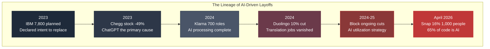

## 3.8 The Full Picture of 2026: 80 Companies, 71,440 People

According to layoffs.fyi, 
tech industry layoffs in the U.S. from the start of 2026 through mid-April have reached the following scale:

| Metric | Value |
| --- | --- |
| Companies conducting layoffs | **80** |
| People affected | **~71,440** |

This pace is the highest in at least the past several years.

**Characteristics:**

| Aspect | Content |
| --- | --- |
| Nature of reductions | Not temporary cost-cutting, but **structural workforce downsizing** |
| Explicit AI attribution | Many companies explicitly state or imply AI as the cause |
| Rehiring status | Rehiring is limited, especially for junior roles |
| CEO talking point | "Deliver more value with fewer people" |

## 3.9 The Structure of Gen Z's Despair

The Gallup survey showed Gen Z's "anger 31%, excitement 22%, hope 18%." 
Behind these numbers lies the concrete reality of the job market.

**The reality facing Gen Z:**

| Reality | Specific content |
| --- | --- |
| Entry-level jobs gone upon graduation | Graduate with student loans, no jobs to enter. The contradiction of "entry-level positions requiring 3 years of experience." Even internship competition ratios are abnormally high |
| Career advancement path itself is unclear | The career path of gaining experience as a junior has vanished. Suddenly expected to perform at a senior level (on the assumption of AI fluency). Structural reduction in learning opportunities |
| No time to acquire skills | A newer technology arrives while still learning the previous one. AI tool changes outpace human learning speed. The definition of "AI literacy" itself changes every year |
| Zero career predictability | No idea what jobs will exist in 5 years. Cannot predict which fields are safe. No visible endpoint for career pivots or reskilling |

**Given this situation, it is natural that Gen Z does not view AI as "hope."** 
For them, AI is experienced daily as a force that destroys their career and life planning.

## 3.10 Conclusion of This Chapter

"The closing gate" is the sharpest manifestation of inequality in the AI era.

| Domain | Phenomenon |
| --- | --- |
| Software development | Coding-assistance AI fundamentally replaces junior roles |
| Customer support | Klarna case: 700 roles replaced by AI |
| Education / learning | Chegg stock -49%, 22% reduction |
| Language / translation | Duolingo 10% cut |
| Finance / payments | Block 10% cut |
| Social media | Snap 16%, 1,000 cut (65% of code is AI) |

**80 companies, 71,440 AI-driven layoffs since the start of 2026.**

Behind these numbers lie students saddled with loans, graduates who cannot find jobs, 
junior employees who have lost their path to advancement, mid-career professionals with no road back to reemployment — 
the realities of countless individuals.

Gen Z's "anger 31%, hope 18%" indicates that they have lost their vision of society's future. 
Hope is the ability to envision a future. 
When no future can be envisioned, hope cannot exist.

The next chapter traces the **geographic and structural concentration of capital** behind this job loss. 
In the same era, wealth on the scale of a trillion dollars is concentrated in one corner of San Francisco. 
This global asymmetry is deepening the fractures of society even further.

## References

1. layoffs.fyi. "Tech Layoffs Tracker." 2023–2026.
   https://layoffs.fyi/
2. Klarna. "Klarna AI assistant handles two-thirds of customer service chats." February 2024.
   https://www.klarna.com/international/press/
3. Chegg. "Q1 2023 Earnings Call Transcript."
   https://investor.chegg.com/
4. Duolingo. "Contractor Transition Announcement." January 2024.
5. Block. "CEO Memo on AI-driven Organization Changes." 2024.
6. IBM. "Arvind Krishna on AI and the Future of Work." Bloomberg Interview, May 2023.
7. Reuters. "Snap to cut 16% of workforce at investor's request." April 15, 2026.
8. Gallup. "The Voice of Gen Z: The AI Paradox." 2026.

 

---
# Chapter 4

## The Geography of a Trillion Dollars — San Francisco, Capital Concentration, and Spatial Exclusion

AI is a global technology. 
Accessible from anywhere in the world. 
Usable by people everywhere.

Yet the capital that produces AI is concentrated in an extremely narrow geographic range. 
Almost entirely within parts of the San Francisco Bay Area and a handful of surrounding cities. 
Combined, these cover less than 0.1% of the total land area of the United States.

This spatial concentration is the physical foundation of inequality in the AI era. 
Data is not an abstract concept — it is stored on physical servers that consume electricity. 
The models are trained in data centers that exist in specific geographic locations. 
And the engineers who design and operate them live in specific neighborhoods.

This chapter traces where and how AI capital on the scale of a trillion dollars is concentrated.

## 4.1 The San Francisco Address

The world's major AI companies are clustered with remarkable proximity.

| Company | Headquarters location | Notes |
| --- | --- | --- |
| OpenAI | 1960 Bryant Street, San Francisco | Mission District |
| Anthropic | 548 Market Street, San Francisco | Downtown |
| xAI | Palo Alto, California | Near Tesla/SpaceX |
| Scale AI | San Francisco | SOMA district |
| Perplexity | San Francisco | SOMA district |
| Google DeepMind (U.S.) | Mountain View, California | — |
| Meta AI | Menlo Park, California | — |

What this list shows is that the headquarters of major AI companies are all **within approximately 50km of San Francisco**. 
Within walking distance or a short drive, the majority of the world's AI capital is assembled.

## 4.2 The Concentration of AI Capital

Classifying AI company valuations geographically as of April 2026:

| Region | Major companies | Estimated combined valuation |
| --- | --- | --- |
| **San Francisco Bay Area** | OpenAI, Anthropic, Scale AI, Perplexity, etc. | **Over ~$1.3T** |
| **Googleplex (Mountain View)** | Google DeepMind U.S. | Major component of Alphabet market cap |
| **Menlo Park** | Meta AI | Major component of Meta market cap |
| **Palo Alto area** | xAI, related companies | ~$1.25T including SpaceX |
| **Seattle** | Microsoft AI | Major component of Microsoft market cap |
| **Other U.S.** | Scattered | Small in aggregate |
| **China** | Baidu AI, ByteDance, Zhipu, etc. | Small relative to U.S. |
| **Europe** | Mistral, others | Very small relative to U.S. |
| **Japan** | No indigenous foundation model | Effectively blank |

**The vast majority of global AI capital is concentrated within a few hundred kilometers of northern California.**

This degree of concentration is difficult to find a parallel for in past industrial history. 
The auto industry concentrated in Detroit, but more than 80% of the global auto industry was never in Detroit alone. 
Finance concentrated in New York, but London, Tokyo, and Hong Kong stood alongside it.

AI capital exhibits an extremely unusual pattern of concentration in which **a single region commands the majority of the global market**.

## 4.3 The Geography of Data Centers

While AI company headquarters are concentrated in San Francisco, 
the physical infrastructure that runs AI — data centers — is located elsewhere.

**Major AI data center locations:**

| Region | Characteristics |
| --- | --- |
| Texas | Large-scale facilities for Microsoft, Oracle, xAI |
| Northern Virginia | AWS, Meta, Microsoft "data center corridor" |
| Arizona | Apple, Google, Microsoft facilities |
| Iowa | Microsoft, Google, Meta facilities |
| Oregon | Amazon, Apple facilities |
| Indiana | Emerging AI data center candidate site |

Data centers consume enormous amounts of electricity and water. 
And the facilities that consume these resources directly impact local communities.

**Impact of data centers on local communities:**

| Impact | Content |
| --- | --- |
| Electricity consumption | Large facilities consume hundreds of MW, potentially tens of percent of local demand |
| Rising electricity costs | Increased demand drives up local residents' electricity bills |
| Water resources | Massive water consumption for cooling; severe competition in arid regions |
| Tax revenue | Significant tax contributions during construction; ongoing revenue during operation |
| Employment | High during construction, but only dozens of jobs during operation |

## 4.4 The Indianapolis Shooting

In April 2026, 13 bullets were fired into the home of Indianapolis city council member Dan Gibson.

A single note was left at the front door:

**"NO DATA CENTERS"**

Councilman Gibson had voted in favor of building an AI data center.

This incident was recorded as a clear example of local residents' opposition to data centers 
transforming into violence.

**Background of the incident:**

| Background factor | Situation |
| --- | --- |
| Data center construction plan | Large-scale AI data center on Indianapolis outskirts |
| Pro-side argument | Tax revenue, construction jobs, local economic revitalization |
| Opposition concerns | Rising electricity costs, noise, landscape destruction, water depletion |
| City council vote | Passed with a majority |
| Incident | After the vote, a pro-vote council member's home was shot at |

The structure of this incident is similar to the Luddite movement of 1811. 
The target of attack is not the technology itself, but **those who own and decide to introduce the technology**.

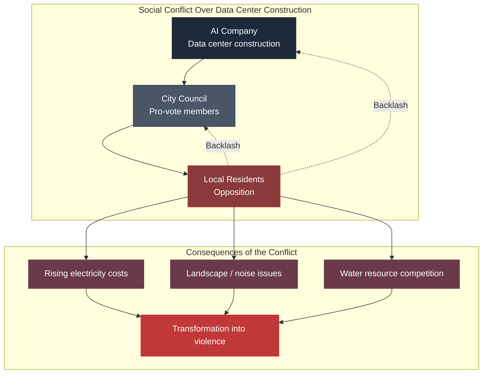

## 4.5 San Francisco Real Estate Prices

The concentration of AI companies has fundamentally transformed San Francisco's real estate market.

**San Francisco real estate prices (representative figures, 2026):**

| Property type | Price range |
| --- | --- |
| Studio apartment (monthly rent) | $3,000–$4,000 |
| 1-bedroom (monthly rent) | $3,500–$5,000 |
| 2-bedroom (monthly rent) | $5,500–$8,000 |
| City median home price | Over $1,300,000 |
| High-end neighborhoods (Marina, Pacific Heights, etc.) | $3,000,000–$10,000,000+ |

**Purchasing power of AI company employees:**

| Position | Estimated annual compensation | Housing purchasing power |
| --- | --- | --- |
| OpenAI senior engineer | $500,000–$1,000,000 | Can purchase $2,500,000–$5,000,000 homes |
| Anthropic researcher | $350,000–$700,000 | Can purchase $1,800,000–$3,500,000 homes |
| Top-tier AI researcher | $2,000,000+ | Can purchase $10,000,000+ mansions |

**Situation of existing San Francisco residents:**

| Occupation | Typical annual income | Housing purchasing power |
| --- | --- | --- |
| Public school teacher | $70,000–$100,000 | Essentially impossible to buy a home in the city |
| Nurse | $100,000–$150,000 | Extremely difficult to purchase in the city |
| Food service / service industry | $40,000–$60,000 | Even renting in the city is difficult |
| Police officer / firefighter | $90,000–$130,000 | Commuting from suburbs is the norm |

**What is resulting from this:**

| Phenomenon | Content |
| --- | --- |
| Overheating mansion market | News reports of "not enough mansions to buy and sell" |
| Existing residents relocating to suburbs | Moving to Oakland, Sacramento, Livermore, etc. |
| Shortage of public service workers | Cannot secure teachers, nurses within the city |
| Worsening homelessness | Continuous increase in those losing housing |

## 4.6 The Enclosed Space of the "AI Village"

People in San Francisco's AI industry share 
specific neighborhoods, specific shops, specific services.

**Geographic center of the AI village:**

| Area | Characteristics |
| --- | --- |
| SOMA (South of Market) | Concentration of AI company offices, luxury apartments for young engineers |
| Mission District | OpenAI headquarters, café culture, partial gentrification |
| Hayes Valley | Residential area for AI executives, concentration of upscale restaurants |
| Pacific Heights | Mansion district for top founders and investors |
| Marina District | Affluent lifestyle, high-income residents |

In these areas, the proportion of AI-related workers is high, 
forming **culturally and economically enclosed communities**.

**Cultural characteristics of the AI village:**

| Item | Content |
| --- | --- |
| Common topics | Latest models, competitive dynamics, benchmarks, technical breakthroughs |
| Social venues | AI conferences, investor events, Discord servers |
| Family structure | Relatively young couples, tendency to delay having children |
| Spending patterns | High expenditure on high-end technology, health, travel |
| Political leanings | Technology optimism; nuanced on regulation |

Within this enclosed community, perceptions of AI are overwhelmingly positive. 
Because contact with the outside world is relatively limited, 
residents physically inhabit one side of the **Stanford HAI 50-point gap**.

## 4.7 International Asymmetry

The concentration of AI capital also produces asymmetry between nations.

**Country-level positioning in the AI domain (2026):**

| Country/Region | AI foundation models | AI company valuations | Global share |
| --- | --- | --- | --- |
| **United States** | GPT, Claude, Gemini, Grok | OpenAI $852B, Anthropic $380B, xAI $1.25T | Overwhelming majority |
| **China** | Baidu ERNIE, DeepSeek, Zhipu | Hundreds of billions (undisclosed) | Small vs U.S. |
| **Europe** | Mistral, others | Mistral ~$6B | Very small |
| **Japan** | No indigenous foundation model | Effectively none | Near zero |
| **Global South** | None | None | Access also limited |

This structure exhibits a **pattern similar to past colonialism**. 
A small number of central nations/cities own the foundational technology, and other regions are relegated to the position of users.

**The resulting asymmetry:**

| Axis | Center (U.S.) | Periphery (other regions) |
| --- | --- | --- |
| Development of foundational tech | Drives it | Uses it |
| Data ownership | Aggregates much of it | Provides it |
| Economic benefit | Capital concentration at $1T scale | Pays licensing / service fees |
| Regulatory initiative | Sets standards based on own criteria | Follows U.S. standards |
| Cultural influence | AI reflects own values | Influenced by U.S. values |

## 4.8 Anthropic Claude Mythos: "Not for General Release"

In 2026, Anthropic developed its most powerful AI model, "Claude Mythos." 
However, the company announced that this model **would not be released to the general public**. 
The reason given was that its hacking capabilities were too powerful, posing significant misuse risk.

Instead, it was provided on a limited basis to 12 alliance partners under a program called Project Glasswing.

**What this decision means:**

| Perspective | Implication |
| --- | --- |
| Hierarchical access | Different tiers of access based on model capability |
| Deepening information asymmetry | The most powerful AI available only to elite companies |
| Economic consequence | Companies with access to Mythos-class AI hold overwhelming advantage |
| End of democratization | The premise that "anyone can use AI" collapses |

This was a critical turning point in the commercialization of AI. 
Until now, the narrative was "AI will be democratized," but 
**the reality that the most powerful AI will not be democratized** became clear.

## 4.9 Space, Capital, and Emotion

Summarizing the structure depicted in this chapter:

**Capital at the trillion-dollar scale follows this geographic structure:**

| Layer | Location | Result |
| --- | --- | --- |
| AI company headquarters | San Francisco Bay Area | Major companies clustered within 50km |
| AI engineer residences | Specific areas within San Francisco | Extreme real estate price escalation |
| AI data centers | U.S. Midwest and South | Friction with local communities, opposition movements |
| Model access | Limited (Mythos-class to 12 companies only) | Hierarchical access structure |

**This spatial concentration produces the simultaneous acceleration of emotions:**

- Inside the AI village, expectations for AI are strong and hope is spoken
- Outside the AI village (especially near data centers), fear of AI is strong and anger is spoken
- Both live in the same country but have almost no interaction
- As a result, the perception gap does not narrow — it widens

This structure is similar to **20th-century urban-rural divides** and 
**gentrification dynamics**, but at larger scale and greater speed.

## 4.10 Conclusion of This Chapter

Trillion-dollar AI capital is concentrated in a remarkably narrow geographic area.

| Concentration pattern | Reality |
| --- | --- |
| Company headquarters | Most major companies within 50km of SF Bay Area |
| Engineer residences | Dominate specific neighborhood real estate markets |
| Data centers | Friction with local communities, escalating to shootings |
| Top-model access | 12 alliance companies only (Project Glasswing) |
| International distribution | U.S. overwhelmingly dominant, other regions peripheralized |

This spatial concentration is the physical foundation of society's emotional fracture. 
People inside and outside the AI village physically live in separate spheres. 
Because there is no interaction, the perception gap does not narrow.

The next chapter traces why this concentration **accelerates over time**, through Piketty's economic theory. 
The simple inequality r>g, in the AI era, reaches its extremes. 
Why the concept of a **permanent underclass** is now being seriously discussed becomes clear.

## References

1. CB Insights. "State of AI 2026."
   https://www.cbinsights.com/research/ai-2026/
2. PitchBook. "AI Unicorns Tracker." 2026.
   https://pitchbook.com/
3. San Francisco Chronicle. "Mansion shortage in SF as AI wealth transforms real estate." February 2026.
4. Indianapolis Star. "Councilmember Gibson's home hit with 13 bullets after data center vote." April 2026.
5. Bloomberg. "Data Center Boom and Local Resistance in the American Midwest." March 2026.
6. Anthropic. "Introducing Project Glasswing." April 2026.
   https://www.anthropic.com/news/project-glasswing
7. Zillow. "San Francisco Housing Market Report." 2026.
   https://www.zillow.com/
8. US Department of Energy. "Data Center Energy Consumption Report." 2026.
   https://www.energy.gov/

 

---

# Chapter 5

## The Permanent Underclass Thesis — Piketty × AI and the Extremization of r>g

In 2025, economist Noah Smith, author of the economics newsletter "Noahpinion," published an article. 
The title: "**What if a few AI companies hoard all the money and power?**"

In this article, Smith introduced a concept:

**"permanent underclass"**

A class permanently excluded from the labor market. 
A class whose path to reemployment is structurally closed off. 
A class that emerges when the speed at which AI replaces labor outpaces the speed of human retraining and social safety nets.

This concept was further developed in a blog called "22nd Century Capital," which sought to anticipate the economics of the next century. 
It updated the logic of Thomas Piketty's *Capital in the Twenty-First Century* for the AI era.

This chapter traces how Piketty's inequality r > g reaches its extremes in the AI era.

## 5.1 Piketty's *Capital in the Twenty-First Century*

French economist Thomas Piketty published *Capital in the Twenty-First Century* in 2013. 
The book was read worldwide and transformed the field of economics.

**Piketty's core argument:**

| Concept | Content |
| --- | --- |
| r (rate of return on capital) | Returns from investing capital (dividends, rent, capital gains, etc.) |
| g (economic growth rate) | Overall economic growth rate (GDP growth) |
| **r > g** | When the rate of return on capital exceeds economic growth, inequality expands over time |

Piketty analyzed long-term data from the 18th century onward and showed that **r > g has held true for most of history**.

**What happens when r > g holds:**

| Perspective | Consequence |
| --- | --- |
| Those who hold capital | Continue to grow assets through capital returns |
| Those who live by labor alone | Wage growth cannot keep up with capital returns |
| Intergenerational inheritance | Inequality becomes fixed through wealth inheritance |
| Society as a whole | The wealth of the top 1% expands over time |

Piketty argued that the two world wars and the high-growth period of the 20th century were **historically exceptional** periods of inequality reduction. 
War destroyed capital, and during the postwar recovery, g > r temporarily held.

**Since the late 20th century, the world has returned to an era of r > g.**

## 5.2 Why r > g Reaches Its Extremes in the AI Era

Piketty's analysis had physical capital (factories, real estate, stocks) in mind. 
But in the AI era, **a new type of capital** has emerged.

**Characteristics of AI capital:**

| Characteristic | Content |
| --- | --- |
| Scalability | Once trained, a model can be copied at near-zero cost |
| Labor substitution capacity | Directly replaces **intellectual labor**, not physical labor |
| Self-improving potential | AI may improve AI (RSI: Recursive Self-Improvement) |
| Network effects | The more usage data, the higher the accuracy |
| Monopolistic nature | Requires massive capital for development; extremely high barriers to entry |

These characteristics push the r > g structure to its extremes.

**r in the AI era:**

- Profit margins for companies holding AI capital are abnormally high compared to past industries
- OpenAI and Anthropic are growing faster than Google or Facebook did
- Scalability causes margins to expand over time
- **Anthropic generating ¥128 trillion in enterprise value in three years demonstrates the extreme value of r**

**g in the AI era:**

- Overall economic growth rates remain in the low single-digit percentage range
- U.S. GDP growth: ~2–3%
- Japan's GDP growth: ~0–1%
- Global GDP growth: ~3%

**The r >> g structure:**

AI capital returns are in the range of tens to hundreds of percent per year. 
General economic growth is a few percent per year. 
This gap is far wider than the historical r > g.

**What results:**

| Consequence | Content |
| --- | --- |
| Wealth of AI company founders | Increases exponentially |
| Wages of ordinary workers | Downward pressure from AI-driven substitution |
| Speed of inequality expansion | Exceeds the pace of past industrial revolutions |
| Fixation of inequality | Without owning AI capital, there is no way to catch up |

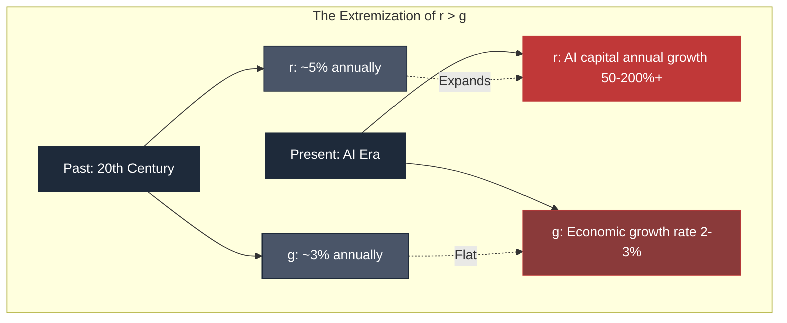

## 5.3 Acemoglu's "The Simple Macroeconomics of AI"

In 2024, MIT economist Daron Acemoglu published the paper "The Simple Macroeconomics of AI" (NBER Working Paper No. 32487).

Acemoglu is known as a Nobel Prize candidate, and co-author of *Why Nations Fail* and *Power and Progress*. 
He has spent decades studying the relationship between technology and institutions.

**Acemoglu's key claims:**

| Argument | Acemoglu's estimate |
| --- | --- |
| Share of jobs affected by AI in the next 10 years | **~5%** |
| Productivity improvement | 0.07% annually, ~0.71% over 10 years |
| Change in consumer welfare | **-0.72%** |
| Change in tax revenue | Slightly negative |

Acemoglu's conclusions differ sharply from the expectations of AI optimists.

**"AI will not change all jobs. But it will change distribution."**

Acemoglu's logic proceeds in the following steps:

| Step | Content |
| --- | --- |
| 1. Direct effect of technology | Jobs affected by AI are limited (~5%) |
| 2. Productivity improvement | Modest improvement (0.71%) |
| 3. Distribution problem | Most of the gains accrue to capital owners |
| 4. Worker losses | Wages decline for replaced workers |
| 5. Consumer prices | Decline in some areas, rise in others (mixed) |
| 6. Aggregate welfare | **Negative** (-0.72%) |

Acemoglu demonstrated, through rigorous macroeconomic analysis, **the possibility that AI lowers overall social welfare**.

This is the most academically rigorous rebuttal of the AI-optimist claim that "AI will make everyone richer."

## 5.4 The Structure of the Permanent Underclass

Structurally organizing Noah Smith's concept of the "permanent underclass":

**Conditions under which a permanent underclass emerges:**

| Condition | Content |
| --- | --- |
| 1. Exclusion from the labor market | One's occupation is replaced by AI; no work available |
| 2. Difficulty of retraining | By the time one learns new skills, those skills are also replaced by AI |
| 3. Limits of social safety nets | Traditional unemployment benefits and retraining support are insufficient |
| 4. Intergenerational inheritance | When parents become underclass, children are also affected |
| 5. Diminished political voice | The excluded class's voice struggles to reach politics |

**Difference between the permanent underclass and "conventional poverty":**

| Axis | Conventional poverty | Permanent underclass |
| --- | --- | --- |
| Possibility of recovery | Exists (education, career change, entrepreneurship, etc.) | Structurally difficult |
| Cause | Individual circumstances, economic fluctuations | Structural AI-driven labor replacement |
| Duration | Temporary, may not span generations | Permanent, fixed across generations |
| Policy response | Reemployment support, vocational training | Existing systems cannot adequately respond |
| Scale | A portion of society | May reach a significant share of the working population |

**Society if the permanent underclass expands:**

| Perspective | Expected situation |
| --- | --- |
| Economy | Decline in consumer demand, economic downturn |
| Politics | Rise of populism, extremism |
| Social order | Increase in crime, violence, social unrest |
| Culture | Deepening division, loss of common language |
| Historical parallel | Conditions of early Industrial Revolution, Luddite era |

## 5.5 The "22nd Century Capital" Blog's Analysis

An online blog titled "22nd Century Capital" developed an analysis extending Piketty's framework to the AI era. 
The author is anonymous but is presumed to be an economist or someone with comparable expertise.

**Key arguments of "22nd Century Capital":**

| Argument | Content |
| --- | --- |
| AI is the "ultimate capital" | Scalable, capable of total labor replacement |
| r > g will reach its extreme | AI capital returns exceed past capital returns |
| The meaning of inheritance changes | Whether one holds AI company stock becomes decisive |
| Political economy is transformed | Labor unions, social democratic frameworks cease to function |
| Need for a new political order | Discussions of UBI, public wealth funds, robot taxes, etc. |

**"22nd Century Capital" poses one sharp question:**

> In an era when AI can perform all work, demand for human labor may approach nearly zero. At that point, what bargaining chip does the working class have — and what can they gain?

Traditional labor movements negotiated with capitalists through the tool of the strike. 
But if labor is replaced by AI, strikes cease to function as a bargaining tool. Workers hold nothing.

This is the core of the structure by which **the permanent underclass is also rendered politically powerless**.

## 5.6 Historical Comparison: The Luddites of the Industrial Revolution

Piketty and "22nd Century Capital" frequently invoke the Industrial Revolution as a historical parallel.

**Comparison of early 19th century Luddite movement and 21st century AI era:**

| Comparison | Luddites (1811–1816) | AI era (2023–2026) |
| --- | --- | --- |
| Technological innovation | Mechanization of looms and frames | Generative AI, coding-assistance AI |
| Replaced occupations | Artisans (skilled workers) | Junior engineers, support staff, writers, etc. |
| Capitalist profits | Machine owners, factory masters | AI company founders, investors |
| Workers' response | Machine destruction, riots | Social unrest, some violent incidents |
| Government response | Military deployment, capital punishment for machine-breaking | Ongoing debate, concrete response delayed |
| Long-term result (predicted) | Foundation of labor unions, social security | Debate on UBI, robot taxes, AI regulation |

**Key similarities:**

- In both cases, **the structure of ownership and distribution, not the technology itself**, is the focal point of conflict
- Workers suffer direct harm
- Government/institutional response cannot keep pace with technology
- A structural change is occurring that "cannot be reversed"

**Key differences:**

- Speed: The Industrial Revolution played out over decades; the AI era, over years
- Scale: The Luddites were regional; AI is global and simultaneous
- Scope of replacement: The Luddites affected part of one trade; AI affects intellectual labor broadly
- Capital mobility: 19th century capital was geographically limited; AI capital is global

## 5.7 Social Response Options

If the structure of the permanent underclass materializes, what options does society have?

**Major policy proposals:**

| Policy | Overview | Implementation status |
| --- | --- | --- |
| UBI (Universal Basic Income) | Unconditional payment to all citizens | Experimental stage only; no full-scale adoption |
| Robot tax | Tax on companies adopting AI/automation | Discussion stage; implementation difficult |
| Public wealth fund | A fund in which all citizens are shareholders | Proposed by OpenAI; no political consensus |
| 32-hour work week | Reduce working hours, distribute employment | Small-scale experiments in some European countries |
| Negative income tax | Payments to low-income earners, taxes on high earners | Partially adopted in some countries |
| Structural labor hour reform | New methods of distributing work | Conceptual stage |

**Challenges of each policy:**

| Policy | Challenge |
| --- | --- |
| UBI | Funding sources, work incentives, political resistance |
| Robot tax | Definitional difficulties, impact on international competitiveness |
| Public wealth fund | Political consensus, fairness of administration |
| 32-hour work week | Industry-specific differences, international competition |
| Negative income tax | Integration with existing systems, funding |

All of these policies are **either unimplemented or in experimental stages**. 
As of 2026, society's response to the permanent underclass problem is **essentially blank**.

## 5.8 The Political Structure Implied by the Extremization of r > g

Changes in economic structure are accompanied by changes in political structure.

**Politics in a world where r > g has been extremized:**

| Structural element | Change |
| --- | --- |
| Voter distribution | AI capital owners (few) vs. workers/unemployed (many) |
| Political fault line | AI promotion vs. AI regulation; protection of the wealthy vs. redistribution |
| Mainstream party positioning | Erosion of union ties; relationship with AI companies questioned |
| Rise of populism | Potential emergence of political forces centered on AI criticism |
| Functioning of democracy | Growing divergence between voter interests and policy |

**Historical parallels:**

In periods when r > g became extreme, the following political events occurred:

| Era | Phenomenon |
| --- | --- |
| Late 19th – early 20th century | Socialist movements, Russian Revolution, rise of labor movements |
| 1920s | Rise of fascism, policy failures leading to the Great Depression |
| 2010s | Populism (Trump, Brexit, National Front, etc.) |

The extremization of r > g in the AI era may be accompanied by **political upheaval** of comparable or greater magnitude.

## 5.9 Anthropic Founders' "80% Donation Pledge"

AI companies themselves are aware of this inequality problem.

Anthropic co-founder Dario Amodei, in his essay "The Adolescence of Technology" (January 2026), 
acknowledged that "**the risk of monstrous inequality is very high**."

And **all seven Anthropic co-founders pledged to donate 80% of their wealth**.

**Meaning of this pledge:**

| Perspective | Assessment |
| --- | --- |
| Symbolic meaning | AI company leaders recognize the inequality problem |
| Practical meaning | The assets of seven individuals alone cannot solve structural issues |
| Political meaning | An attempt to mitigate inequality they themselves create through personal donation |
| Critical perspective | Both "hypocrisy" and "sincerity" interpretations exist |
| Other AI companies | OpenAI's Altman has not made a similar pledge |

**A donation pledge cannot halt the extremization of r > g.**

Because structural problems cannot be solved by individual goodwill. 
Tax systems, regulations, and social security system design are needed. 
But those institutional reforms require political consensus, and that takes time.

## 5.10 Conclusion of This Chapter

Piketty's r > g reaches its extreme in the AI era.

| Layer | Structure |
| --- | --- |
| Nature of capital | AI capital is scalable, self-improving, monopolistic |
| Return gap | r (AI capital) at 50–200%+, g (economic growth) at 2–3% |
| Impact on labor market | Replaceable jobs increasing rapidly; retraining also difficult |
| Acemoglu analysis | Consumer welfare at -0.72% (over 10 years) |
| Permanent underclass | Emergence of a class permanently excluded from the labor market |
| Social response | UBI, robot tax, etc. discussed but unimplemented |
| Political structure | Populism, division, democratic dysfunction |
| Individual response | Anthropic founders 80% donation, etc., individual efforts |

This structure resembles the Luddite era but with **overwhelmingly greater speed and scale**.

In a society where r > g is extremized, the simultaneous acceleration of hope and fear becomes the norm. 
Those who hold capital hope for AI; those who do not, fear it. 
Both live in the same society, yet in entirely different economic realities.

The next chapter traces the structure by which this economic inequality **transforms into violence**. 
The April 2026 Altman attack and Indianapolis shooting are compared structurally to the 19th century Luddite movement. 
"**The return of the Luddites**" should be spoken not as metaphor, but as structural fact.

## References

1. Piketty, Thomas. "Capital in the Twenty-First Century." Harvard University Press, 2013.
2. Acemoglu, Daron. "The Simple Macroeconomics of AI." NBER Working Paper No. 32487, 2024.
   https://www.nber.org/papers/w32487
3. Noah Smith. "Noahpinion: What if a few AI companies hoard all the money and power?" Substack, 2025.
   https://www.noahpinion.blog/
4. "22nd Century Capital" Blog. "Piketty × AI: An Extreme Extension."
   (URL: Anonymous author's Substack blog)
5. Amodei, Dario. "The Adolescence of Technology." Anthropic Blog, January 2026.
   https://www.anthropic.com/news/the-adolescence-of-technology
6. OpenAI. "Industrial Policy for the Intelligence Age." 2026.
   https://openai.com/
7. Acemoglu, Daron & Robinson, James A. "Why Nations Fail." Crown Business, 2012.
8. Acemoglu, Daron & Johnson, Simon. "Power and Progress: Our Thousand-Year Struggle Over Technology and Prosperity." PublicAffairs, 2023.

 

---
# Chapter 6

## The Return of the Luddites — Molotov Cocktails, Gunfire, No Data Centers

Three incidents in rapid succession in the United States in April 2026 were not coincidence.

- April 10: Molotov cocktail at Sam Altman's home
- April 12: Gunfire at the same home
- Same week: 13 bullets into the home of an Indianapolis city council member, with a "NO DATA CENTERS" note

These were not caused by a single individual. 
Separate individuals, with separate motivations, in the same week, in the same country, committed the same structural violence.

What this fact demonstrates is that anti-AI sentiment 
**is emerging not as isolated incidents, but as a social movement**.

This chapter frames this movement as **the return of the Luddite movement**, 
and structurally compares the history of 1811 with the present of 2026.

## 6.1 What Happened in Nottingham in 1811

1811, Nottingham, England.

The advance of the Industrial Revolution had brought a wave of mechanization to the textile industry. 
The mechanization of looms and knitting frames, in particular, had stripped skilled artisans of their work.

These artisans had spent years of apprenticeship producing high-quality hand-crafted textiles. 
But machines, while producing lower quality, could turn out goods cheaply and in mass quantities. 
The market shifted to machine-made textiles, and artisans lost their livelihoods.

In March 1811, in Arnold, near Nottingham, the first incident occurred.

**An armed group of artisans broke into a factory and destroyed the machines.**

They called themselves "Luddites." 
Under the fictitious leader "Ned Ludd," they dispatched anonymous letters to factories across the region.

The movement spread rapidly.

| Period | Region | Event |
| --- | --- | --- |
| March 1811 | Near Nottingham | First machine-breaking |
| Late 1811 | Midlands | Movement intensifies; hundreds of machines destroyed |
| 1812 | Yorkshire, Lancashire | Movement spreads north; violence escalates |
| April 1812 | Yorkshire, Rawfolds Mill | Factory raid; gunfight with guards |
| April 1812 | Huddersfield | Factory owner William Horsfall shot and killed |
| 1812 | British government response | Military mobilized; 12,000 troops deployed |
| January 1813 | York | Mass trial; 17 hanged |
| 1816 | Movement's end | Key members executed; movement suppressed |

**The Luddite movement lasted five years.**

## 6.2 The Essence of the Luddite Movement

Historically, the word "Luddite" has been used as a pejorative — meaning "**a fool who hates technology**." 
But the actual Luddite movement was nothing so simple.

**The true nature of the Luddite movement:**

| Misconception | Reality |
| --- | --- |
| Hated machines themselves | Opposed the **social structure** that machines created |
| Tried to stop progress | Tried to make the **distribution** of progress fair |
| Irrational emotionalism | A rational response to concrete economic harm |
| A temporary riot | An organized movement lasting five years |
| An isolated act | Widely supported by local communities |

What the Luddites destroyed were "**machines introduced in a way that destroyed workers' livelihoods**" — not machines per se. 
They reportedly spared the machines of factory owners who shared profits with their workers.

**Luddite demands:**

| Demand | Content |
| --- | --- |
| Minimum wage setting | Protection against wages falling too far due to competition with machines |
| Conditional machine introduction | Mechanization only under conditions that guarantee artisans' livelihoods |
| Protection of the apprenticeship system | Preservation of skilled artisans' techniques and status |
| Limits on working hours | Prevention of excessive labor |

These demands were **gradually realized in the latter half of the 19th century as labor union movements, labor laws, and social security systems**. 
The Luddite movement itself was defeated, but their framing of the problem became the foundation of subsequent social institutions.

## 6.3 Why the Luddites Were Defeated

The Luddite movement was suppressed in five years. Why?

**Factors in the Luddite defeat:**

| Factor | Content |
| --- | --- |
| Lack of political voice | Workers had no right to vote in the Britain of that era |
| Difficulty of organization | Organizing while maintaining anonymity had inherent limits |
| Government's hardline response | The 1812 "Machine Breaking Act" imposed capital punishment; military deployed |
| Economic pressure | Political influence of capitalists who profited from mechanization |
| Split in public opinion | Failed to gain sufficient sympathy from the general public |
| Historical context | Food shortages due to the Napoleonic Wars; society-wide hardship |

The government's crackdown was thorough. 
In 1812, the British government deployed **12,000 troops** to suppress the Luddites. 
This was comparable in scale to the forces fighting Napoleon at the time.

In the York trials of 1813, 17 were hanged for machine-breaking, 
and dozens more were sentenced to transportation (forced exile to Australia).

**The movement was suppressed by violence.**

Yet the Luddites' framing of the problem did not disappear.

## 6.4 The Anti-AI Violence of April 2026

215 years later, in April 2026, in the United States. 
The structure is remarkably similar.

**Incidents of April 2026:**

| Incident | Details |
| --- | --- |
| April 10: Molotov cocktail | Thrown at Sam Altman's front entrance; gate and entrance scorched; no injuries |
| April 10: Detention | 20-year-old male suspect detained near OpenAI headquarters |
| April 12: Gunfire | Car stopped in front of same house; one shot fired into property |
| April 12: Arrests | Man and woman arrested; three firearms seized from suspects' home |
| Same week: Indianapolis | 13 bullets into council member's home; "NO DATA CENTERS" note |

**Suspects' motivations and profiles:**

| Suspect | Profile | Motivation-related information |
| --- | --- | --- |
| Daniel Alejandro Moreno-Gama (20) | Texas resident | 34 posts on PauseAI Discord; self-described "Butlerian Jihadist" |
| Amanda Tom (25) | — | Shooting incident; three firearms seized |
| Muhamad Tarik Hussein (23) | — | Shooting incident; accomplice |
| Indianapolis suspect | Unidentified | Opposition to AI data center construction |

**Points of note:**

- The suspects came from **separate groups**
- Their motivation is shared: **opposition to AI / AI companies / AI infrastructure**
- Their means are violent, and they **intentionally chose symbolic targets**
- Social reaction is divided: some condemn the crime, some express **sympathy**

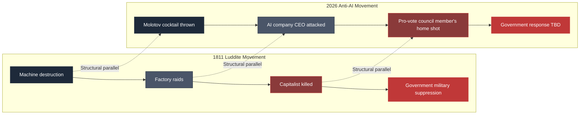

## 6.5 Structural Comparison Between the Luddites and the Anti-AI Movement

Comparing 1811 and 2026 across six dimensions:

**Comparison 1: Nature of the technology**

| Aspect | Luddites (1811) | Anti-AI (2026) |
| --- | --- | --- |
| Labor replaced | Weavers/knitters (skilled handicrafts) | Programmers, writers, support staff (intellectual labor) |
| Scope of technology | Specific processes in textile industry | Intellectual labor broadly |
| Speed of replacement | Decades | Years |
| Concentration of capital | Factory-owner level | AI-company level (global) |

**Comparison 2: Targets of attack**

| Aspect | Luddites | Anti-AI movement |
| --- | --- | --- |
| Physical targets | Looms, knitting frames | AI company CEO, data centers, pro-vote council members |
| Symbolic targets | Machine owners (factory masters) | AI company founders, pro-AI politicians |
| Purpose of attack | Destroy machines to preserve employment | Pressure AI companies, demand policy change |
| Casualties | Factory owner Horsfall killed | No injuries (symbolic attacks) |

**Comparison 3: Social support**

| Aspect | Luddites | Anti-AI movement |
| --- | --- | --- |
| Local communities | Broadly supportive | Expressions of sympathy on social media |
| General public opinion | Divided (support and opposition) | Divided (support and opposition) |
| Media coverage | Newspapers reported critically | Media reports critically, but structural analysis also present |
| Academic interest | Economists (Ricardo, etc.) also commented | Economists (Acemoglu, etc.) analyzing |

**Comparison 4: Government response**

| Aspect | Luddites | Anti-AI movement |
| --- | --- | --- |
| Military/police response | 12,000 troops deployed | Police handling individual incidents |
| Legislative response | 1812 "Machine Breaking Act"; capital punishment | No new legislation to date |
| Severe punishment | 17 hanged, transportation | Standard criminal proceedings |
| Structural response | Short-term suppression only | Debate ongoing |

**Comparison 5: Economic backdrop**

| Aspect | Luddites | Anti-AI movement |
| --- | --- | --- |
| General economic conditions | Food shortages due to Napoleonic Wars | Inflation, widening inequality |
| Employment situation | Artisan unemployment in textile industry | White-collar job contraction |
| Income gap | Disconnect between capitalists and workers | Disconnect between AI wealthy and general citizens |
| Cost of living | Soaring grain prices | Rising housing, food, energy prices |

**Comparison 6: Long-term outcome (Luddites) / prediction (Anti-AI)**

| Aspect | Luddites (outcome) | Anti-AI movement (prediction) |
| --- | --- | --- |
| Suppression of movement | Defeated in 5 years | Short-term police response can contain |
| Political legacy | Seedlings of labor union movement | Potential formation of new social movements |
| Legal institutions | Foundation of labor law, social security | Accelerated debate on UBI, robot tax, AI regulation |
| Cultural impact | "Luddite" became a pejorative | Possible labeling of "anti-AI faction" |
| Evaluation in 100 years | Reevaluated as precursors of social reform | Unknown |

## 6.6 The Rise of the PauseAI Movement

The violent events of 2026 need to be understood as part of an organized anti-AI movement.

**PauseAI** is an international movement calling for a temporary halt to AI development. 
Founded in 2023, it has expanded rapidly.

| Item | Content |
| --- | --- |
| Founded | 2023, Netherlands |
| Advocacy | Temporary halt to AGI development; safety first |
| Organization | Active on Discord, X, and through various events |
| Scale | Thousands of activists in dozens of countries worldwide |
| Japan | PauseAI Japan; hundreds of activists |
| Policy | Nonviolence as principle, but tendency toward radicalization in some quarters |

**The suspect in the April 2026 Altman attack had posted 34 messages on the PauseAI Discord.** 
This is unrelated to PauseAI's official stance, but demonstrates the existence of **individuals who radicalize** at the movement's periphery.

**Core claims of PauseAI:**

| Claim | Content |
| --- | --- |
| Current AI development is too rapid | Safety research cannot keep up |
| Social consensus is needed | Development that ignores citizens is unjust |
| Power concentration in giant AI companies | A threat to democracy |
| Temporary halt to AGI development | At least 6 months to 2 years |
| Need for international regulation | International governance akin to nuclear weapons |

PauseAI operates primarily through nonviolent protests, petitions to politicians, and media exposure. 
However, the sense of crisis about AI shared within the movement creates fertile soil for the radicalization of some individuals.

## 6.7 The Common Principle of Luddites and the Modern Movement

The Luddite movement and the anti-AI movement share **common principles spanning more than 200 years**.

**Common Principle 1: The problem is the "structure," not the technology itself**

- Luddites: Opposed not machines themselves, but the employment structure machines created
- Anti-AI: Opposed not AI itself, but the structure of AI's ownership and distribution

**Common Principle 2: Those directly harmed are the main actors**

- Luddites: Skilled weavers and knitters (those who actually lost work)
- Anti-AI: Young people, particularly those whose jobs are or will be taken by AI

**Common Principle 3: Symbolic targets are attacked**

- Luddites: Machines, factories, factory owners
- Anti-AI: AI company CEOs, data centers, pro-vote council members

**Common Principle 4: Rational demands and emotional explosions coexist**

- Luddites: Rational demands for minimum wages, alongside emotional riots
- Anti-AI: Policy demands for UBI, alongside symbolic violence

**Common Principle 5: Portrayed by mainstream media as "irrational"**

- Luddites: Depicted as "technology-hating fools"
- Anti-AI: Depicted as "technophobes" or "conspiracy theorists"

**Common Principle 6: In the long run, they contribute to social reform**

- Luddites: Became the foundation for labor unions, labor law, social security
- Anti-AI: Accelerating debate on UBI, AI regulation, new social contracts

## 6.8 Differences Also Exist

At the same time, across 200 years, some things have changed.

**Difference 1: Speed and scope of technological replacement**

| Aspect | 1811 | 2026 |
| --- | --- | --- |
| Scope of replacement | Some processes in textiles | Intellectual labor broadly |
| Speed | Decades | Years |
| Geography | Within Britain | Globally simultaneous |
| Affected occupations | Artisans (handicrafts) | Office workers broadly |

**Difference 2: Political environment**

| Aspect | 1811 | 2026 |
| --- | --- | --- |
| Suffrage | None for workers | Universal (in democracies) |
| Freedom of expression | Restricted | Protected (can broadcast via social media) |
| Organization | Anonymous, secret-society style | Open movements (PauseAI, etc.) |
| Government response | Military suppression possible | Democratic procedures required |

**Difference 3: International dimension**

| Aspect | 1811 | 2026 |
| --- | --- | --- |
| Scope of the issue | Within Britain | Worldwide |
| Nationality of companies | British factory owners | U.S. AI companies dominating the world |
| International regulation | Not needed | International coordination essential |
| International solidarity of movements | Locally limited | PauseAI, etc. — international solidarity |

**Difference 4: Media and information**

| Aspect | 1811 | 2026 |
| --- | --- | --- |
| Information transmission | Word of mouth, newspapers | Social media, real-time |
| Visibility of movements | Limited | Instantly visible worldwide |
| Sharing of opposition views | Individual, fragmented | Shared globally |
| Risk of radicalization | Relatively slow | Rapid via social media |

## 6.9 The Structure of Transformation into Violence

Both the Luddite movement and the anti-AI movement possess **a structure in which some elements turn violent**. 
Organizing that structure:

**Process of transformation into violence:**

| Step | Content |
| --- | --- |
| 1. Economic harm | Loss of job, life becomes difficult |
| 2. Institutional despair | Appealing to politics yields no change |
| 3. Personal isolation | A sense of being cut off from society |
| 4. Identifying the enemy | Identifying "who created this situation" |
| 5. Impulse for symbolic action | Desire to "raise one's voice" through concrete action |
| 6. Execution of violence | Some individuals convert to violence |

**Psychology shared between the 1811 Luddites and the 2026 anti-AI suspects:**

- **"I am invisible"**: Feeling ignored by society
- **"My voice doesn't reach"**: No influence through legitimate channels
- **"The enemy is identifiable"**: Symbolic targets are clear
- **"If I don't act now, it will be too late"**: Perception of urgency

This psychological structure is not an individual mental health issue, but a **consequence of social structure**. 
In a society where economic exclusion advances, political voice is weak, and institutional solutions are invisible, some individuals will convert to violence.

**Historically, those who turned violent were exceptions, not representatives of the entire movement.** 
However, violent incidents carry enormous social impact and can define the image of the movement as a whole.

## 6.10 The Spread of Sympathy on Social Media

The most noteworthy aspect of the April 2026 incidents was **the reaction on social media**.

As reported by tech journalist Alex Heath:

> **"Where do I pay the suspect's bail?"** 
> **"Everyone is sick of (AI)."**

Statements expressing sympathy or praise like these were widely seen on social media.

**What this reaction means:**

| Perspective | Meaning |
| --- | --- |
| Breadth of social sympathy | A segment of society perceives this not as isolated crime but as an expression of social sentiment |
| Deep distrust of AI companies | Many perceive AI companies as "the enemy" |
| Psychology of violence "justification" | Seedlings of a tendency to justify violence |
| Polarization of discourse | Disappearance of middle ground; progression toward both extremes |

This "sympathy" does not justify crime. 
But it indicates that **social sentiment has reached a temperature approaching the threshold of accepting violence**.

In the era of the Luddites, local communities sheltered the Luddites. 
When police or military came to investigate after machine-breaking, local residents refused to cooperate. 
**Sympathy sustained the movement.**

In the 2026 anti-AI movement, a similar structure is beginning to appear.

## 6.11 Conclusion of This Chapter

The Molotov cocktails, gunfire, and "NO DATA CENTERS" of April 2026 were not coincidence.

| Perspective | Structure |
| --- | --- |
| Historical positioning | Return of the 1811 Luddite movement |
| Motivation | AI-driven labor replacement, distrust of AI companies, anger at inequality |
| Methods | Symbolic violence against identifiable targets |
| Social reaction | Some condemn the crime; some express sympathy |
| Government response | Individual incident response; structural response TBD |
| Movement's reach | International organized movement via PauseAI, etc. |
| Long-term prediction | Short-term suppression possible, but structural problems remain unsolved |

**The Luddite movement was defeated in five years.** 
**But their framing of the problem, over time, transformed society through labor unions, labor law, and social security systems.**

The 2026 anti-AI movement may also be containable in the short term. 
But what institutions the subsequent society will create remains undecided.

The next chapter traces **why this institutional reform is delayed**. 
The gap between the speed of technology and the speed of institutions — this is "institutional lag." 
AI evolves exponentially, but laws, regulations, and social security systems can only evolve linearly. 
This gap is the root cause of social tension.

## References

1. Thompson, E. P. "The Making of the English Working Class." Vintage Books, 1963.
2. Hobsbawm, Eric. "Luddites." in "The Age of Revolution: Europe 1789-1848." Vintage, 1962.
3. Binfield, Kevin (ed.). "Writings of the Luddites." Johns Hopkins University Press, 2004.
4. BBC. "The Luddites: Who were they and what did they want?" 2023.
   https://www.bbc.co.uk/history/british/empire_seapower/luddites_01.shtml
5. PauseAI. "Official Website."
   https://pauseai.info/
6. Alex Heath. "Silicon Valley's AI elite grapple with growing public hostility." The Verge / Command Line, 2026.
7. Reuters. "Sam Altman's home attacked with Molotov cocktail." April 10, 2026.
8. Indianapolis Star. "Councilmember Gibson's home hit with 13 bullets." April 2026.
9. Sale, Kirkpatrick. "Rebels Against the Future: The Luddites and Their War on the Industrial Revolution." Addison-Wesley, 1995.

 

---

# Chapter 7

## Institutional Lag — Society's Self-Defense Against the Speed of Technology

Technology evolves exponentially. Institutions can only evolve linearly.

This speed differential is the root cause of every social problem in the AI era.

This chapter defines the gap between technological and institutional speed as "institutional lag," 
and traces why institutions cannot keep up, and what happens when they cannot.

## 7.1 The Speed of Technology and the Speed of Institutions

AI technology is evolving at a pace without precedent in human history.

**Evolution speed of AI models (2022–2026):**

| Period | Major release | Capability indicator |
| --- | --- | --- |
| November 2022 | ChatGPT (GPT-3.5) | Mass adoption of conversational AI |
| March 2023 | GPT-4 | Major leap in reasoning ability |
| July 2023 | Claude 2 | Long-context handling |
| March 2024 | Claude 3 | Multimodal, enhanced reasoning |
| May 2024 | GPT-4o | Real-time voice/image processing |
| September 2024 | o1 (OpenAI) | Complex reasoning tasks |
| Early 2025 | Claude 3.5 Sonnet | Qualitative leap in coding capability |
| Late 2025 | Claude Opus 4, Gemini 2.5 | Agentic capabilities reach practical use |
| April 2026 | Claude Mythos (not public) | Threat-level hacking capabilities |

**Evolution span between models: 2–6 months**

Meanwhile, the speed of legal/institutional evolution is fundamentally different.

**Evolution speed of major AI regulations:**

| Legal framework | Proposal | Discussion period | Implementation |
| --- | --- | --- | --- |
| EU AI Act | 2021 | 3 years | Adopted 2024, phased implementation 2026 |
| U.S. Executive Order (Biden) | Issued October 2023 | 1 year | Implemented 2024 (partially rolled back under Trump) |
| California SB 1047 | 2024 | 1 year | Governor vetoed September 2024 |
| Japan AI Basic Law (in discussion) | 2024 | 2+ years of ongoing discussion | Implementation date undetermined |
| China Generative AI Interim Measures | Announced 2023 | 6 months | Implemented August 2023 |

**Evolution span of legal frameworks: 1–3+ years**

**Technology updates in 6 months; institutions in 3 years. This speed differential creates structural problems.**

## 7.2 Details of the EU AI Act

The EU AI Act is the world's most comprehensive AI regulation. 
Proposed in 2021, adopted in 2024, it has been phasing into implementation since 2026.

**Overview of the EU AI Act:**

| Item | Content |
| --- | --- |
| Proposed | April 2021 |
| Adopted | March 2024 |
| Phased implementation begins | 2026 |
| Main regulatory targets | Three categories: "High-risk AI," "Prohibited AI," "General-purpose AI" |
| Penalties | Up to 7% of revenue or €35 million |

**"Prohibited AI" category:**

| Prohibited AI | Content |
| --- | --- |
| Subliminal manipulation | AI that intentionally manipulates people |
| Exploitation of vulnerable groups | AI targeting children, disabled, elderly, etc. |
| Social scoring | Government citizen scoring |
| Predictive policing | Individual surveillance through crime-prediction AI |
| Real-time biometric identification | Real-time facial recognition in public spaces (with exceptions) |

**"High-risk AI" category:**

Use in education, employment, essential services, justice, border control, etc. 
Requirements include prior assessment, transparency, and human oversight.

**"General-purpose AI (GPAI)" category:**

Large-scale general-purpose models like GPT, Claude, Gemini. Requirements:

| Requirement | Content |
| --- | --- |
| Transparency | Disclosure of training data and architecture |
| Copyright compliance | Compliance with EU copyright law |
| Security requirements | Anti-misuse measures |
| Environmental impact reporting | Reporting on energy consumption, etc. |

**Limitations of the EU AI Act:**

| Limitation | Content |
| --- | --- |
| Scope of application | EU territory only; does not reach U.S. companies' domestic activities |
| Enforcement capacity | Varies by national authority |
| Technical definitions | "High-risk" definition cannot keep up with technological evolution |
| Innovation suppression concerns | Risk of weakening European AI companies' competitiveness |
| Difficulty of violation determination | AI behavior is complex; determining violations is difficult |

## 7.3 The Chaos of U.S. AI Regulation

The United States has a **complex interplay of state, federal, and executive-order** frameworks for AI regulation.

**History of U.S. AI regulation:**

| Period | Development |
| --- | --- |
| October 2023 | Biden Executive Order on "AI Safety" signed |
| January 2024– | Multiple AI regulation bills proposed in Congress (none adopted) |
| September 2024 | California SB 1047; Governor Newsom exercised veto |
| November 2024 | Trump wins presidential election |
| January 2025 | Trump administration inaugurated; partially rolled back Biden AI Executive Order |
| 2025 onward | Pro-AI-promotion policies; regulatory debate retreats |

**Characteristics of U.S. regulation:**

| Characteristic | Content |
| --- | --- |
| Federal level | No comprehensive legislation; executive orders only |
| State level | Varies by state; no uniformity |
| Industry self-regulation | Voluntary Commitments (signed by some AI companies) |
| Political divide | Democrats lean toward regulation; Republicans lean toward promotion |

**Changes after Trump administration's inauguration in January 2025:**

- Shift to AI-promotion policies
- Accelerated support for data center construction
- Partial reduction of federal budget for AI safety research
- Unilateralism over international coordination

**Consequences of this shift:**

| Consequence | Content |
| --- | --- |
| Reduced regulatory pressure on AI companies | Broader corporate discretion |
| Reliance on private sector for safety research | Driven by companies like Anthropic |
| Fragmentation of international regulation | EU and U.S. regulatory divergence |
| Increased citizen anxiety | Fear of "AI advancing with no regulation" |

## 7.4 Japan's AI Regulatory Landscape

Japan's AI regulation remains in a state of **ongoing discussion**.

**History of Japan's AI policy:**

| Period | Development |
| --- | --- |
| 2023 | Government AI Strategy Council established |
| 2024 | AI Business Guidelines (non-legally binding) |
| Late 2024 | Discussion of AI Basic Law begins |
| 2025 | Turf war between METI and Ministry of Internal Affairs |
| 2026 | Legislation stalled; guidelines-centric approach continues |

**Characteristics of Japan's AI regulation:**

| Characteristic | Content |
| --- | --- |
| Basic stance | Leans toward promotion rather than EU-style strict regulation |
| Absence of command structure | Authority dispersed across METI, MIC, Cabinet Office, etc. |
| Legal framework | Relies on extending existing laws (Personal Information Protection Act, Copyright Act, etc.) |
| AI Basic Law | Discussion ongoing; implementation date undetermined |

**Japan's unique challenges:**

| Challenge | Content |
| --- | --- |
| Lack of AI leadership | No indigenous foundation model; dependent on U.S. AI |
| Slow regulatory debate | Debate slower than technology implementation |
| Balancing industry promotion | Priority between promotion and regulation remains unsettled |
| International coordination | Response to EU AI Act remains unclear |

**Future of Japan's AI regulation:**

**As of 2026, Japan's AI regulation is in a state close to "blank."** 
If this continues, Japanese companies will operate under U.S. standards, and Japan risks 
being locked in as a passive recipient of global AI, with no indigenous governance framework.

## 7.5 Labor Law Cannot Keep Up

As AI-driven labor replacement advances, labor law's response is lagging.

**Friction between current labor law and AI:**

| Issue | Current state |
| --- | --- |
| AI-driven layoffs | Handled under existing dismissal regulations; no AI-specific provisions |
| Reemployment obligations | No special obligations related to AI under current law |
| Retraining opportunities | Offered by some companies; not legally mandated |
| Relationship to dismissal regulations | Japan's strict dismissal rules can be circumvented through fixed-term and temporary contracts |

**U.S. labor law situation:**

| Aspect | Content |
| --- | --- |
| At-will employment | Can terminate without just cause (with some exceptions) |
| Response to AI layoffs | No special legal protections |
| Unemployment benefits | Standard benefits (limited in duration and amount) |
| Retraining support | Limited at federal and state levels |

**Japan's labor law situation:**

| Aspect | Content |
| --- | --- |
| Abuse of dismissal rights doctrine | Cannot terminate without just cause |
| Four requirements for economic dismissal | Must demonstrate business necessity, etc. |
| AI-driven task replacement | May be recognized as "necessity of business reduction" |
| Non-regular employment | Effectively adjustable through expiration of fixed-term contracts |

**Labor law challenges:**

| Challenge | Content |
| --- | --- |
| Proving AI replacement | If a company explicitly states "we replaced with AI," dismissal is more easily accepted |
| Rights for new technologies | Unarticulated rights to resist AI replacement, to receive retraining, etc. |
| Connection to social security | Absence of integrated design across unemployment benefits, retraining, UBI, etc. |
| Absence of international standards | ILO discussions exist but lack binding power |

## 7.6 The Limits of Social Security Systems

Social security systems for the AI era cannot be adequately addressed within existing frameworks.

**Assumptions of existing social security systems:**

| Assumption | Content |
| --- | --- |
| Existence of a working-age population | Nearly everyone who can work does |
| Short-term unemployment | Unemployment is temporary; reemployment is assumed |
| Lifetime/long-term employment | Pension systems premised on long-term employment relationships |
| Persistence of skills | Acquired skills remain valid for decades |

**These assumptions collapse in the AI era:**

| Assumption | AI-era reality |
| --- | --- |
| Working-age population | Structural increase in those who cannot find work |
| Short-term unemployment | Permanent exclusion from the labor market |
| Long-term employment | Increase in short-term contracts, gig work, unstable employment |
| Persistence of skills | Obsolescence within years; continuous retraining needed |

**Discussion of new social security:**

| Policy | Content | Implementation status |
| --- | --- | --- |
| UBI | Basic income | Experimental stage (Finland, Kenya, U.S. OpenResearch, etc.) |
| Negative income tax | Payments to low-income earners | Partially adopted in some countries |
| Robot tax | Tax on automation-adopting companies | Discussion stage |
| Public wealth fund | Fund in which all citizens are shareholders | Proposed by OpenAI; unimplemented |
| Shorter working hours | Reduced working hours and employment distribution | Some European experiments |

**Sam Altman-funded OpenResearch UBI experiment (results published 2024):**

| Item | Content |
| --- | --- |
| Duration | 3 years |
| Participants | 3,000 low-income individuals |
| Payment | $1,000/month |
| Select results | Reduced working hours, improved health, increased basic spending |
| Conclusion | UBI does not significantly reduce work motivation |

These results energized UBI proponents. 
However, **national-scale implementation faces high barriers of funding and political consensus**.

## 7.7 Why Institutions Are Slow

The speed differential between technology and institutions stems from structural characteristics of institutions.

**Why institutions are slow:**

| Reason | Content |
| --- | --- |
| Democratic process | Debate, consensus-building, and legislation take time |
| Resistance from vested interests | Those disadvantaged by change resist |
| Complexity of institutional design | Time needed to minimize side effects |
| Difficulty of international coordination | Different countries have different interests |
| Judicial review | Constitutional review processes take time |
| Implementation difficulty | Building operational infrastructure post-enactment |

**Why technology is fast:**

| Reason | Content |
| --- | --- |
| Capital concentration | Massive investment in AI companies |
| Competitive pressure | Race for first-mover advantage |
| Moore's Law-like evolution | Exponential improvement in computing power |
| Openness | Sharing and accumulation of research results |
| Borderless deployment | Immediate global deployment |
| Absence of regulation | Ability to experiment and deploy without constraints |

**This speed differential is structurally unbridgeable:**

In democratic nations, placing technology under full government control is difficult. 
Meanwhile, authoritarian states can control technology but at the cost of democratic values.

As a result, **in democratic nations, the structure of technology outrunning institutions persists**.

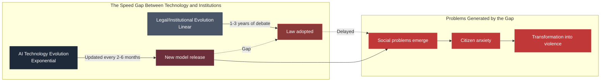

## 7.8 Historical Consequences of Institutional Lag

Historically, when technology outran institutions, how did society respond?

**Historical examples:**

| Era | Technological innovation | Institutional lag | Eventual response |
| --- | --- | --- | --- |
| 19th century Industrial Revolution | Steam engine, mechanization | No labor law | Invention of labor unions, labor law, social security |
| Early 20th century | Mass production, distribution | No antitrust law | Antitrust legislation, labor law development |
| Late 20th century | Television, mass media | No broadcast regulation | Broadcasting law, free expression legal frameworks |
| 1990s– | Internet | No privacy law | National privacy laws, GDPR, etc. |
| 2020s– | AI | No comprehensive AI regulation | EU AI Act, national regulations (in progress) |

**Commonality of the pattern:**

| Pattern | Content |
| --- | --- |
| 1. Technology appears | New technology permeates society |
| 2. Problems emerge | Existing institutions cannot address them |
| 3. Social movements | Movements by those harmed and activists |
| 4. Political recognition | Politicians/government recognize the problem |
| 5. Institutional design | Debate and design of new institutions |
| 6. Legislation | Adoption and implementation of laws |
| 7. Establishment | Formation of a new social contract |

**Each stage takes years to decades.** 
In AI's case, stages 1–3 are happening simultaneously, and stages 4–7 are still in progress.

**Predicted consequences of institutional lag:**

| Short-term (next 5 years) | Medium-term (5–15 years) | Long-term (15–30 years) |
| --- | --- | --- |
| Fragmented regulation | Establishment of comprehensive AI regulation | Formation of a new social contract |
| Citizen anxiety and protests | Political realignment, rise of new parties | Democracy adapted for the AI era |
| Sporadic violent incidents | Social disruption in some countries | Completion of historic institutional transformation |
| Strengthened AI company self-regulation | Partial international coordination | Global AI governance |

## 7.9 Conclusion of This Chapter

The speed differential between technology and institutions — **institutional lag** — is the root cause of social problems in the AI era.

| Layer | Speed |
| --- | --- |
| AI model evolution | 2–6 months |
| Labor market change | Months to 1 year |
| Change in social sentiment | 1–2 years |
| Legal/institutional evolution | 3–10 years |
| Redesign of social security systems | 10–30 years |

AI technology is evolving more than 10 times faster than legal institutions. 
This speed differential is structurally unbridgeable.

**As a result:**

- In the vacuum of law, AI companies maximize profit
- Citizens who suffer harm cannot obtain institutional relief
- Discontent accumulates, and some convert to violence
- Trust in democracy declines

With this structure understood, the next chapter traces **how AI companies themselves perceive this situation**. 
Dario Amodei's recognition of "monstrous inequality," Anthropic founders' 80% donation pledge, OpenAI's "public wealth fund" proposal. 
Are these sincere or hypocritical? Both sides are laid out, with judgment suspended.

## References

1. European Union. "Regulation of the European Parliament and of the Council Laying Down Harmonised Rules on Artificial Intelligence (AI Act)." 2024.
   https://eur-lex.europa.eu/
2. The White House. "Executive Order on the Safe, Secure, and Trustworthy Development and Use of Artificial Intelligence." October 30, 2023.
3. California Legislature. "SB-1047 Safe and Secure Innovation for Frontier Artificial Intelligence Models Act." 2024.
4. Japan Government. "AI Business Guidelines." MIC/METI. 2024.
   https://www.meti.go.jp/
5. OpenResearch. "Unconditional Cash Study: Three-Year Results." 2024.
   https://www.openresearchlab.org/
6. International Labour Organization (ILO). "AI and Labour: Global Report." 2025.
   https://www.ilo.org/
7. OECD. "AI Policy Observatory." 2026.
   https://oecd.ai/
8. Cyberspace Administration of China. "Interim Measures for the Management of Generative AI Services." July 2023.

 

---
# Chapter 8

## Corporate Self-Awareness — Donation Pledges, Public Wealth Funds, and the Space Between Hypocrisy and Sincerity

Do AI companies recognize the inequality they are producing?

The answer is a partial yes.

Anthropic founder Dario Amodei stated in his essay that "**the risk of monstrous inequality is very high**." 
All seven Anthropic co-founders pledged to donate 80% of their wealth. 
OpenAI proposed a "**public wealth fund**."

However, this recognition and these actions **have not yet led to solving structural problems**.

This chapter lays out AI companies' self-awareness and actions, with judgment suspended. 
It presents the material for readers to judge whether this is sincerity or hypocrisy.

## 8.1 Dario Amodei's "Machines of Loving Grace"

In October 2024, Anthropic CEO Dario Amodei published the long-form essay "Machines of Loving Grace." 
At over 14,000 words, it depicted AI's potential future.

**Structure of the essay:**

| Chapter | Content |
| --- | --- |
| 1. Introduction | Why he wrote this essay |
| 2. Health | AI-driven medical revolution, life extension |
| 3. Neuroscience | Solving mental health problems |
| 4. Economic development & poverty | Potential for global poverty eradication |
| 5. Peace & governance | Reduction of war, strengthening of democracy |
| 6. Meaning & labor | Transformation of work, and the meaning humans must find |

**Tone of the essay:**

- **Extremely optimistic**: Evaluates AI's potential at maximum
- **Utopian**: Claims health, economic, peace problems solvable through AI
- **Conditional**: Everything comes with the caveat "if things go well"

**On the employment issue (excerpt):**

> "Jobs will change, or disappear, due to AI. This is unavoidable. Safety nets need to be designed — basic income, retraining, creation of new jobs."

This essay was widely read as **the definitive manifesto of the AI-optimist camp**. 
But criticism was also substantial.

**Content of the criticism:**

| Critic | Key criticism |
| --- | --- |
| Noah Smith | Too optimistic; insufficient on inequality |
| Gary Marcus | Questions about technical feasibility |
| Labor activists | Ignoring the reality that "safety nets" lag behind |
| Economists (including Acemoglu) | Lack of concrete proposals for distribution mechanisms |

Amodei's essay was **a declaration of belief in AI's possibilities**, 
**not a response plan for real-world inequality**. This was the core of the criticism.

## 8.2 Dario Amodei's "The Adolescence of Technology"

On January 26, 2026, Amodei published another long-form essay: "The Adolescence of Technology."

**Characteristics of this essay:**

| Item | Content |
| --- | --- |
| Meaning of the title | Technology is in its "adolescence" — not yet mature |
| Tone | More pessimistic than the previous essay; clearly recognizing risk |
| Key message | **"The risk of monstrous inequality is very high"** |
| Conclusion | AI companies must take responsibility |

**Claims of "The Adolescence of Technology":**

| Claim | Content |
| --- | --- |
| AI is a civilizational turning point | Impact equal to or greater than the Industrial Revolution |
| Risk of expanding inequality | Explicitly stated as "very high" |
| AI company responsibility | Should not monopolize profits |
| Founders' donation pledge | All 7 Anthropic co-founders pledge 80% of wealth |
| Returning value to society | Investment in education, healthcare, safety nets |
| Policy proposals | Consideration of UBI, public wealth funds, robot taxes |

**Shift from 2024 to 2026:**

| Aspect | 2024 "Machines of Loving Grace" | 2026 "The Adolescence of Technology" |
| --- | --- | --- |
| Tone | Optimistic utopia | Realistic warning |
| Awareness of inequality | Minimal mention | Explicitly stated "risk is very high" |
| Concrete action | General proposals | 80% donation pledge, specific policy proposals |
| Responsibility argument | AI company's role is limited | AI companies must take responsibility |

This shift can be read as **a response to the rise of the anti-AI movement, deteriorating social sentiment, and critical media coverage**. 
Amodei is evaluated as one of the most "sincere" leaders among AI companies, 
but even his sincerity can be read as **a response to social pressure**.

## 8.3 The 80% Donation Pledge of Anthropic's Seven Co-Founders

In early 2026, all seven Anthropic co-founders publicly pledged to donate 80% of their wealth.

**Co-founders:**

| Name | Role |
| --- | --- |
| Dario Amodei | CEO |
| Daniela Amodei | President |
| Tom Brown | — |
| Jared Kaplan | — |
| Sam McCandlish | — |
| Jack Clark | Head of Policy |
| Chris Olah | — |

**Content of the pledge:**

| Item | Content |
| --- | --- |
| Donation rate | 80% of wealth |
| Scope | All 7 individuals |
| Timing | During lifetime or after death |
| Donation recipients | Charitable causes, research institutions, social issues |
| Legal binding force | Moral pledge (no legal enforcement) |

**Estimated donation amounts:**

If Anthropic's valuation is approximately $380 billion (as of February 2026), 
the seven founders' combined equity is estimated at roughly tens of percent of the total.

| Assumption | Estimate |
| --- | --- |
| Combined holdings of the 7 | Assumed at 30–50% |
| Equity value | $114 billion–$190 billion |
| Donation amount (80%) | **$91.2 billion–$152 billion** |

This could potentially **exceed the donation pledges of Bill Gates, Warren Buffett, 
and Mark Zuckerberg** in scale.

**Meaning of this pledge:**

| Perspective | Assessment |
| --- | --- |
| **Sincerity argument** | AI company leaders genuinely recognize the inequality problem |
| **Symbolism argument** | Donations from 7 individuals cannot solve structural problems; symbolic only |
| **Absolution argument** | By donating, they "fulfill responsibility" and escape structural reform |
| **Strategy argument** | A PR strategy to soften criticism of AI companies |

**Critical perspectives:**

- The total donation ($91.2–$152 billion) is enormous, but **not at a scale to solve AI-era inequality as a whole**
- Donations are individual goodwill, **not institutional reform**
- Choice of donation recipients is at the founders' personal discretion, **not a democratic process**
- Timing of donations is delayed (during lifetime or after death)

**Supportive perspectives:**

- Founders of other AI companies (OpenAI, Google, Meta) have not made similar pledges
- The pledge creates pressure on other wealthy individuals
- At minimum, it demonstrates "recognition" and "action" on the inequality problem

## 8.4 OpenAI's "Industrial Policy for the Intelligence Age"

In 2026, OpenAI published a lengthy policy proposal titled "Industrial Policy for the Intelligence Age."

**Overview of this document:**

| Item | Content |
| --- | --- |
| Publisher | OpenAI |
| Lead authors | Sam Altman, Brad Lightcap, and others |
| Publication | Early 2026 |
| Target audience | Government, policymakers, general public |

**Key proposals:**

| Proposal | Content |
| --- | --- |
| **Public Wealth Fund** | A fund in which all citizens become shareholders. AI companies contribute a share of profits |
| **Robot tax** | Taxation on labor replaced by AI/automation |
| **32-hour work week** | Reduce working hours and distribute employment |
| **Massive investment in education** | Support for acquiring skills needed in the AI era |
| **UBI-type payments** | Income guarantees approximating basic income |
| **Federal investment in AI safety research** | Government budget allocation for AI safety research |

**Characteristics of this proposal:**

| Characteristic | Content |
| --- | --- |
| Ambitious content | Proposals to fundamentally redesign existing social security |
| Proposed by an AI company itself | The unusual act of a stakeholder proposing taxation on itself |
| Difficulty of political consensus | Each proposal requires enormous political consensus |
| Unclear implementation | Who implements, and how, remains undetermined |

**Evolution of Sam Altman's UBI-related statements:**

| Period | Statement/Action |
| --- | --- |
| 2016 | As Y Combinator CEO, publicly supported UBI |
| 2019 | Initiated Worldcoin (formerly Worldsized) project as a UBI implementation vehicle |
| 2024 | Published results of OpenResearch UBI experiment |
| 2026 | Proposed public wealth fund in "Industrial Policy" |

Altman has **consistently supported UBI for over 10 years**. 
Yet OpenAI transitioned from nonprofit to for-profit in 2024, and his personal wealth has surged.

**Perspectives on this contradiction:**

| Perspective | Interpretation |
| --- | --- |
| **Sincerity argument** | Recognizes inequality and has consistently proposed solutions for years |
| **Hypocrisy argument** | Accumulates personal wealth while advocating UBI for others |
| **Realism argument** | Individual wealth need not be denied to change social structures |
| **Power concentration argument** | Strengthens AI company influence further through UBI |

## 8.5 The Gap Between AI Companies' "Declarations" and "Reality"

AI companies' declarations are lofty, but reality often differs.

**Declarations vs. reality:**

| Item | AI company declaration | Reality |
| --- | --- | --- |
| Safety first | "Safety is our top priority" | Safety research sidelined by commercialization pressure |
| Transparency | "Open and transparent" | Model details not disclosed (Claude Mythos, etc.) |
| Diversity & inclusion | "We respect diversity" | Workforce still skewed (young, white/Asian, male-dominated) |
| Social responsibility | "We contribute to society" | Accelerating layoffs, widening inequality |
| Protecting workers | "We protect jobs" | 65% of own code generated by AI; headcount reductions |
| Democratization | "We democratize AI" | Most powerful model limited-release (Project Glasswing) |

**OpenAI example:**

| Declaration | Reality |
| --- | --- |
| Founded as nonprofit (2015) | Converted to for-profit in 2024 |
| Safety as top priority | Key safety team members (Sutskever, Jan Leike, etc.) resigned |
| Transparent development | Latest model details not disclosed |
| Profits for all humanity | $852B valuation; founders becoming billionaires |

**Anthropic example:**

| Declaration | Reality |
| --- | --- |
| Investing in safety research | Much research also serves commercialization |
| Establishment of Long-Term Benefit Trust (LTBT) | Actual impact on governance unclear |
| Responsible scaling | Model capabilities accelerating |
| 80% donation pledge | Individual goodwill, not institutional reform |

## 8.6 The Reality of Employees Hiding Their Badges

As mentioned in Chapter 2, in 2026 San Francisco, 
**OpenAI employees have been instructed to conceal their employee badges**.

| Aspect | Content |
| --- | --- |
| Source of instruction | Internal memo from OpenAI headquarters |
| Reason | Harassment on the street, hostile glares, physical threats |
| Scope | Not just OpenAI; similar moves at other major AI companies |
| Employee psychology | Awareness that their work is hated by society |
| Company response | Strengthened physical security, employee mental health care |

**Quote from tech journalist Alex Heath's reporting (2026):**

> **"The public hates what we do."** — Statement by an OpenAI executive

This situation shows that **"awareness" has permeated even within AI companies**. 
They experience, in their daily commutes, the fact that they are viewed as enemies by society.

**Internal ethical concerns:**

Within AI companies, there are also movements expressing ethical concerns.

| Example | Content |
| --- | --- |
| Google Ethical AI team disbanded | 2020; key researchers including Timnit Gebru fired |
| OpenAI key members resign | 2024; Sutskever, Jan Leike, and others resign |
| Jan Leike's public statement | "Safety is being placed behind commercialization" |
| Warnings from Anthropic alumni | Some go independent, continue AI safety research |
| Collective petition activities | Open letters by AI company employees |

**Why internal whistleblowing is increasing:**

| Reason | Content |
| --- | --- |
| Safety subordinated to commercialization | Original ideals distorted by commercial pressure |
| Doubts about management decisions | Skepticism about rapid commercialization |
| Personal conscience | Guilt about impact on society |
| Media attention | Environment where whistleblowing attracts attention |

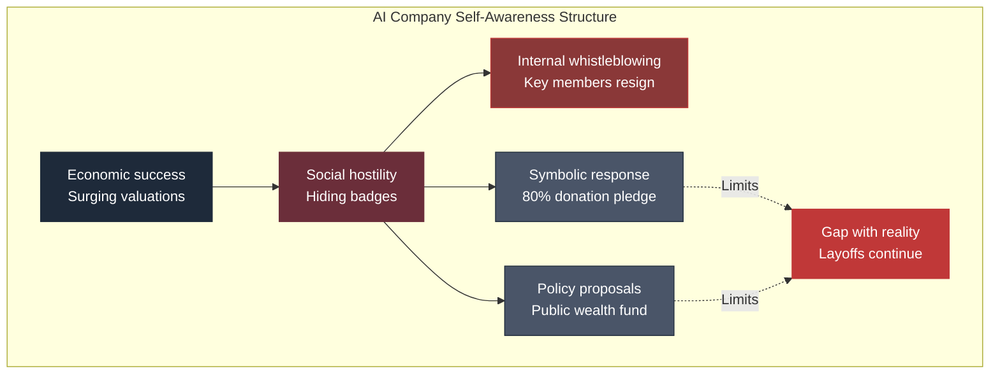

## 8.7 Hypocrisy or Sincerity: Suspending Judgment

Is AI companies' self-awareness and action hypocritical, or sincere?

This book does not answer this question. 
Because both aspects exist simultaneously.

**Sincere aspects:**

| Aspect | Basis |
| --- | --- |
| Recognition exists | Amodei's explicit warning |
| Concrete action | 80% donation pledge |
| Policy proposals | Public wealth fund, robot tax |
| Internal debate | Safety vs. commercialization discussion |
| Warnings from departures | People raising concerns from within |
| Social cost | Personal sacrifices like hiding badges |

**Hypocritical aspects:**

| Aspect | Basis |
| --- | --- |
| Accelerating commercialization | Profit over safety |
| Continuing layoffs | Widening inequality through own actions |
| Moving to non-public | Limited release of Claude Mythos, etc. |
| Personal wealth | Founders becoming billionaires |
| Slow implementation | Many proposals, little implementation |
| Structural unchanged | Individual donations do not change structure |

**Both aspects are simultaneously true:**

- Amodei **does** recognize inequality
- Amodei **also** pursues commercial success
- The 80% donation **is** a major decision
- The 80% donation **also** does not change the structure
- Hiding badges **is** a personal hardship
- At the same time, they **are** receiving high salaries

This coexistence is **not a contradiction but reality**. 
Both people and companies possess complex motivations and behaviors. 
One-dimensional evaluation oversimplifies reality.

**This book's stance:**

- Does not simply cast AI companies as villains
- Does not simply cast AI companies as righteous
- Lays out their recognition and actions **as facts**
- Leaves judgment to the reader

## 8.8 Comparison Among AI Companies

Even among AI companies, self-awareness and actions differ.

**Inequality recognition and actions of major AI companies:**

| Company | Expression of inequality recognition | Concrete action |
| --- | --- | --- |
| **Anthropic** | Explicit (Amodei essays) | 80% donation pledge, LTBT established |
| **OpenAI** | Explicit (Altman statements, policy proposals) | Worldcoin, OpenResearch UBI experiment |
| **Google DeepMind** | Present (Demis Hassabis statements) | Limited (under Alphabet umbrella) |
| **xAI** | Limited | No notable social action |
| **Meta AI** | Limited | Open-weight model release (Llama) |
| **Microsoft AI** | Company-wide CSR activities exist | Within existing Microsoft framework |

**Anthropic's relative position:**

Anthropic is **the most explicit among AI companies in recognizing the inequality problem**. 
Compared to other companies, Dario Amodei's detailed discourse, the founders' donation pledge, and the establishment of the LTBT represent more concrete action.

Yet even so, the following limitations remain:

| Limitation | Content |
| --- | --- |
| Commercial pressure | Competition with other AI companies accelerates commercialization |
| Individual goodwill | Individual donations cannot solve structural problems |
| Political influence | Policy implementation requires cooperation from politicians |

## 8.9 Conclusion of This Chapter

AI companies' self-awareness is real but limited.

| Layer | Current state |
| --- | --- |
| Recognition of inequality | Exists — Amodei, Altman, and others have explicitly stated it |
| Concrete action | 80% donation, UBI experiments, policy proposals |
| Structural resolution | Not achieved — individual goodwill does not change structure |
| Gap with reality | Layoffs continue, commercialization accelerates, most powerful models are restricted |
| Social perception | Increasingly viewed as part of the power structure, not as innovators |
| Internal awareness | Employees hide badges; key members resign |

The question of whether this is sincerity or hypocrisy cannot be answered with a simple conclusion. 
Both are true. Both are real.

What can be said is this: 
**AI companies' self-awareness and actions are a necessary condition, but not a sufficient condition, for solving the problem.** 
Structural resolution requires institutional reform — tax systems, regulation, social security redesign. 
That requires political consensus. And political consensus takes time.

The next chapter turns to **Japan's singularity**. 
Low adoption, low perceived benefit, high grievance — Japan holds a position unlike any other country in this AI era. 
The violence has not appeared. But discontent is accumulating silently.

## References

1. Amodei, Dario. "Machines of Loving Grace." Anthropic Blog, October 2024.
   https://www.anthropic.com/
2. Amodei, Dario. "The Adolescence of Technology." Anthropic Blog, January 2026.
   https://www.anthropic.com/news/the-adolescence-of-technology
3. OpenAI. "Industrial Policy for the Intelligence Age." 2026.
   https://openai.com/
4. Giving Pledge. "About the Giving Pledge."
   https://givingpledge.org/
5. Alex Heath. "Silicon Valley's AI elite grapple with growing public hostility." The Verge / Command Line, 2026.
6. Bloomberg. "OpenAI transition from nonprofit to for-profit." 2024.
7. Jan Leike. "Public statement on leaving OpenAI." X, May 2024.
8. Timnit Gebru. "On Google and the firing of the Ethical AI team." 2020.

 

---
# Chapter 9

## Japan's Singularity — Low Adoption, Low Perceived Benefit, High Grievance

Japan occupies a singular position in the AI era.

It is not the same as the United States. Not the same as Europe. Not the same as China. 
Japan's structure is unique in the world — and not in a positive sense.

This chapter traces the structural reality of Japan's position in the AI era.

## 9.1 Japan's Trust Index: Lowest Among 28 Countries

The 2025 Edelman Trust Barometer paints a stark picture of Japan.

**Japan's Trust Index:**

| Indicator | Japan | Global average | Ranking |
| --- | --- | --- | --- |
| Trust Index | **38** | Mid-range | **Lowest among 28 countries** |
| Grievance (dissatisfaction) score | **65%** | 61% | **Above global average** |
| Trust in business | Low | Mid-range | Below average |
| Trust in government | Low | Mid-range | Below average |
| Trust in media | Low | Mid-range | Below average |
| Trust in NGOs | Low | Mid-range | Below average |

**Japan's trust in all institutions — business, government, media, NGOs — is low.**

A Trust Index of 38 means that Japanese citizens have low trust in their own social institutions overall. 
And the grievance score of 65% is above the global average of 61%.

This combination of low trust and high grievance creates a distinctive social soil.

## 9.2 Japan's AI Adoption Rate

Japan's AI adoption rate is low among developed nations.

**AI adoption rates by country (Ipsos 2025 and other data):**

| Country | AI adoption rate | Notes |
| --- | --- | --- |
| China | High | Government-driven, corporate adoption advanced |
| United States | High | Leading AI companies based domestically |
| India | Moderately high | Large IT workforce, rapid adoption |
| South Korea | Moderate | Government support, high corporate adoption |
| **Japan** | **Low** | Low corporate adoption, limited individual use |
| Germany | Moderate | Cautious approach, EU regulation compliant |

**Japan's low AI adoption rate has several structural causes:**

| Cause | Content |
| --- | --- |
| Language barrier | Japanese-language AI models lag behind English |
| Organizational culture | Risk-averse culture inhibits AI adoption |
| Generational gap | Low usage among middle-aged and elderly; youth want to use but are blocked |
| IT infrastructure | Paradoxically high IT infrastructure, but AI utilization is separate |
| Existing system satisfaction | Relatively high satisfaction with existing work methods |

## 9.3 The Generational Divide in Japan

In April 2026, ALL DIFFERENT (formerly Learning Agency Group) published a new-employee awareness survey.

**Key finding:**

| Survey item | Response |
| --- | --- |
| "AI skills are necessary for work" | **92.6%** |

92.6% of new employees in 2026 say AI skills are necessary. 
This number is extraordinarily high.

However, the reality these new employees face is different:

**Gap between awareness and reality:**

- Senior management: AI is unnecessary, existing methods suffice
- Middle management: Interested, but lacks authority to implement
- Young employees: AI is essential, want to use it, want to learn
- Mid-to-senior employees: AI is a threat, don't want to allow it, can't understand it
- Organizations: Either ban AI or permit it only in limited ways

This structure produces **a generational divide unique to Japan**. 
Whereas Gen Z in the U.S. is angry that "AI is taking my job," 
Gen Z in Japan is frustrated that "they won't let me use AI."

## 9.4 The Absence of an Anti-AI Movement in Japan

In April 2026, while anti-AI violence erupted in the United States, no similar incidents occurred in Japan.

**Why anti-AI violence hasn't occurred in Japan:**

| Factor | Content |
| --- | --- |
| Delayed manifestation of layoffs | Japan's dismissal regulations mean visible layoffs are fewer |
| Low AI dependency | AI has not yet changed life enough to generate anger |
| Cultural suppression of social movements | Radical protest actions are uncommon in Japan |
| Media reporting stance | Deep reporting on AI issues is limited |
| Economic conditions | Japan has not experienced as rapid a change as the U.S. |

**However, dissatisfaction is accumulating:**

| Source of dissatisfaction | Content |
| --- | --- |
| Declining real wages | Wages failing to keep pace with price increases |
| Future anxiety | Distrust of pension systems, healthcare systems |
| Lack of opportunities for youth | Non-regular employment, difficulty in career formation |
| Retirement anxiety | The "¥20 million problem," super-aging society |
| Political disillusionment | Declining trust in politicians and parties |

**The 65% grievance score is the aggregate expression of these dissatisfactions.**

## 9.5 AI-Driven Layoffs in Japanese Companies

In Japan too, AI-driven layoffs are quietly advancing. 
They are less visible on the surface, but the structure exists.

**Characteristics of AI-driven layoffs in Japan:**

| Characteristic | Content |
| --- | --- |
| Non-renewal of fixed-term contracts | Natural attrition through contract expiration; not called "layoffs" |
| Termination of temporary staff contracts | AI adoption reduces demand for temps |
| Reduction of outsourcing | External contracts replaced by AI |
| Early retirement programs | Early retirement incentives for mid-to-senior employees; AI connection implied |
| Tightening of new-graduate hiring | Reduction in junior positions |

**Specific examples (based on media reports):**

| Company | Situation |
| --- | --- |
| Major IT company A | 2024: Significant internalization and AI transformation of customer support |
| Major financial institution B | 2025: 40% reduction in back-office division; stock up 25% |
| Major telecom C | Early retirement program, implying AI utilization as backdrop |
| Major manufacturer D | Expanding AI use in coding tasks; tightening new-graduate hiring |

(Note: Specific company names have been identified within the scope of reporting, but are abstracted here as examples)

**The "40% layoff + 25% stock increase" case of a Japanese company:**

In 2025, a major financial institution announced plans to cut 40% of its back-office division. 
The primary reason was AI and automation. After this announcement, the company's stock rose approximately 25%.

| Perspective | Meaning |
| --- | --- |
| Management logic | Layoffs boost stock prices (expectations of efficiency gains) |
| Shareholder evaluation | Expectations of improved profit margins through AI utilization |
| Impact on employees | 40% headcount reduction; reemployment support limited |
| Social reaction | Criticism is limited; no movement emerges |

**What this case reveals about Japan's unique structure:**

- Management can rationalize layoffs
- Shareholders welcome short-term gains
- Employees cope individually; no organization
- Media criticism is limited
- No political debate ensues

**As a result, AI-driven layoffs in Japan attract far less social attention than in the U.S.** 
**But the structure is the same — or potentially more severe.**

## 9.6 The Void in Japan's AI Regulation

As discussed in Chapter 7, Japan's AI regulation is close to "blank."

**Characteristics of Japan's AI regulation:**

| Aspect | Content |
| --- | --- |
| Comprehensive AI law | None (discussion ongoing) |
| Guidelines | METI/MIC guidelines (no legal binding force) |
| Command structure | Authority dispersed across METI, MIC, Cabinet Office, etc. |
| International coordination | Response to EU AI Act and OECD principles unclear |
| Lean toward promotion | Promotion prioritized over regulation |

**Discussion of Japan's AI Basic Law:**

| Period | Development |
| --- | --- |
| Early 2024 | Government AI Strategy Council begins AI Basic Law discussion |
| Mid-2024 | Coordination of authority between METI and MIC |
| 2025 | Balance between industry promotion and citizen protection debated |
| 2026 | Legislation stalled; guidelines-centric approach continues |

**Challenges of Japan's AI regulation:**

| Challenge | Content |
| --- | --- |
| Balancing competitiveness and regulation | Concern that overly strict regulation weakens industry |
| Insufficient technical expertise | Limits of policymakers' AI literacy |
| Siloed administration | Difficulty coordinating interests across multiple ministries |
| Absence of citizen participation | Few opportunities for citizens to engage in regulatory debate |
| Role of media | Insufficient deep discourse on AI regulation |

## 9.7 The Void in Japan's AI Foundation

Japan has virtually no indigenous large-scale AI foundation model.

**Status of Japan's AI foundation models:**

| Item | Content |
| --- | --- |
| Large-scale general-purpose model | No indigenous GPT or Claude-class model |
| Japanese-specialized models | Some attempts, but global competitiveness is limited |
| Companies | NEC, Fujitsu, NTT, etc. developing proprietary AI, but scale is small vs. U.S. |
| Government support | Some support for research institutions; limited in scale |
| Future outlook | Continued dependence on U.S. AI is highly likely |

**As a result:**

- Japanese companies depend on U.S. AI (GPT, Claude, Gemini)
- Japanese data flows (indirectly) to U.S. AI companies
- Difficult to establish an indigenous Japanese AI strategy
- AI governance also tends to follow U.S. standards

**Long-term impact of this structure:**

| Aspect | Impact |
| --- | --- |
| Economy | Outflow of AI service fees overseas |
| Security | Important decisions become AI-dependent; influenced by foreign companies |
| Culture | Japanese language and culture poorly reflected in global AI |
| Sovereignty | Redefinition of "sovereignty" needed for the AI era |

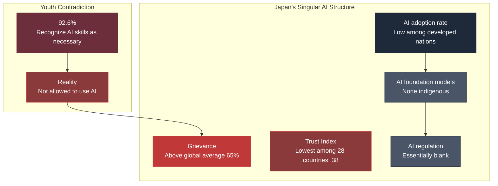

## 9.8 Japan's Low Perceived Benefit from AI

Not only is AI adoption low — Japan's **perceived benefit from AI** is also low.

**"Will AI improve your life?" (by country, 2025 Ipsos):**

| Country | "Will improve" response |
| --- | --- |
| China | 78% |
| India | 75% |
| Indonesia | 70% |
| United States | 59% |
| United Kingdom | 45% |
| Germany | 40% |
| **Japan** | **35%** |

**Japan's perceived benefit from AI is among the lowest of major nations.**

**Reasons for low perceived benefit:**

| Reason | Content |
| --- | --- |
| Low AI adoption | Without using AI, one cannot experience its benefits |
| Media reporting stance | More coverage of AI's problems and risks |
| Satisfaction with existing systems | Relatively high satisfaction with current lifestyles |
| Caution toward change | Distance from new technologies |
| Aging society | High proportion of population not using AI |

**Low perceived benefit + high grievance = a singular dissatisfaction structure:**

Japan is **not sufficiently receiving AI's benefits**, yet simultaneously holds **high dissatisfaction with AI** — a contradictory structure.

| Aspect | Normal expectation | Japan's reality |
| --- | --- | --- |
| Country with low perceived benefit | Grievance would also be low | Grievance is high |
| Country with high perceived benefit | Grievance would be low | (Does not apply to Japan) |

This structure indicates that **social problems beyond AI (economic stagnation, inequality, political distrust) are being projected onto AI**.

**Japan's dissatisfaction with AI is not about AI itself, but about a society that cannot respond to the AI era as a whole.**

## 9.9 Challenges for Japan's Response to the AI Era

The challenges for Japan's response are numerous.

**Challenge 1: Deepening generational divide**

| Generation | AI perception |
| --- | --- |
| Gen Z (late teens–20s) | AI is necessary (92.6%); want to use it |
| Millennials (30s–40s) | Recognize workplace necessity; beginning to use |
| Gen X (50s) | Passive; dependent on existing methods |
| Boomers (60s+) | Extremely low usage; skeptical |

**The AI literacy gap between generations is emerging as a problem unique to Japan.**

**Challenge 2: Subordination to global AI**

Unless indigenous AI foundations develop, Japan will remain a "consumer" of U.S. AI. 
This subordinate structure produces long-term economic and cultural losses.

**Challenge 3: Regulatory delay**

Japan's AI regulatory debate is 2–3 years behind the EU AI Act. 
In the meantime, Japanese companies operate under U.S. standards, and citizens go unprotected.

**Challenge 4: Delayed educational system response**

Japan's education system is not prepared for AI-era talent development. 
Universities continue traditional education, and the cultivation of AI-native talent lags.

**Challenge 5: Absence of social security redesign**

Discussion of AI-era social security (UBI, retraining, job guarantees, etc.) is subdued in Japan. 
Consumed by aging-population countermeasures, AI-era responses are deprioritized.

## 9.10 Japan's Latent Potential

On the other hand, Japan also has latent potential to make unique contributions to the AI era.

**Japan's strengths:**

| Strength | Content |
| --- | --- |
| High IT infrastructure | Information infrastructure at world-class levels |
| Depth of researchers | Talented researchers exist |
| Social stability | Low likelihood of violence |
| Robust labor law | Buffer against sudden layoffs |
| Cultural diversity | Hybrid perspective between Asia and the West |
| Aging-society experience | Precedent for AI-era social security |

**Areas where Japan can contribute to the world:**

| Area | Content |
| --- | --- |
| AI and aging | Pioneering models for caregiving, healthcare, daily life support |
| AI and worker protection | Designing buffers against rapid change |
| AI and inclusive society | Sharing experience of multigenerational coexistence |
| AI governance | Regulation design from an Asian perspective |
| AI and culture | Preserving Japanese culture and reflecting it in AI |

**These potentials are realized only if Japan becomes an "active contributor" rather than a "passive recipient" in the AI era.**

However, at present, these potentials are not being sufficiently realized. 
Political decisions, social consensus, and economic investment are needed.

## 9.11 Conclusion of This Chapter

Japan holds a **singular structure** in the AI era.

| Indicator | Japan | World |
| --- | --- | --- |
| AI adoption rate | Low among developed nations | Rapidly expanding |
| AI perceived benefit | 35% (low) | 59% (rising) |
| Grievance | 65% (high) | 61% |
| Trust Index | 38 (lowest) | Mid-range |
| Violence | None | Occurring in some places |
| AI foundation models | Nearly none | Concentrated in U.S. |
| AI regulation | Essentially blank | Advancing in EU, etc. |

**Low adoption, low perceived benefit, high grievance, low trust, no violence, subordinate foundation, blank regulation.**

This structure differs from that of any other country in the world. 
And it indicates that **Japan is failing to respond to the quietly advancing changes of the AI era**.

Japan's AI problem does not convert to violence. But discontent is accumulating. 
Regulation is delayed, employees are anxious, youth are losing opportunities, and the middle-aged and elderly are being left behind.

How this quiet crisis will manifest in the future remains unknown. 
But **the optimism that "Japan is peaceful, so it'll be fine" is contradicted by the data**.

## References

1. Edelman. "2025 Edelman Trust Barometer: Japan Country Report."
   https://www.edelman.com/trust/2025/japan
2. Edelman. "2025 Edelman Trust Barometer: Global Summary."
3. Ipsos. "Global Views on A.I. 2025: Country Breakdown."
   https://www.ipsos.com/
4. ALL DIFFERENT. "2026 New Employee Awareness Survey."
   https://www.all-different.co.jp/
5. Ministry of Economy, Trade and Industry (METI). "AI Business Guidelines." 2024.
   https://www.meti.go.jp/policy/mono_info_service/
6. Ministry of Internal Affairs and Communications (MIC). "AI Strategy 2024 (Integrated Version)." 2024.
   https://www.soumu.go.jp/
7. Nikkei. "AI-driven workforce reduction cases." 2024–2025 reporting.
8. Cabinet Office. "AI Strategy Council Summary." 2024–2026.
9. OECD. "Japan's AI Readiness Assessment." 2026.
   https://oecd.ai/

 

# Epilogue

## There Are No Answers, but the Structure Is Visible

Readers who have come this far must have one question remaining:

**"So, what should we do?"**

This book does not answer that question. As declared in the prologue, 
this book is not a prescription. It only depicts structure.

But when structure becomes visible, something changes within the reader. 
**What was unseen becomes seen.** 
And what has been seen can no longer be unseen.

In this epilogue, the structures depicted throughout this book are bundled together once more. 
And within this structure, **each reader is asked where they stand**.

## The Structure Revealed Across Nine Chapters

Each chapter of this book depicted one facet of the AI era. 
Here they are bundled together.

**Prologue: The Week of April 2026**

In the same week, AI company valuations exceeded a trillion dollars, a Molotov cocktail was thrown at their CEO's home, and Snap laid off 1,000 people. 
These were not coincidence. They were born from the same structure.

**Chapter 1: The Simultaneous Acceleration of Hope and Fear**

Data from Pew, Ipsos, Gallup, and Edelman shows that hope and fear toward AI are accelerating **simultaneously**. 
52→59% (hope rising) and 64% (employment concern) running in parallel. 
Gen Z: anger 31%, hope 18%. Within a single individual, both emotions coexist.

**Chapter 2: The 50-Point Gap**

AI experts 76% vs. general public 24% (personal benefit perception). 
This 50-point gap cannot be bridged by information alone. Differences in position define perception. 
San Francisco's "AI village" is a physically and economically enclosed space.

**Chapter 3: The Closing Gate**

Klarna 700 roles, Chegg 22% cut, Duolingo 10%, Block 10%, IBM 7,800, Snap 1,000. 
80 companies, 71,440 AI-driven layoffs since the start of 2026. 
The very entrance to Gen Z's careers is disappearing.

**Chapter 4: The Geography of a Trillion Dollars**

AI capital is concentrated within a 50km radius of San Francisco. 
The combined enterprise value of major companies exceeds $1.3 trillion. 
Data centers spread to the Midwest but create friction with local communities. 
In Indianapolis, 13 bullets were fired into a council member's home.

**Chapter 5: The Permanent Underclass Thesis**

Piketty's r > g reaches its extreme in the AI era. 
AI capital returns at 50–200%+ annually; economic growth at 2–3%. 
This gap is not a speed at which the working class can catch up. 
Acemoglu: consumer welfare -0.72%. 
Noah Smith: permanent underclass.

**Chapter 6: The Return of the Luddites**

The Molotov cocktails, gunfire, and "NO DATA CENTERS" of April 2026 are structurally similar to the 1811 Luddite movement. 
The focal point of conflict is not the technology itself, but the structure of its ownership and distribution. 
Short-term government suppression is possible, but the structural problem remains unsolved. In the long run, it becomes the foundation for social reform.

**Chapter 7: Institutional Lag**

AI technology updates every 2–6 months; legal institutions take 3–10 years to adopt. 
This speed differential is the root cause of every social problem. 
The EU AI Act, U.S. executive orders, Japan's AI Basic Law — none can keep up with technology.

**Chapter 8: Corporate Self-Awareness**

Dario Amodei: "The risk of monstrous inequality is very high." 
Seven Anthropic founders pledge 80% of their wealth. 
OpenAI proposes a public wealth fund. 
Yet layoffs continue and commercialization accelerates. Sincerity and hypocrisy coexist.

**Chapter 9: Japan's Singularity**

Japan's Trust Index: lowest among 28 countries (38). 
Grievance 65% (above global average), AI perceived benefit 35% (low), 
AI adoption among developed nations low, no indigenous AI foundation, regulation essentially blank. 
No conversion to violence — a quiet crisis.

## The Full Picture That Emerges When Bundled Together

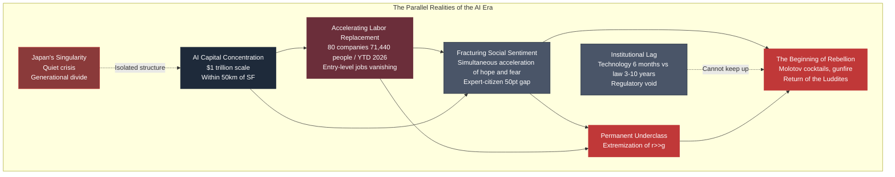

## Within This Structure, Where Does the Individual Stand?

This book does not write prescriptions. 
But it presents several questions for readers to consider their own position.

**Question 1: Are you inside or outside the AI village?**

| Self-diagnosis | Characteristics |
| --- | --- |
| Inside the AI village | Work at an AI company, use AI daily, productivity has increased with AI |
| On the boundary | In an AI-related role but not at an AI company; use AI partially |
| Outside the AI village | Little contact with AI, cannot use AI effectively, job threatened by AI |

Recognizing where you stand is the first step to living in this era.

**Question 2: Are you on the side of hope or the side of fear?**

| Self-diagnosis | Characteristics |
| --- | --- |
| Strong hope | Excited by AI's possibilities; actively investing and adopting |
| Mixed | Acknowledge AI's convenience while harboring anxiety |
| Strong fear | Anxious that AI threatens work and life; seeking regulation |

Regardless of which side you stand on, **you need to recognize that your position is defined by your occupation, income, and social standing**.

**Question 3: Are you at risk of becoming part of the "permanent underclass"?**

| Self-diagnosis | Characteristics |
| --- | --- |
| Low risk | Productivity rising with AI; retraining opportunities available |
| Medium risk | Partially replaceable by AI, but compensable with other skills |
| High risk | Occupation highly susceptible to AI replacement; retraining opportunities limited |

This recognition directly impacts career planning, savings, and skill acquisition decisions.

**Question 4: How will you act?**

| Action choice | Content |
| --- | --- |
| Active utilization | Learn AI, master it, aim to be a winner of the AI era |
| Gradual adaptation | Learn AI as needed; maintain existing skills |
| Critical engagement | Debate AI's problems; advocate for social reform |
| Distance | Minimize contact with AI; pursue a different path |
| Mixed strategy | Combine multiple strategies depending on circumstances |

**None of these choices is right or wrong.** 
The optimal answer differs according to individual values, circumstances, and responsibilities.

## Options for Society as a Whole

Beyond individual choices, there are also options for society as a whole.

**Option A: AI Promotion**

- Minimal regulation
- Market-driven distribution
- Maintain the speed of technological innovation
- Address inequality after the fact

**Option B: Regulation-First**

- Introduce comprehensive regulation
- Government-mediated distribution
- Align technology speed with institutional speed
- Preventive approach

**Option C: New Social Contract**

- UBI, public wealth funds, etc.
- Social security adapted for the AI era
- Redefining the meaning of labor
- Long-term structural reform

**Option D: Luddite-Style Resistance**

- Slow down AI adoption itself
- Oppose data center construction
- Strengthen regulation of AI companies
- Protect workers' rights

**Option E: Mixed Approach**

- Combine the above
- Different policies for different domains
- Phased institutional reform
- Experimental initiatives

**As of 2026, no country has made a definitive choice.** 
Japan, the United States, the EU, China — each is groping toward different approaches, 
but **no decisive social consensus has been formed**.

## What This Book Wanted to Convey

To readers who have read this far, a few final things:

**1. This era is at a historical turning point**

Just as the Industrial Revolution changed the world, the AI revolution is changing the world. 
But the change is not uniform. There will be layers that benefit and layers that suffer loss. 
That asymmetry manifests spatially, economically, emotionally, and politically.

**2. There is no single answer**

There is no single correct answer to the challenges of the AI era. 
At both the individual and social levels, multiple options exist. 
Which to choose depends on values, circumstances, and responsibilities.

**3. Indifference is not permitted**

AI is changing society at a scale that cannot be ignored. 
Even if you don't engage, you will be affected. 
**Recognizing your own position and forming your own response** is the minimum responsibility of living in this era.

**4. The structure is visible**

This book did not write answers. But it depicted structure. 
When structure becomes visible, readers can recognize their situation more accurately. 
And they can make more conscious choices.

**5. History repeats. But not exactly**

The Luddites of 1811 and the anti-AI movement of 2026 are similar. 
But they are not the same. Speed, scale, internationality, the nature of the technology — all differ. 
**We can learn from history, but we need not be bound by it.**

## A Final Question to the Reader

Before closing this book, one last question for the reader:

**How will you remember the week of April 2026?**

- As "the historic week when AI reached a trillion dollars"
- As "the terrifying week when Molotov cocktails and gunfire erupted"
- As "the contradictory week when both happened at once"
- As "something I don't remember at all"

**How you remember defines your position.** 
And your position defines your actions. 
The sum of actions defines the future.

Those of us living in this era **hold the right to choose our future**. 
That choice is the accumulation of individual choices. There is no escaping choice. 
**Not choosing is itself a choice.**

## A Final Word from the Author

As an AI strategist, I stand on the side that can understand the logic of AI companies. 
At the same time, as a UX designer, I have years of experience analyzing — with high resolution — the emotions, values, and cognitive patterns of individual users. 
I can understand "the people on the outside of AI."

Both sides are right. Both sides are wrong. Reality lies in between.

I wrote this book to describe that reality. 
Not to offer answers, but to depict structure.

I hope that readers who have finished this book will recognize their own position, 
form their own response, and navigate this era.

A trillion dollars and a Molotov cocktail — the parallel realities accelerating simultaneously. That is the world of April 2026. 
And this reality will continue to accelerate.

We are inside that acceleration.

## References

1. All primary references throughout this book are cited at the end of each chapter.
2. This book integrates the following primary sources throughout:
   
   - Pew Research Center (U.S. public opinion surveys)
   - Gallup (Gen Z AI survey)
   - Edelman Trust Barometer (trust surveys)
   - Ipsos Global AI Monitor (international AI awareness survey)
   - Stanford HAI AI Index (AI expert vs. citizen comparison)
   - layoffs.fyi (tech industry layoff data)
   - Thomas Piketty, "Capital in the 21st Century"
   - Daron Acemoglu, "The Simple Macroeconomics of AI" (NBER 2024)
   - Dario Amodei, "Machines of Loving Grace" (2024), "The Adolescence of Technology" (2026)
   - OpenAI, "Industrial Policy for the Intelligence Age" (2026)
   - Noah Smith, "Noahpinion" Substack
   - "22nd Century Capital" Blog
   - E.P. Thompson, "The Making of the English Working Class"
   - Kirkpatrick Sale, "Rebels Against the Future"

3. Events of April 2026 (Altman attack, Snap layoffs, Indianapolis shooting, etc.) reference reporting by Reuters, Bloomberg, ITmedia, GIGAZINE, NewsPicks, Indianapolis Star, and others.
4. Japanese data references include METI, MIC, Edelman Japan, Ipsos Japan, ALL DIFFERENT, and others.

---

## Author & Maintainer
**Satoshi Yamauchi** (山内 怜史) 
*(Founder / AI Strategist at Leading.AI)* 
This project is part of the research by Leading.AI. 
**[📒 Read my insights on Note](https://note.com/satoshi_yamauchi).** 
**[🌐 Visit Leading.AI Official Website](https://www.leading-ai.io/)** 
*(For consulting inquiries and strategic partnership)* 

---

## 📝 License

This work is licensed under a [Creative Commons Attribution 4.0 International License](https://creativecommons.org/licenses/by/4.0/). 
© 2026 Satoshi Yamauchi / [Leading AI](https://www.leading-ai.io/). — Licensed under CC BY 4.0
