# 1兆ドルと火炎瓶。
AI時代の同時加速する現実。 
A Trillion Dollars and a Firebomb: The Parallel Realities of the AI Era

  

---

## まえがき

2022年11月30日、ChatGPTが公開された。

人々は驚いた。歓喜した。AIが来た、と誰もが言った。未来が明るく見えた。

それから3年5ヶ月が経った2026年4月10日、サンフランシスコのある一軒家に、火炎瓶が投げ込まれた。

家の持ち主はサム・アルトマン。ChatGPTを生んだOpenAIのCEO。

2日後の未明、同じ家の前に停車した車から、銃が撃ち込まれた。

同じ週、インディアナポリス市の市議会議員宅に13発の銃弾が撃ち込まれた。 
玄関前に残されていたメモには「NO DATA CENTERS」と書かれていた。 
議員はAIデータセンター建設に賛成票を投じた人物だった。

同じ週、米スナップが従業員の16%、約1,000人の削減を発表した。 
CEOは「AIの進歩で業務効率化が進み、小規模チームでの運営が可能になった。 
新規コードの65%以上をAIが生成している」と説明した。 
2026年年初来、米テック業界80社が合わせて約71,440人を削減していた。

同じ週、Anthropicの企業価値が約57兆円、OpenAIが約128兆円に到達したと報じられた。 
SpaceXとxAIの統合価値は1.25兆ドル、IPO目標は1.75兆ドル。 
合計すると、AI資本は既に1兆ドルを遥かに超えている。

同じ週に、1兆ドルと火炎瓶が存在した。

この本は、この非対称を描くための本だ。

---

何が起きているのかを説明する本ではない。答えを出す本でもない。処方箋を書く本でもない。

過去3ヶ月半、私は13冊の書籍をオープンソースで書いてきた。全て「AIをどう活用するか」の視点で書いた。D&V、10:80:10、オーケストレーター。全部、答えがある書籍だった。

この14冊目は違う。答えを出さない。構造を描くだけだ。

なぜか。この時代に生きる私たちの中で、何かが壊れつつあるからだ。しかしそれが何であるかを、まだ誰も正確に言語化できていない。私もできない。だから書いて、見つける。

読み終えたとき、あなたの中に何らかの像が結ばれることを願う。それが希望でも絶望でも、私は指示しない。ただ、同じ時代を生きる一人として、私が見ている構造をここに置く。

---

## 目次

- **序章:** 2026年4月、同じ週に起きた二つの出来事
- **第1章:** 期待と恐れの同時加速 — 世論データが示す非線形の感情史
- **第2章:** 専門家と市民の50ポイント格差 — AI村の住民と取り残される者
- **第3章:** 入り口が閉じる — エントリーレベル職の蒸発と若年層の絶望
- **第4章:** 1兆ドルの地理 — サンフランシスコ、資本の集中、空間的排除
- **第5章:** 永久下層市民論 — ピケティ × AI と r>g の極限
- **第6章:** ラッダイトの再来 — 火炎瓶、銃撃、No Data Centers
- **第7章:** 制度的遅滞 — 技術の速度に追いつけない社会の自己防衛
- **第8章:** 企業の自己認識 — 寄付誓約、公共富裕基金、偽善と誠実の狭間
- **第9章:** 日本の特異性 — 低利用・低受益感・高grievanceの土壌
- **終章:** 答えはない、だが構造は見える

---

# 序章

## 2026年4月、同じ週に起きた二つの出来事

---

2026年4月10日、午前3時37分から45分の間。

サンフランシスコ市内、ある住宅街の一軒家の玄関に、火が灯った。火炎瓶だった。投げ込んだのは20歳の男。テキサス州在住、名前はダニエル・アレハンドロ・モレノ＝ガマ。

門と玄関の一部が焼け焦げた。幸い、負傷者はいなかった。男は走って逃げた。

その約1時間後、OpenAI本社ビルの付近で、男が「全員を殺しに来た」と叫んでいるとの通報があった。警察が駆けつけ、男を拘束した。同一人物だった。

男のリュックから、灯油、ライター、そしてAI企業の幹部や投資家たちの住所リスト、さらにアルトマンCEOに宛てた手紙が見つかった。

男は、PauseAIのDiscordサーバーに34件のメッセージを投稿していた。PauseAIは、AI開発の一時停止を求める市民運動のグループだ。男は自分自身を「バトレリアン・ジハーディスト」と称していた。フランク・ハーバートのSF小説『デューン』に登場する、知的機械の全面禁止を掲げる宗教的集団の名前だ。

---

それから約46時間後、2026年4月12日、午前1時40分。

同じ家の前に、一台の車が停まった。助手席の窓から腕が伸び、敷地内に向けて一発、銃が発射された。

車はそのまま走り去った。防犯カメラが車両のナンバープレートを捉えていた。

数日後、二人が逮捕された。25歳のアマンダ・トム、23歳のムハマド・タリク・フセイン。容疑者の自宅からは、3丁の銃が押収された。

この発砲でも、負傷者はいなかった。

---

同じ週、米国インディアナポリス市の市議会議員ダン・ギブソン氏の自宅に、13発の銃弾が撃ち込まれた。

玄関前には、一枚のメモが残されていた。

「NO DATA CENTERS」

ギブソン議員は、AIデータセンターの建設に賛成票を投じた人物だった。データセンターは膨大な電力を消費し、地域の電気代を押し上げる。市民の一部は、自分たちの生活コストを犠牲にしてAI企業の利益に奉仕することに、強い反発を抱いていた。

その反発が、銃弾になった。

---

そして同じ週、2026年4月15日、米スナップが発表した。

従業員の16%、約1,000人を削減する。

同社の株式の約2.5%を保有する投資会社アイレニック・キャピタル・マネジメントが、ポートフォリオ最適化と業績改善を求めていた。スナップはそれに応じた。

CEOのエバン・シュピーゲル氏は、理由をこう説明した。

「AIの進歩によって業務を効率化し、小規模チームでの運営が可能になっている。新規コードの65%以上をAIが生成している。」

フルタイム従業員数は、昨年12月時点で5,261人だった。今回の削減で約4,261人に減る。シュピーゲル氏は、年後半までに年間5億ドル超の費用削減を見込むと述べた。

---

米テック業界における2026年年初来のレイオフは、80社で約71,440人。

データ集計サイトlayoffs.fyiによれば、この規模のレイオフは、少なくとも過去数年では最高ペースだ。

そして、解雇の理由として「AI」を明示的に挙げる企業は、急速に増えている。

| 企業                       | AI起因の削減内容                          |
| ------------------------ | ---------------------------------- |
| **Klarna**（スウェーデンの金融テック） | 700人分のカスタマーサポート業務をAIに置き換え          |
| **Duolingo**             | コントラクター（外部請負）の10%をAIで代替            |
| **Chegg**（学習プラットフォーム）    | ChatGPTの普及で生徒のサービス利用が激減、大規模レイオフを実施 |
| **IBM**                  | 2023年に「7,800人分の仕事をAIで置き換える」計画を発表   |
| **Block（旧Square）**       | AI自動化を理由に段階的な削減を継続                 |

この流れは止まっていない。むしろ加速している。

---

同じ週。

**Anthropicの企業価値は約57兆円に達した**と報じられた。同社は、約8,000億ドルという次のラウンドの提案を辞退したと伝えられた。それでも同社の年間売上高は、2025年末の90億ドルから、2026年4月には300億ドル（約4.5兆円）まで跳ね上がっていた。主力商品のClaudeをローンチしてから、まだ3年しか経っていない。

**OpenAIの企業価値は約128兆円に達した**（2026年3月時点のポストマネー評価額8,520億ドル）。

**xAIとSpaceXの統合価値は1.25兆ドル（約188兆円）**、来るIPOでの目標は1.75兆ドルとされた。

AI企業の企業価値は、合計で1兆ドルを遥かに超えている。

サンフランシスコ市内では、「売買する豪邸が足りなくなる」というニュースが地元紙を賑わせていた。AI企業の従業員たちが、買い尽くしていた。

---

これが、2026年4月の一週間だ。

同じ時代に、同じ国で、同じ技術をめぐって、片方では128兆円の企業価値が生まれ、もう片方では自宅に火炎瓶と銃弾が投げ込まれ、1,000人が職を失った。

この二つの出来事は、因果関係として直接つながっているわけではない。しかし、同じ土壌から生えている。同じ技術の、同じ展開の、別の側面だ。

この本は、この二つの出来事が、なぜ同じ週に、同じ国で、起きたのかを問う本だ。

そしてもう一つ、より重い問いを立てる。

この二つの出来事は、これから先、どのように展開していくのか。

---

## 本書が扱わないこと、扱うこと

本書は、AIをどう使うかについて書かない。既に13冊書いた。本書は別の問いに向かう。

本書は、AIの技術的詳細について書かない。読者が知るべきは、技術の中身ではなく、社会のダイナミクスだ。

本書は、答えを書かない。処方箋を書かない。「こうすべきだ」とは書かない。

本書は、構造を書く。何が起きているのか、なぜ起きているのか、過去の何と似ているのか、違うところはどこか、見えている範囲で描く。

読者が読み終えたとき、何かの像が結ばれることを期待する。その像が希望であるか絶望であるかは、読者が決める。

---

## なぜこの本が、今、必要なのか

1811年、英国のノッティンガムで、ラッダイト運動が起きた。織物職人たちが、機械化によって仕事を失う恐怖から、織機や編機を破壊した。

英国政府は、機械破壊を死刑に該当する犯罪として鎮圧した。1813年、ヨークで17人が絞首刑になった。運動は敗北した。

しかし、その敗北の過程で、労働者の権利意識が生まれた。労働組合運動の萌芽、労働法の起草、社会保障制度の設計——それらは全て、ラッダイト運動の敗北からゆっくりと立ち上がっていった。

テクノロジーに対する市民の反乱は、それが起きた瞬間に意味を持つのではない。その反乱を、社会がどう受け止めるかによって、後の世界の形が決まる。

2026年4月の、火炎瓶と銃弾と大量解雇の一週間は、ラッダイト運動の再来かもしれない。

そうだとしたら、この一週間を、きちんと見る必要がある。事実を記録し、構造を分析し、歴史の中に位置付ける必要がある。見なかったことにはできない。

私はAIストラテジストとして、AI企業の論理を理解できる側に立つ。同時にUXデザイナーとして、N1ユーザーに対して、彼ら彼女らの何かに対する感情・価値観・思考特性を解像度高く分析してきた経験がある。「AIの外側にいる人」を理解することができる。

どちらの側も正しい。どちらの側も間違っている。その間に、現実がある。

本書は、その現実を記述する試みだ。

---

## 本書の構成

本書は、全11章と終章で構成される。

第1章から第3章までは、**社会感情のデータ**を扱う。人々がAIに対して何を感じているのか、その感情がどう変化してきたのか、そして感情のデータが何を示しているのかを、一次ソースから追う。

第4章と第5章は、**経済の構造**を扱う。AI資本がどこに集中しているのか、なぜ集中するのか、その集中がどのような格差を生むのか。ピケティのr>gをAI時代に拡張する論考を扱う。

第6章と第7章は、**反乱と制度**を扱う。ラッダイト運動の歴史的再検討と、2026年のAI反対運動の構造的比較。そして、技術速度と制度速度のギャップを扱う。

第8章は、**AI企業自身の自己認識**を扱う。ダリオ・アモデイのエッセイ、アルトマンの政策提言、寄付誓約、公共富裕基金構想——これらが誠実なのか偽善なのか、判断を留保して並べる。

第9章は、**日本の特異性**を扱う。低利用率、低受益感、高grievance——日本はこのAI時代にどのような位置にいるのか。

終章は、ここまでの構造を束ねる。答えは書かない。しかし、見えている構造を明示する。

---

この序章の終わりに、もう一度、最初の問いを置く。

2026年4月の一週間、なぜ1兆ドルと火炎瓶が、同じ時代に、同じ国で、存在したのか。

以下の章で、この問いを追う。

---

## 参考文献

1. Reuters. "OpenAI's Altman's home in San Francisco attacked with Molotov cocktail." 2026年4月10日.
   https://jp.reuters.com/markets/global-markets/FWQ46V57GBM6NGNXOQQUB2FLFM-2026-04-10/

2. GIGAZINE. "サム・アルトマン宅前での銃撃事件、男女2人を逮捕." 2026年4月13日.
   https://gigazine.net/news/20260413-sam-altman-second-attack/

3. ITmedia. "アルトマン氏宅前で銃撃事件、AIへの反発か." 2026年4月13日.
   https://www.itmedia.co.jp/news/articles/2604/13/news104.html

4. Reuters. "米スナップ、従業員の16％削減へ 投資家の要請受け." 2026年4月15日.

5. NewsPicks. 後藤直義「【データ解説】Z世代の『AIへの怒り』が止まらない」2026年4月16日.

6. layoffs.fyi. Tech Layoffs Tracker 2026.
   https://layoffs.fyi/

7. Indianapolis Star. "Councilmember Gibson's home hit with 13 bullets after data center vote." 2026年4月.

---

# 第1章

## 期待と恐れの同時加速 — 世論データが示す非線形の感情史

---

AIに対する社会感情は、直線ではない。

「2022年の歓喜が2026年の怒りに変わった」という説明は、この時代を単純化しすぎている。実際に起きているのは、もっと厄介な構造だ。

世論データが示しているのは、**期待が上昇しながら、同時に不安も上昇している**という現実だ。二つの感情が、互いを打ち消し合うのではなく、並走して加速している。

この章では、2022年11月のChatGPT登場から2026年4月までの社会感情の遷移を、一次ソースに基づいて追う。

---

## 1.1 Pew Research Centerが示す米国市民の感情

Pew Research Centerは、米国における AI に対する市民の認識を、2021年から継続的に調査している。そのデータは、AIへの感情が単純な「期待→失望」の線を描いていないことを示している。

| 時期     | AI への懸念   | 期待のみ | 混在・わからない |
| ------ | --------- | ---- | -------- |
| 2021年  | 45%       | 18%  | 約37%     |
| 2023年  | 52%（+7pt） | 10%  | 38%      |
| 2025年春 | 50%       | 10%  | 38%      |

2025年8月の追加調査では、より具体的な不安が数値化された。

| 懸念項目       | 2025年8月時点 |
| ---------- | --------- |
| AIが仕事を減らす  | 64%       |
| AIで賃金が低下する | 60%       |

この数字の推移は、あることを示している。**AIに対する懸念は、ChatGPT登場直後の2023年に既に高かった**。熱狂期と言われる時期に、米国市民の半数以上は既に懸念を抱いていた。

しかし興味深いのは、この間に「期待」が消えていないことだ。懸念が52%でも、期待を持つ層や混在層は一定数存在し続けている。

**「消えていない期待」と「高まり続ける懸念」の並存。これが現実だ。**

---

## 1.2 Ipsos Global AI Monitorが示す世界規模の楽観

一方、世界規模で見ると、別の構造が見える。

Ipsosは世界30カ国以上で AI に対する意識調査を継続している。Ipsos Global AI Monitor の2022年から2025年にかけての推移:

| 年     | 「AIは私の生活を向上させる」への同意   |
| ----- | --------------------- |
| 2022年 | 52%                   |
| 2024年 | 55%                   |
| 2025年 | **59%**（+7pt vs 2022） |

この数字は3年間で**7ポイント上昇**している。グローバル全体で見ると、AIへの楽観は下がっていない。むしろ上がっている。

しかし同じ期間に、同じ調査は別のことも示している。

| 懸念項目                | 傾向            |
| ------------------- | ------------- |
| 自分の仕事がAIに置き換えられる懸念  | 主要国で上昇傾向      |
| AIの規制が必要との回答        | 過半数超え         |
| AI企業への信頼（Edelman調査） | 米国で過去1年に-15pt |

つまり、**Ipsosが示す楽観の上昇と、懸念の上昇は、同時に起きている**。

これは、矛盾ではない。これが、この時代の社会感情の基本構造だ。

人々は、AIに期待している。同じ人が、AIに怯えている。期待と恐れは、別々の人間の間に分かれているのではなく、一人の人間の中に共存している。

---

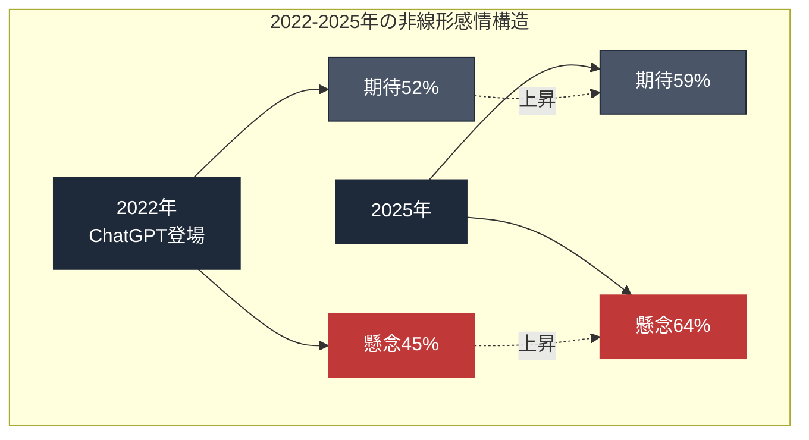

---

## 1.3 Gallup「Z世代の声：AIのパラドックス」

2026年2月から3月にかけて、Gallupは米国Z世代（14-29歳）1,500人以上を対象に、AIに対する感情と態度の調査を実施した。報告書のタイトルは「The Voice of Gen Z: The AI Paradox」。

| Z世代の感情（複数回答） | 割合      |
| ------------ | ------- |
| **怒り**       | **31%** |
| 興奮           | 22%     |
| 希望           | 18%     |
| 不安           | 上昇傾向    |

怒りが興奮を**9ポイント上回っている**。希望は、わずか18%だ。

さらに深刻なのは、仕事に関する認識だ。

| 質問                        | 同意率           |
| ------------------------- | ------------- |
| 仕事において、AIのリスクはメリットを上回っている | **過半数（50%超）** |

これは、実際に労働市場に出ていく、あるいは既に出ているZ世代の認識だ。彼らが感じているのは、AIに関する抽象的な不安ではない。具体的な労働市場の変化を、直接見ている。

| エントリーレベル職の消失 | 現象              |
| ------------ | --------------- |
| ソフトウェア開発     | 初級職の求人が激減       |
| カスタマーサポート    | AIチャットボット化で人員削減 |
| コンテンツ制作      | 生成AIによる代替       |
| フリーランス市場     | 単価の下落           |

Z世代にとって、AIは「自分たちのキャリアの入り口を塞ぐもの」として認識されている。大学を卒業しても、入るべき職がない。入ったとしても、昇進経路が不明確だ。

そして、わずか1年前の調査と比較しても、感情スコアは**著しく悪化している**。

これが、Gallupの報告書が「パラドックス」と呼んだ現象だ。AIに最も柔軟に適応できるはずの世代が、最もAIに怒っている。

---

## 1.4 Edelman Trust Barometerが示す信頼の崩壊

2025年のEdelman Trust Barometerは、AI産業に対する信頼度の急落を示した。

| 指標                | 数値                  |
| ----------------- | ------------------- |
| **AI産業への信頼度（米国）** | 過去1年間で**-15ポイント低下** |
| Grievance（不満）スコア  | 米国で高水準              |
| テクノロジー一般への信頼      | 過去最低水準に接近           |
| 政府の規制への期待         | 上昇                  |

信頼度の低下は、AI企業全般に広がっている。個別企業ではなく、産業全体への信頼が崩れている。

この構造は、単なる「AI嫌い」ではない。**市民が、AI企業を既存の権力構造の一部として認識し始めている**ことを意味する。Google、Microsoft、Amazonと同列、あるいはそれ以上の、監視と規制が必要な対象として。

---

## 1.5 期待と恐れの「同時加速」を理解する

ここまでのデータを統合すると、見えてくる構造は以下の通りだ。

**構造1: 期待と恐れは同じ人の中に共存している**

「AIに期待する人」と「AIを恐れる人」が別々にいるのではない。同じ個人の中で、両方の感情が同時に存在し、両方が強度を増している。

これは心理学的には「認知的不協和」の状態だ。人間は通常、矛盾する感情を抱えることに耐えられない。しかし、AIに関しては、多くの人が耐え続けている。期待もするし、恐れもする。どちらか一方に決められない。

**構造2: 世代によって重心が異なる**

| 世代          | 感情の重心        |
| ----------- | ------------ |
| Z世代         | 怒り > 興奮 > 希望 |
| ミレニアル世代     | 混在の割合が高い     |
| X世代・ベビーブーマー | 利用率が低く、不安が先行 |

しかし、各世代とも「同時加速」のパターンは共通している。程度の違いはあっても、期待と恐れが同時に進行しているのは全世代で同じだ。

**構造3: 時系列で見ると、両感情が同時に強化されている**

2022年から2026年の4年間で:

| 指標                | 変化              |
| ----------------- | --------------- |
| 期待（Ipsos）         | 52% → 59%（+7pt） |
| 雇用懸念（Pew）         | 不明 → 64%（上昇）    |
| Z世代の怒り（Gallup）    | 測定なし → 31%に登場   |
| AI産業への信頼（Edelman） | -15pt           |

両方の感情が同時に加速している。どちらか一方が他方を押し退けるのではない。

---

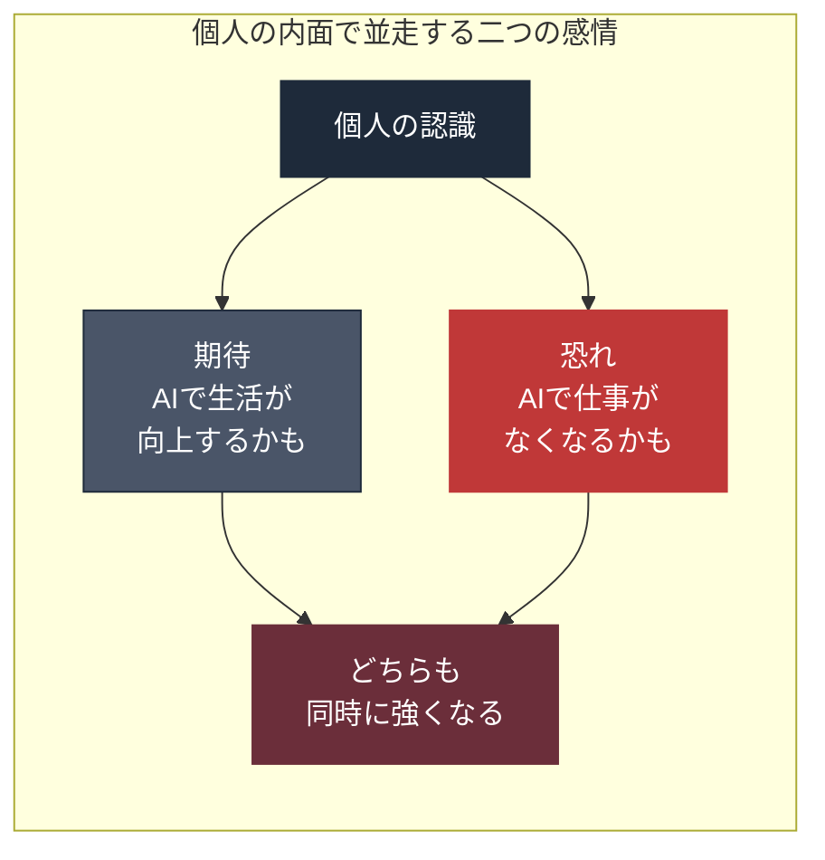

---

## 1.6 この構造が意味すること

期待と恐れが同時に加速する社会は、行動の予測が極めて難しい。

**単純な期待型社会**では、AIへの投資が増え、利用が拡大し、規制は緩い。市民はAI企業を応援する。

**単純な恐怖型社会**では、AIへの反発が強まり、規制が厳しくなり、市民はAI企業を攻撃する。

しかし、**期待と恐れが同時加速する社会**では、両方が同時に起きる。

| 期待が推進すること   | 同時に恐れが推進すること   |
| ----------- | -------------- |
| AIへの投資は加速する | AI企業への襲撃も起きる   |
| 利用は拡大する     | 反対運動も拡大する      |
| 規制の議論は進む    | 規制は技術速度に追いつかない |

2026年4月の一週間で起きた「1兆ドルと火炎瓶」の並存は、この構造から生まれている。

AI企業の評価額は記録的な水準に達した。同じ週に、そのCEOの自宅が襲撃された。どちらも、同じ社会の、同じ感情構造から生まれた現象だ。

矛盾ではない。これが、この時代の基本状態だ。

---

## 1.7 この章の結論

AIに対する社会感情は、直線ではない。

データが示すのは、「期待→失望」の単純な移行ではなく、**期待と恐れの同時加速**という非線形の構造だ。

| 出典           | データの示すこと            |
| ------------ | ------------------- |
| Pew Research | 期待も恐れも両方上昇          |
| Ipsos        | 楽観は上昇（52→59%）       |
| Gallup       | Z世代の怒り31%が希望18%を上回る |
| Edelman      | AI産業への信頼は-15pt低下    |

この構造が理解できないと、なぜ1兆ドルと火炎瓶が同じ週に存在したのかも、理解できない。

次章では、この「同時加速」の一つの原因を追う。**AI専門家と一般市民の間に広がる、50ポイントの認識格差**だ。同じ国、同じ技術を見ていながら、違う結論に至る二つの集団が存在する。この格差が、社会の亀裂を決定的にしている。

---

## 参考文献

1. Pew Research Center. "How Americans View the Use of AI in the Workplace." 2024-2025.
   https://www.pewresearch.org/social-trends/2025/

2. Pew Research Center. "Public More Likely to See Facial Recognition Use by Police as Good, Rather Than Bad." 2021.
   https://www.pewresearch.org/

3. Ipsos. "Global Views on A.I. 2024." Ipsos Global AI Monitor.
   https://www.ipsos.com/en/global-views-ai-2024

4. Ipsos. "Global Views on A.I. 2025."
   https://www.ipsos.com/

5. Gallup. "The Voice of Gen Z: The AI Paradox." 2026年2月-3月調査報告書.
   https://www.gallup.com/

6. Edelman. "2025 Edelman Trust Barometer: Insights for the Technology Sector."
   https://www.edelman.com/trust/2025/trust-barometer

7. NewsPicks. 後藤直義「【データ解説】Z世代の『AIへの怒り』が止まらない」2026年4月16日.

---

# 第2章

## 専門家と市民の50ポイント格差 — AI村の住民と取り残される者

---

2025年、Stanford HAI（Human-Centered AI Institute）が発表した調査報告は、現代社会における最も深刻な認識格差の一つを数字で可視化した。

**AI専門家と一般市民の間の50ポイント格差**だ。

同じ国、同じ時代、同じ技術を見ていながら、二つの集団は全く異なる結論に達している。この格差が存在する限り、社会の合意形成は成立しない。

---

## 2.1 Pew Research Center × Stanford HAI の衝撃的データ

Pew Research CenterとStanford HAIが共同で実施した調査は、AI専門家1,013人と米国一般市民5,410人に、同じ質問を投げかけた。

| 質問                            | AI専門家   | 一般市民    | 差分       |
| ----------------------------- | ------- | ------- | -------- |
| 今後20年間、AIがあなた個人にとって良い影響をもたらすか | **76%** | **24%** | **52pt** |
| 今後20年間、AIが米国全体にとって良い影響をもたらすか  | 56%     | 17%     | 39pt     |
| AIによって仕事が減少する                 | 39%     | 64%     | 25pt     |
| 重要な意思決定をAIが主導することを許容する        | 47%     | 12%     | 35pt     |

全ての質問で、AI専門家と一般市民の認識は大きく乖離している。そして、その乖離は**医療、教育、アートやエンタメ、全分野で共通**している。

---

## 2.2 なぜこの格差が生まれるのか

専門家と一般市民の認識差は、通常、情報量の差で説明される。専門家は詳細を知っているから、より正確な判断ができる、と。

しかしAIに関しては、この説明は不十分だ。

**専門家はAIの可能性を最大に見積もる傾向がある。** 彼らはAIを設計し、AIで成功を収め、AIの延長線上に自分のキャリアを置いている。AIが失敗すれば、自分の人生も失敗する。だから、AIがうまくいく未来を、より強く信じる必要がある。

**一般市民はAIの脅威を最大に見積もる傾向がある。** 彼らは実際に職場でAIを使われ始め、同僚のレイオフを目撃し、自分の仕事の先行きに不安を持っている。AIが成功すれば、自分の仕事が失われる可能性がある。だから、AIのリスクを強く認識する。

どちらが正しいのか。

**どちらも正しい。** そして、どちらも、自分の立場から見た部分的な真実を語っている。

この構造は、情報量の差では解消できない。専門家により多くの情報を与えても、彼らの楽観は変わらない。一般市民により多くの情報を与えても、彼らの恐怖は消えない。**立場の違いは、事実よりも強く人間の認識を規定する**からだ。

---

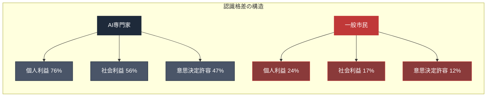

---

## 2.3 「AI村」の物理的実在

サンフランシスコ、マーケットストリート。

OpenAIの本社ビルには、社名のロゴがない。普通の高層ビルの一つとして、市街に溶け込んでいる。

入り口には、張り紙がある。

**「社員証を隠すように」**

この張り紙は、AI企業幹部が最近、街頭で見知らぬ人から攻撃的な視線や言葉を受けるようになったために貼られた。社員証をつけて歩けば、ターゲットになる。

これが、2026年のサンフランシスコにおけるAI企業従業員の日常だ。

ジャーナリストのアレックス・ヒースは、シリコンバレーの複数のAI企業幹部に取材し、こう書いた。

**「世間は、私たちの仕事を嫌っているんです」**

AI企業の従業員たちは、自分たちが社会から敵視されていることを、徐々に認識し始めている。

---

## 2.4 サンフランシスコのAIエンジニア経済学

AI企業の従業員の報酬は、一般市民の想像を超える水準にある。

**AIエンジニアの報酬水準（2025-2026年時点）**

| 職位                 | 年収                                  |
| ------------------ | ----------------------------------- |
| OpenAI 上級エンジニア     | $500,000〜$1,000,000（約7,500万円〜1.5億円） |
| Anthropic 研究者      | $350,000〜$700,000                   |
| トップ級の研究者           | $2,000,000以上                        |
| シニアエンジニア平均（主要AI企業） | 約 $450,000                          |

これは、同じサンフランシスコで働く一般的な労働者の年収の**5〜10倍**に相当する。

**サンフランシスコ市内の経済的帰結**

| 項目              | 数値                            |
| --------------- | ----------------------------- |
| 家賃中央値（スタジオ〜1BR） | 月額 $3,500〜$5,000              |
| 住宅価格中央値         | $1,300,000超                   |
| 豪邸売買            | AI企業従業員の買い占めで「売買する豪邸が足りない」と報道 |

AIエンジニアたちは、サンフランシスコの不動産を、一般市民が手の届かない価格帯に押し上げている。

**空間的排除が進行している**

| 対象              | 帰結              |
| --------------- | --------------- |
| 既存住民            | 郊外へ、あるいは別の都市へ移住 |
| 教員、医療従事者、サービス業者 | 市内に住めなくなる       |
| 市の経済            | AI産業への依存度を高める   |

この経済構造が、市民の感情の土台になっている。AI企業は単なる職場ではなく、**既存の生活環境を破壊する勢力として認識されている**。

---

## 2.5 グローバルな富の集中

AI企業の企業価値は、驚くべき速度で膨張している。

**2026年4月時点の主要AI企業の企業価値**

| 企業                                     | 評価額                   | 補足                                               |
| -------------------------------------- | --------------------- | ------------------------------------------------ |
| **OpenAI**                             | **約8,520億ドル（約128兆円）** | 2024年1,570億→2025年3,000億→2026年3月8,520億（1年半で5倍以上）  |
| **Anthropic**                          | **約3,800億ドル（約57兆円）**  | 2025年末1,830億→2026年2月3,800億。約8,000億ドルの次回ラウンド提案を辞退 |
| **xAI + SpaceX統合価値**                   | **約1.25兆ドル（約188兆円）**  | IPO目標: 1.75兆ドル（約263兆円）                           |
| Google DeepMind, Microsoft AI, Meta AI | 親会社時価総額の主要構成要素        | —                                                |

**合算すると、AI資本は既に1兆ドル規模を遥かに超えている。**

この膨大な富が、数百人〜数千人のAI企業創業者、投資家、上級従業員に集中している。

---

## 2.6 Anthropicの例: 3年で128兆円

Anthropicの成長速度は、歴史上類を見ない水準だ。

| 時期          | マイルストーン                              |
| ----------- | ------------------------------------ |
| 2021年       | Anthropic創業                          |
| 2023年3月     | Claude 1 公開                          |
| 2024年3月     | Claude 3 公開                          |
| 2025年末      | 年間売上高 90億ドル                          |
| 2026年3月初    | 年間売上高 190億ドル                         |
| **2026年4月** | **年間売上高 300億ドル（約4.5兆円）／企業価値 約128兆円** |

主力商品Claudeをローンチしてから、まだ**3年**しか経っていない。

**「3年で128兆円の企業価値」** — この速度は、20世紀の産業史の中で比肩するものが見当たらない。Google、Facebook、Amazon、Apple、これらのどれよりも速い成長曲線を描いている。

この速度は、投資家と創業者にとっては歓喜だ。しかし一般市民にとっては、**富の集中が目の前で起きているという実感**を生んでいる。

---

## 2.7 二つの現実

「AI村の住民」の現実と、「取り残される者」の現実は、物理的には同じ国、同じ都市、同じ時代にある。しかし、体験としては全く別の世界だ。

| 比較項目   | AI村の住民の現実    | 取り残される者の現実   |
| ------ | ------------ | ------------ |
| 収入     | 年収数千万円〜数億円   | 家賃の上昇に追いつかない |
| 住環境    | 豪邸、自家用車で通勤   | 郊外への移住を強いられる |
| 職場感    | 社員証は隠すが仕事は充実 | レイオフで同僚が去る   |
| AIの未来観 | 明るい          | 暗い           |
| AIの認識  | 人類にとって良いもの   | 人類にとって脅威     |

この二つの現実が、同じ時代に並存している。Stanford HAI の50ポイント格差は、この二つの現実の距離を数字化したものだ。

---

## 2.8 格差の社会的帰結

認識格差は、社会的帰結を生む。

| 帰結            | 内容                                                                                          |
| ------------- | ------------------------------------------------------------------------------------------- |
| **合意形成の不可能性** | AI規制をめぐる議論が平行線。専門家は「規制は技術革新を妨げる」、市民は「規制がなければ我々は守られない」。立法府は両者の中間で動けない                        |
| **制度設計への不信**  | 市民はAI企業による規制設計を信頼できない。規制当局は専門家の意見に依存するため、専門家寄りの規制になる。結果として、市民の不信はさらに深まる                     |
| **暴力への転化**    | 合意形成できない → 制度的な解決策が見えない → 一部が暴力に訴える。これが、2026年4月のアルトマン襲撃やインディアナポリス銃撃の土壌（ラッダイト運動と同じ構造、第6章で詳述） |

---

## 2.9 この章の結論

AI専門家と一般市民の間には、**50ポイントの認識格差**がある。

| 質問項目   | AI専門家 | 市民  | 差分   |
| ------ | ----- | --- | ---- |
| 個人利益   | 76%   | 24% | 52pt |
| 社会利益   | 56%   | 17% | 39pt |
| 雇用減少懸念 | 39%   | 64% | 25pt |
| 意思決定許容 | 47%   | 12% | 35pt |

この格差は、情報量の差では解消できない。立場の違いが、同じ事実から異なる結論を生んでいる。

物理的には、AI村（サンフランシスコのAI企業とその従業員）と、取り残される側（一般市民）は同じ都市に住んでいる。しかし、経済的・体験的には、全く別の世界に生きている。

| 格差の現れ         | 数値             |
| ------------- | -------------- |
| AI企業の企業価値（合算） | 1兆ドル超          |
| AIエンジニアの年収    | 一般労働者の5〜10倍    |
| 住宅価格・家賃       | 既存住民を市外に押し出す水準 |

この格差が、社会感情の「同時加速」の一つの原因だ。期待と恐れが同じ社会の中で並走するのは、そもそも社会が一つではないからだ。

次章では、この格差の最前線にいる**Z世代**に焦点を当てる。彼らが直面している「入り口が閉じる」現象——エントリーレベル職の蒸発——は、AI時代の格差の最も鋭い表れだ。

---

## 参考文献

1. Pew Research Center & Stanford HAI. "How the U.S. Public and AI Experts View Artificial Intelligence." 2025.
   https://www.pewresearch.org/

2. Stanford HAI. "AI Index Report 2026."
   https://aiindex.stanford.edu/report/

3. Alex Heath. "Silicon Valley's AI elite grapple with growing public hostility." The Verge / Command Line. 2026.

4. Bloomberg. "Anthropic reaches $380 billion valuation as annual revenue hits $30 billion." 2026年4月.

5. Reuters. "OpenAI valued at $852 billion in secondary share sale." 2026年3月.

6. San Francisco Chronicle. "Mansion shortage as AI wealth transforms SF real estate." 2026.

7. Levels.fyi. "Software Engineer Salary at OpenAI / Anthropic." 2025-2026.
   https://www.levels.fyi/

---

# 第3章

## 入り口が閉じる — エントリーレベル職の蒸発と若年層の絶望

---

2026年4月15日、米スナップのCEOエバン・シュピーゲルは、従業員1,000人の削減を発表した声明でこう述べた。

**「新規コードの65%以上をAIが生成している。」**

この一文が、Z世代のAIに対する怒りの核心を言い当てている。

新規コードの65%をAIが生成するなら、新しいコードを書いて学ぶ立場の人間は、もう必要ない。インターン、新卒エンジニア、ジュニア開発者——かつてソフトウェア産業の「入り口」だった職は、急速に消えつつある。

---

## 3.1 エントリーレベル職の構造的消失

**ソフトウェア開発の現状**

GitHub CopilotがGAされた2022年、Cursorが台頭した2023年、Claude Codeが登場した2024年。この3年間で、コーディング支援AIは、**ジュニアエンジニアの仕事を部分的にではなく、本質的に代替し始めた**。

| 業務              | AIによる代替状況         |
| --------------- | ----------------- |
| 簡単なCRUDアプリケーション | AI単独で生成可能         |
| バグ修正            | AIが原因特定から修正まで実行   |
| ユニットテスト作成       | AIが全面的に担当         |
| コードレビュー         | AIが先行チェック、人間が最終判断 |

これらは全て、かつてジュニアエンジニアが経験を積むための仕事だった。**「10年選手を育てるための1年目の仕事」が消えている**。

**求人市場のデータ**

| データソース                           | 変化                        |
| -------------------------------- | ------------------------- |
| Indeed、LinkedIn、Glassdoor等の求人データ | ジュニアポジションが減少傾向            |
| 米国テック業界の新卒採用                     | 2023年以降、縮小                |
| 「エントリーレベル」ポジションの要件               | 「最低3年の実務経験が必要」が増加（矛盾した表現） |

---

## 3.2 カスタマーサポートの事例: Klarna

2024年、スウェーデンの金融テック企業Klarnaは、注目すべき発表を行った。

**「AIアシスタントが、カスタマーサポートの700人分の仕事量を処理している」**

Klarnaは、OpenAIのAI技術を使って構築したチャットボットが、35言語で顧客対応を行っていると報告した。CEOのセバスティアン・シェミアトコウスキは、次のように述べた。

| 指標         | 成果                   |
| ---------- | -------------------- |
| AIが処理した業務量 | **700人のフルタイム従業員に相当** |
| 顧客の問題解決時間  | 2分半（従来の平均11分から短縮）    |
| 顧客満足度スコア   | 人間の対応と同等             |
| 年間利益改善見込み  | **4,000万ドル**         |

Klarnaはこの発表後、人員削減を加速した。同社は2000年創業で約7,000人の従業員を抱えていたが、2023年以降、コアスタッフを**約3,500人に縮小**した。削減の主要因として、AI活用による業務効率化が明示された。

この事例は、サービス業全般への警告だった。**顧客対応は、AIが最も早く人間を代替できる領域**であることが証明された。

---

## 3.3 教育・学習プラットフォームの崩壊: Chegg

Cheggは、米国の大学生向け学習支援プラットフォームだ。宿題のヘルプ、教科書レンタル、チュータリングを提供していた。

2023年5月、CheggのCEOは投資家向けに衝撃的な発表をした。

**「ChatGPTが、我々のビジネスに影響を与え始めている」**

Cheggの株価は、この発表の後、**1日で49%下落**した。

その後の展開:

| 時期      | 出来事                                |
| ------- | ---------------------------------- |
| 2023年後半 | 会員数の急激な減少                          |
| 2024年   | 大規模レイオフ、4%の人員削減                    |
| 2025年   | 更なるレイオフ、**全従業員の22%削減**             |
| 株価推移    | 2021年ピーク $113 → 2025年 **$1台** まで下落 |

Cheggは、教育サービス業界で最初に「ChatGPTによって破壊された企業」として記録された。

この事例は、教育、コンテンツ制作、ライティング支援といった**知的サービス業全般**への予兆だった。

---

## 3.4 言語学習と翻訳: Duolingo

2024年1月、Duolingoは**コントラクター（外部請負契約者）の10%を削減**すると発表した。

削減されたのは、主に翻訳と言語コンテンツ作成に従事していた人々だった。Duolingoの広報担当者は明確に述べた。

**「生成AIが、これらの業務を効率化した。」**

Duolingoはこの発表後、AI駆動の学習機能（Duolingo Max）を強化し、**ユーザー一人ひとりに最適化された対話型学習**を提供し始めた。人間の教師やコンテンツクリエイターの役割は、大幅に縮小された。

言語学習分野は、AI翻訳の精度向上により、**人間による翻訳や教材作成の需要が急速に減退**している。

---

## 3.5 決済・金融: Block (旧Square)

ジャック・ドーシーが率いるBlock（旧Square）は、2024年から2025年にかけて、段階的にレイオフを続けた。

| 時期      | 施策                      |
| ------- | ----------------------- |
| 2024年1月 | **約1,000人（全従業員の10%）削減** |
| 2024年後半 | 追加の削減                   |
| 2025年   | 組織再編と継続的な効率化            |

ドーシーは、社内メモで明確に述べた。

**「我々はAIを活用して、より少ない人数で、より大きな成果を出す組織になる。」**

Blockは、エンジニアリング、カスタマーサポート、運用業務の各分野で、AIによる業務自動化を加速している。

---

## 3.6 先駆的発表: IBM

2023年5月、IBMのCEOアービンド・クリシュナは、衝撃的な発表をした。

**「今後5年間で、バックオフィス業務の30%に相当する約7,800人分の仕事をAIで代替する。」**

この発表は、「AI起因リストラ」が企業戦略として公式に語られた初期の重要事例だった。対象となったのは以下の領域だ。

| 領域       | 内容   |
| -------- | ---- |
| 人事部門     | 管理業務 |
| 財務部門     | 定型業務 |
| ITサポート部門 | 一部業務 |

IBMは、この発表後、**新規採用を人事・財務分野で凍結**し、既存の人員は退職や異動で自然減を進めた。

この事例は、**AIによる労働代替が、個別の企業判断ではなく、経営戦略として体系化されたこと**を意味した。

---

## 3.7 2026年のSnap: 1,000人削減

そして2026年4月15日、Snapは1,000人の削減を発表した。

**Snap CEOエバン・シュピーゲルの声明**

「AIの進歩によって業務を効率化し、小規模チームでの運営が可能になっている。新規コードの65%以上をAIが生成している。」

**この発表の特徴**

| 特徴           | 内容               |
| ------------ | ---------------- |
| AI起因であることを明示 | 声明の中で明確に宣言       |
| 数値の具体的提示     | 新規コードの65%以上がAI生成 |
| 新しい標準の規範化    | 「小規模チームでの運営」が標準  |
| 経営目標の設定      | 年間5億ドル超の費用削減     |

Snapは、**「AIで人間を置き換える」ことを、経営戦略として堂々と発表する**時代の象徴となった。2023年のIBMは「代替する」と述べたが、2026年のSnapは「既に代替している」と述べている。

---

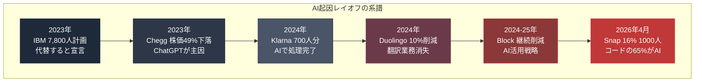

---

## 3.8 2026年全体像: 80社・71,440人

layoffs.fyiのデータによれば、2026年年初来（1月〜4月中旬）のテック業界レイオフは以下の規模に達している。

| 指標      | 数値           |
| ------- | ------------ |
| レイオフ企業数 | **80社**      |
| 削減人数    | **約71,440人** |

この規模は、過去数年で最高ペースだ。

**特徴**

| 観点        | 内容                         |
| --------- | -------------------------- |
| 削減の性質     | 一時的なコスト削減ではなく、**構造的な人員縮小** |
| AI起因の表明   | 多くの企業がAI起因を明示または示唆         |
| 再雇用の状況    | 削減後の再雇用は限定的（特にジュニア層）       |
| CEO発言の定型句 | 「より少ない人数で、より多くの価値を生む」      |

---

## 3.9 Z世代の絶望の構造

Gallup調査が示したZ世代の「怒り31%、興奮22%、希望18%」。この数字の背景には、具体的な就職市場の現実がある。

**Z世代が直面している現実**

| 現実                     | 具体的内容                                                                  |
| ---------------------- | ---------------------------------------------------------------------- |
| 大学卒業時点でエントリーレベル職が消えている | 学費ローンを抱えて卒業しても入るべき職がない。「3年の経験必須」のエントリーポジションという矛盾。インターンすら競争倍率が異常に高い     |
| 中堅への昇進経路そのものが不明確       | ジュニアを経て経験を積むはずだったキャリアパスが消える。突然シニアレベルの仕事を要求される（AIを使いこなせる前提）。学習機会が構造的に減少 |
| スキル獲得の時間的余裕がない         | 新しい技術を学ぶ間にさらに新しい技術が来る。AIツールの変化速度が人間の学習速度を超える。「AIリテラシー」の定義自体が毎年変わる      |
| キャリアの予測可能性がゼロ          | 5年後に何の仕事があるか分からない。どの分野が安全かの予測もできない。転職・リスキリングの終点が見えない                   |

**この状況で、Z世代がAIを「希望」と見ないのは当然だ**。彼らにとってAIは、自分のキャリア・人生設計を破壊する存在として日常的に体験されている。

---

## 3.10 この章の結論

「入り口が閉じる」現象は、AI時代の格差の最も鋭い表れだ。

| 領域        | 現象                             |
| --------- | ------------------------------ |
| ソフトウェア開発  | コーディング支援AIがジュニア職を本質的に代替        |
| カスタマーサポート | Klarna事例で700人分のAI代替            |
| 教育・学習     | Chegg株価49%下落、22%削減             |
| 言語・翻訳     | Duolingo 10%削減                 |
| 金融・決済     | Block 10%削減                    |
| ソーシャル     | Snap 16%、1,000人削減（コード65%がAI生成） |

**2026年年初来で80社、71,440人のAI起因レイオフ**。

この数字の奥には、学費ローンを抱えた学生、就職できない新卒、昇進経路を失ったジュニア社員、再雇用の道がない中堅社員——無数の個人の現実がある。

Z世代の「怒り31%、希望18%」は、彼らが社会の未来図を失っていることを示している。希望とは、未来像を描けることだ。未来像が描けない状態では、希望は持てない。

次章では、この雇用喪失の裏側で起きている**資本の地理的・構造的集中**を追う。同じ時代に、1兆ドル規模の富がサンフランシスコの一角に集中している。このグローバルな非対称が、社会の亀裂をさらに深めている。

---

## 参考文献

1. layoffs.fyi. "Tech Layoffs Tracker." 2023-2026.
   https://layoffs.fyi/

2. Klarna. "Klarna AI assistant handles two-thirds of customer service chats." 2024年2月.
   https://www.klarna.com/international/press/

3. Chegg. "Q1 2023 Earnings Call Transcript."
   https://investor.chegg.com/

4. Duolingo. "Contractor Transition Announcement." 2024年1月.

5. Block. "CEO Memo on AI-driven Organization Changes." 2024.

6. IBM. "Arvind Krishna on AI and the Future of Work." Bloomberg Interview, 2023年5月.

7. Reuters. "米スナップ、従業員の16％削減へ 投資家の要請受け." 2026年4月15日.

8. Gallup. "The Voice of Gen Z: The AI Paradox." 2026.

---

# 第4章

## 1兆ドルの地理 — サンフランシスコ、資本の集中、空間的排除

---

AIは、グローバルな技術だ。世界中からアクセスできる。世界中の人々が利用できる。

しかしAIを生み出す資本は、極端に狭い地理的範囲に集中している。ほぼサンフランシスコ・ベイエリアの一部と、その周辺の数都市。合計しても、米国全土の面積の0.1%にも満たない領域。

この空間的集中が、AI時代の格差の物理的基盤だ。データは抽象的な概念ではなく、電力を消費する物理的サーバーに保存される。モデルを訓練するのは、地理的に存在するデータセンターだ。そしてその設計と運用を担うエンジニアは、特定の地区に住んでいる。

この章では、1兆ドル規模のAI資本が、どこに、どのように集中しているかを追う。

---

## 4.1 サンフランシスコの住所

世界の主要AI企業は、驚くべき近接性で集積している。

| 企業                    | 本社所在地                             | 備考              |
| --------------------- | --------------------------------- | --------------- |
| OpenAI                | 1960 Bryant Street, San Francisco | ミッション地区         |
| Anthropic             | 548 Market Street, San Francisco  | Downtown        |
| xAI                   | Palo Alto, California             | Tesla/SpaceXの近隣 |
| Scale AI              | San Francisco                     | SOMA地区          |
| Perplexity            | San Francisco                     | SOMA地区          |
| Google DeepMind（米国拠点） | Mountain View, California         | —               |
| Meta AI               | Menlo Park, California            | —               |

この一覧が示すのは、主要AI企業の本社は**サンフランシスコから約50km圏内**に収まっているという事実だ。徒歩圏または短い車移動で行き来できる距離に、世界のAI資本の大半が集まっている。

---

## 4.2 AI資本の集中度

2026年4月時点のAI企業の企業価値を、地理的に分類すると、以下のようになる。

| 地域                             | 主要企業                                  | 企業価値合計の概算          |
| ------------------------------ | ------------------------------------- | ------------------ |
| **サンフランシスコ・ベイエリア**             | OpenAI、Anthropic、Scale AI、Perplexity等 | **約1.3兆ドル超**       |
| **Googleプレックス（Mountain View）** | Google DeepMind米国拠点                   | Alphabet時価総額の主要部分  |
| **Menlo Park**                 | Meta AI                               | Meta時価総額の主要部分      |
| **Palo Alto周辺**                | xAI、関連企業                              | SpaceX含め約1.25兆ドル   |
| **シアトル**                       | Microsoft AI                          | Microsoft時価総額の主要部分 |
| **その他米国**                      | 散在                                    | 合計でも少数             |
| **中国**                         | Baidu AI、ByteDance、Zhipu等             | 米国比で小さい            |
| **欧州**                         | Mistral、独自AI企業                        | 米国比で極めて小さい         |
| **日本**                         | 独自ファンデーションモデルなし                       | 実質的に空白             |

**米国、特にカリフォルニア州北部の数百km圏内に、世界のAI資本の大半が集中している。**

この集中度は、過去の産業史で比肩するものを探すのが難しい水準だ。自動車産業はデトロイトに集中したが、世界の自動車産業全体の80%以上がデトロイトにあったわけではない。金融はニューヨークに集中したが、ロンドン、東京、香港も並立していた。

AI資本は、**単一地域がグローバル市場の大半を占める**という、極めて特殊な集中パターンを示している。

---

## 4.3 データセンターの地理

AI企業の本社はサンフランシスコに集中しているが、AIを動かす物理的インフラ（データセンター）は別の場所にある。

**主要AIデータセンターの所在地:**

| 地域       | 特徴                             |
| -------- | ------------------------------ |
| テキサス州    | Microsoft、Oracle、xAIの大規模施設が集積  |
| ヴァージニア北部 | AWS、Meta、Microsoftの「データセンター回廊」 |
| アリゾナ州    | Apple、Google、Microsoftの施設      |
| アイオワ州    | Microsoft、Google、Metaの施設       |
| オレゴン州    | Amazon、Appleの施設                |
| インディアナ州  | 新興のAIデータセンター候補地                |

データセンターは、膨大な電力と水を消費する。そして、それらを消費する施設が、地域社会に直接の影響を与える。

**データセンターの地域社会への影響:**

| 影響項目  | 内容                              |
| ----- | ------------------------------- |
| 電力消費  | 大規模施設で数百MW規模、地域の電力需要の数十%を占めることも |
| 電気代上昇 | 需要増加で地域住民の電気代が上昇する傾向            |
| 水資源   | 冷却用に大量の水を消費、乾燥地域では深刻な競合         |
| 税収    | 建設時に大きな税収貢献、運用開始後は継続的な税収        |
| 雇用    | 建設時は多いが、運用時は少数のみ（数十人規模）         |

---

## 4.4 インディアナポリスの銃撃事件

2026年4月、米インディアナポリス市の市議会議員ダン・ギブソン氏の自宅に、13発の銃弾が撃ち込まれた。

玄関前に残されていたメモには、一行だけ書かれていた。

**「NO DATA CENTERS」**

ギブソン議員は、AIデータセンター建設に賛成票を投じた人物だった。

この事件は、データセンターに対する地域住民の反発が、暴力に転化した明確な事例として記録された。

**事件の背景:**

| 背景要素        | 状況                       |
| ----------- | ------------------------ |
| データセンター建設計画 | インディアナポリス郊外に大規模AIデータセンター |
| 賛成派の主張      | 税収増、建設雇用、地域経済活性化         |
| 反対派の懸念      | 電気代上昇、騒音、景観破壊、水資源の枯渇     |
| 市議会採決       | 賛成多数で可決                  |
| 事件発生        | 採決後、賛成議員の自宅に銃撃           |

この事件の構造は、1811年のラッダイト運動と類似している。技術そのものではなく、**技術を所有・導入する決定権者**が攻撃対象になっている。

---

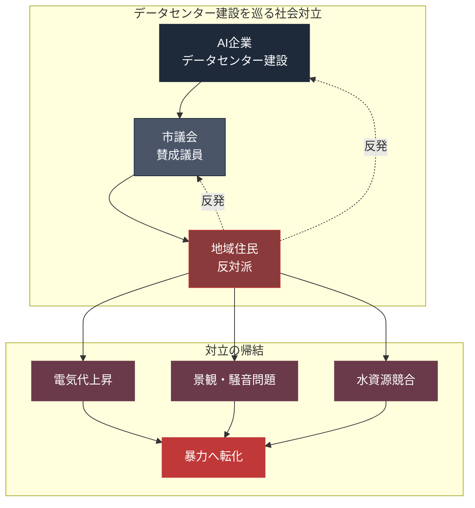

---

## 4.5 サンフランシスコの不動産価格

AI企業の集中は、サンフランシスコの不動産市場を根本的に変えた。

**サンフランシスコ市内の不動産価格（2026年時点の代表的数値）:**

| 物件タイプ                 | 価格帯                     |
| --------------------- | ----------------------- |
| スタジオアパート（月額家賃）        | $3,000〜$4,000           |
| 1ベッドルーム（月額家賃）         | $3,500〜$5,000           |
| 2ベッドルーム（月額家賃）         | $5,500〜$8,000           |
| 市内中央値住宅価格             | $1,300,000超             |
| マリーナ・パシフィックハイツ等の高級住宅地 | $3,000,000〜$10,000,000超 |

**AI企業従業員の購買力:**

| 職位             | 推定年収                | 住宅購買力                        |
| -------------- | ------------------- | ---------------------------- |
| OpenAI 上級エンジニア | $500,000〜$1,000,000 | $2,500,000〜$5,000,000の住宅購入可能 |
| Anthropic 研究者  | $350,000〜$700,000   | $1,800,000〜$3,500,000の住宅購入可能 |
| トップ級AI研究者      | $2,000,000+         | $10,000,000超の豪邸購入可能          |

**サンフランシスコの既存住民の状況:**

| 職業       | 一般的年収             | 住宅購買力           |
| -------- | ----------------- | --------------- |
| 公立学校教員   | $70,000〜$100,000  | 市内で家を買うことは実質不可能 |
| 看護師      | $100,000〜$150,000 | 市内での住宅購入は極めて困難  |
| 飲食・サービス業 | $40,000〜$60,000   | 市内で賃貸するのも困難     |
| 警察官・消防士  | $90,000〜$130,000  | 郊外からの通勤が通常      |

**結果として起きていること:**

| 現象           | 内容                      |
| ------------ | ----------------------- |
| 豪邸市場の過熱      | 「売買する豪邸が足りない」とのニュース     |
| 既存住民の郊外移住    | オークランド、サクラメント、リバモア等への移住 |
| 公共サービス従事者の不足 | 市内で教員、看護師を確保できない        |
| ホームレス問題の深刻化  | 住宅を失う層が継続的に増加           |

---

## 4.6 「AI村」の閉じた空間

サンフランシスコのAI業界に属する人々は、特定の地区、特定の店、特定のサービスを共有している。

**AI村の地理的な中心:**

| エリア                   | 特徴                          |
| --------------------- | --------------------------- |
| SOMA（South of Market） | AI企業オフィスの集積、若手エンジニア向け高級アパート |
| ミッション地区               | OpenAI本社所在、カフェ文化、一部高級化      |
| ヘイズバレー                | AI企業幹部の住宅地、高級レストラン集積        |
| パシフィックハイツ             | トップ級創業者・投資家の豪邸街             |
| マリーナ地区                | ライフスタイル充実、高所得者層             |

これらのエリアでは、AI関連の職業に就く人の比率が高く、文化的にも経済的にも**閉じたコミュニティ**を形成している。

**AI村の文化的特徴:**

| 項目     | 内容                           |
| ------ | ---------------------------- |
| 共通の話題  | 最新モデル、競合動向、ベンチマーク、技術的ブレイクスルー |
| 社交の場   | AIカンファレンス、投資家イベント、ディスコードサーバー |
| 家族構成   | 比較的若いカップル、子どもを持つのが遅い傾向       |
| 消費パターン | 高価格帯のテクノロジー、健康、旅行への支出が多い     |
| 政治的傾向  | 技術楽観主義、規制に対してはニュアンスが分かれる     |

この閉じたコミュニティの中では、AIに対する認識は圧倒的にポジティブだ。外の世界との接点が相対的に少ないため、**Stanford HAI 50ポイント格差**の片側に、物理的に居住している。

---

## 4.7 国際的な非対称

AI資本の集中は、国家間の非対称も生んでいる。

**AI領域の国別位置づけ（2026年時点）:**

| 国・地域         | AI基盤モデル                    | AI企業評価額                                  | 世界シェア    |
| ------------ | -------------------------- | ---------------------------------------- | -------- |
| **米国**       | GPT、Claude、Gemini、Grok     | OpenAI 8,520億、Anthropic 3,800億、xAI 1.25兆 | 圧倒的多数    |
| **中国**       | Baidu ERNIE、DeepSeek、Zhipu | 数百億ドル規模（非公開）                             | 米国比で小規模  |
| **欧州**       | Mistral、その他                | Mistral 60億ドル程度                          | 極めて小規模   |
| **日本**       | 独自基盤モデルなし                  | 実質なし                                     | ほぼゼロ     |
| **グローバルサウス** | 皆無                         | なし                                       | アクセスも限定的 |

この構造は、**過去の植民地主義と類似したパターン**を示している。少数の中心国・都市が基盤技術を所有し、他の地域はそれを利用する立場に置かれる。

**結果として起きる非対称:**

| 軸       | 中心（米国）        | 周辺（他地域）          |
| ------- | ------------- | ---------------- |
| 基盤技術の開発 | 担う            | 利用する             |
| データの所有  | 多くを集約         | 提供する側            |
| 経済的利益   | 1兆ドル規模の資本集中   | ライセンス料・サービス料を支払う |
| 規制の主導権  | 自国基準で設定       | 米国基準に従う          |
| 文化的影響   | 自国の価値観を反映したAI | 米国価値観に影響される      |

---

## 4.8 Anthropic Claude Mythosの「一般非公開」

2026年、Anthropicは最強のAIモデル「Claude Mythos」を開発した。しかしこのモデルは**一般公開されない**と発表した。理由は、そのハッキング能力が高すぎて、悪用のリスクが大きいためとされた。

代わりに、Project Glasswingと呼ばれる12社の同盟パートナーにのみ限定的に提供された。

**この決定が意味すること:**

| 観点       | 意味                                |
| -------- | --------------------------------- |
| アクセスの階層化 | AIモデルの能力によって、アクセスできる層が異なる         |
| 情報格差の深化  | 最強のAIは、少数のエリート企業のみが使える            |
| 経済的帰結    | Mythos級のAIを使える企業は、使えない企業に対して圧倒的優位 |
| 民主化の終焉   | AIは「誰でも使える」という前提が崩れる              |

これは、AIの商業化の過程で起きた重要な転換点だ。これまで「AIは民主化する」と語られてきたが、**最高性能のAIは民主化されない**という現実が明らかになった。

---

## 4.9 空間と資本と感情

この章で描いてきた構造をまとめる。

**1兆ドル規模の資本は、以下の地理的構造に従っている:**

| レイヤー       | 集中場所               | 結果                |
| ---------- | ------------------ | ----------------- |
| AI企業本社     | サンフランシスコ・ベイエリア     | 世界の主要企業が50km圏内に集積 |
| AIエンジニア居住地 | サンフランシスコ市内の特定エリア   | 不動産価格の極端な上昇       |
| AIデータセンター  | 米国中西部・南部           | 地域社会との摩擦、反対運動     |
| モデルへのアクセス  | 限定的（Mythos級は12社のみ） | 階層化されたアクセス        |

**この空間的集中が、感情の同時加速を生んでいる:**

- AI村の内部では、AIへの期待が強く、希望が語られる
- AI村の外部（特にデータセンター近郊）では、AIへの恐れが強く、怒りが語られる
- 両者が同じ国に住みながら、ほとんど交流がない
- 結果として、認識格差は縮まらず、むしろ拡大する

この構造は、**20世紀の都市-農村格差**や、**ジェントリフィケーション問題**と類似しているが、スケールが大きく、速度が速い。

---

## 4.10 この章の結論

1兆ドルのAI資本は、驚くほど狭い地理的範囲に集中している。

| 集中パターン    | 現実                           |
| --------- | ---------------------------- |
| 企業本社      | サンフランシスコ・ベイエリア50km圏内に主要企業の大半 |
| エンジニア居住   | 特定地区の不動産市場を支配                |
| データセンター   | 地域社会との摩擦、銃撃事件にまで発展           |
| 最強モデルアクセス | 12社の同盟のみ（Project Glasswing）  |
| 国際分布      | 米国が圧倒的多数、他地域は周辺化             |

この空間的集中が、社会の感情的亀裂の物理的基盤だ。AI村の内部にいる人と、外部にいる人は、物理的に別の生活圏に住んでいる。交流がないから、認識格差は縮まらない。

次章では、この集中がなぜ**時間と共に加速するのか**を、ピケティの経済理論を通じて追う。r>gという単純な不等式が、AI時代には極限化する。**永久下層市民（permanent underclass）**という概念が、なぜ今、真剣に議論されているのかを明らかにする。

---

## 参考文献

1. CB Insights. "State of AI 2026."
   https://www.cbinsights.com/research/ai-2026/

2. PitchBook. "AI Unicorns Tracker." 2026.
   https://pitchbook.com/

3. San Francisco Chronicle. "Mansion shortage in SF as AI wealth transforms real estate." 2026年2月.

4. Indianapolis Star. "Councilmember Gibson's home hit with 13 bullets after data center vote." 2026年4月.

5. Bloomberg. "Data Center Boom and Local Resistance in the American Midwest." 2026年3月.

6. Anthropic. "Introducing Project Glasswing." 2026年4月.
   https://www.anthropic.com/news/project-glasswing

7. Zillow. "San Francisco Housing Market Report." 2026.
   https://www.zillow.com/

8. US Department of Energy. "Data Center Energy Consumption Report." 2026.
   https://www.energy.gov/

---

# 第5章

## 永久下層市民論 — ピケティ × AI と r>g の極限

---

2025年、経済ニュースレター「Noahpinion」の著者、経済学者ノア・スミスは、一つの記事を発表した。タイトルは**「もし少数のAI企業が、すべてのお金と権力を独占したら？」**。

この記事の中でスミスは、ある概念を提示した。

**「permanent underclass（永久下層市民）」**

労働市場から永続的に排除される層。再雇用の道が構造的に閉ざされた層。AIが労働を代替する速度に、人間の再訓練や社会保障が追いつかない結果として生まれる層。

この概念は、22世紀の経済学を先取りした議論として、「22世紀の資本」というブログでも展開された。トマ・ピケティの『21世紀の資本』のロジックを、AI時代にアップデートした論考だ。

この章では、ピケティの r > g という不等式が、AI時代にどのように極限化するのかを追う。

---

## 5.1 ピケティの『21世紀の資本』

フランスの経済学者トマ・ピケティは、2013年に『Capital in the Twenty-First Century』（邦訳『21世紀の資本』）を発表した。この本は、世界中で読まれ、経済学の議論を一変させた。

**ピケティの核心的主張:**

| 概念        | 内容                               |
| --------- | -------------------------------- |
| r（資本収益率）  | 資本を投資して得られるリターン（配当、家賃、キャピタルゲイン等） |
| g（経済成長率）  | 社会全体の経済成長率（GDP成長率）               |
| **r > g** | 資本収益率が経済成長率を上回ると、格差は時間と共に拡大する    |

ピケティは、18世紀以降の長期データを分析し、**大部分の時代でr > gが成立している**ことを示した。

**r > g が成立すると何が起きるか:**

| 観点        | 帰結               |
| --------- | ---------------- |
| 資本を持つ者    | 資本の収益で資産を増やし続ける  |
| 労働だけで生きる者 | 賃金成長が資本収益に追いつかない |
| 世代間の継承    | 富の相続で格差が固定化      |
| 社会全体      | トップ1%の富が時間と共に拡大  |

ピケティは、20世紀の両大戦と高度成長期が、**歴史的に例外的**な格差縮小の時期だったと論じた。戦争で資本が破壊され、戦後の復興期にg > rが一時的に成立したためだ。

**20世紀後半以降、世界は再びr > gの時代に戻っている。**

---

## 5.2 なぜAI時代にr > gが極限化するのか

ピケティの分析は、物的資本（工場、不動産、株式など）を念頭に置いていた。しかし、AI時代には、**新しいタイプの資本**が出現している。

**AI資本の特性:**

| 特性       | 内容                                             |
| -------- | ---------------------------------------------- |
| スケーラビリティ | 一度訓練したモデルは、コピーコストがほぼゼロ                         |
| 労働代替能力   | 物理的労働ではなく、**知的労働を直接代替**                        |
| 自己増殖性    | AIがAIを改善する可能性（RSI: Recursive Self-Improvement） |
| ネットワーク効果 | 使用データが多いほど精度が上がる                               |
| 独占性      | 開発には巨額の資本が必要、参入障壁が極めて高い                        |

これらの特性が、r > g の構造を極限化する。

**AI時代のr:**

- AI資本を持つ企業の利益率は、過去の産業と比較して異常に高い
- OpenAI、Anthropic の成長速度は、Google や Facebook を超える
- スケーラビリティにより、マージンが時間と共に拡大する
- **Anthropicが3年で128兆円の企業価値を生んだことは、r の極限値を示している**

**AI時代のg:**

- 全体の経済成長率は、依然として年数%の範囲
- 米国GDP成長率: 2-3%程度
- 日本のGDP成長率: 0-1%程度
- 世界全体のGDP成長率: 3%前後

**r >> g の構造:**

AI資本のリターンは年数十%〜数百%。一般経済の成長は年数%。この差は、過去の r > g よりもはるかに大きい。

**結果として起きること:**

| 帰結        | 内容                    |
| --------- | --------------------- |
| AI企業創業者の富 | 指数関数的に増加              |
| 一般労働者の賃金  | AIによる業務代替で下押し圧力       |
| 格差の拡大速度   | 過去の産業革命を超える速度         |
| 格差の固定化    | AI資本を持たない限り、追いつく方法がない |

---

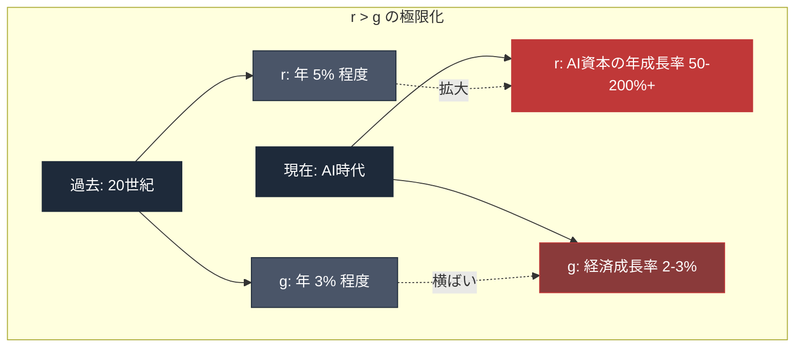

---

## 5.3 アセモグル「AIの単純なマクロ経済学」

2024年、MITの経済学者ダロン・アセモグルは、論文「The Simple Macroeconomics of AI」（NBER Working Paper No. 32487）を発表した。

アセモグルは、2023年ノーベル経済学賞受賞者候補として知られ、『なぜ国家は衰退するのか』『Power and Progress』の共著者でもある。技術と制度の関係を長年研究してきた。

**アセモグルの主要な主張:**

| 論点                   | アセモグルの推計           |
| -------------------- | ------------------ |
| 今後10年でAIの影響を受ける仕事の割合 | **約5%**            |
| 生産性の向上               | 年間0.07%、10年で約0.71% |
| 消費者福祉の変化             | **-0.72%**         |
| 税収の変化                | わずかにマイナス           |

アセモグルの結論は、AI楽観主義者の期待とは大きく異なる。

**「AIはすべての仕事を変えない。しかし、分配を変える。」**

アセモグルの論理は、以下のステップで構成される。

| ステップ       | 内容                  |
| ---------- | ------------------- |
| 1. 技術の直接効果 | AIの影響を受ける仕事は限定的（5%） |
| 2. 生産性向上   | わずかな向上（0.71%）       |
| 3. 分配問題    | 向上分の大半が資本所有者に帰属     |
| 4. 労働者の損失  | 代替された労働者の賃金低下       |
| 5. 消費者物価   | 一部で低下、一部で上昇（混在）     |
| 6. 福祉の総計   | **マイナス**（-0.72%）    |

アセモグルは、**AIが社会全体の福祉を下げる可能性**を、厳密なマクロ経済学的分析で示した。

これは、AI推進派の「AIは全員を豊かにする」という主張への、最も学術的に厳密な反論だ。

---

## 5.4 永久下層市民（permanent underclass）の構造

ノア・スミスが提示した「永久下層市民」の概念を、構造的に整理する。

**永久下層市民が生まれる条件:**

| 条件           | 内容                         |
| ------------ | -------------------------- |
| 1. 労働市場からの排除 | 自分の職種がAIに代替され、仕事がない        |
| 2. 再訓練の困難    | 新しいスキルを学ぶ間に、そのスキルもAIに代替される |
| 3. 社会保障の限界   | 従来の失業給付や再教育支援では不十分         |
| 4. 世代を超えた継承  | 親が下層市民になると、子にも影響が及ぶ        |
| 5. 政治的発言力の低下 | 排除された層の声は政治に届きにくい          |

**永久下層市民と「従来の貧困層」の違い:**

| 軸     | 従来の貧困層         | 永久下層市民           |
| ----- | -------------- | ---------------- |
| 再起可能性 | あり（教育、転職、起業等）  | 構造的に困難           |
| 原因    | 個人の事情、経済変動     | AIによる労働代替の構造     |
| 期間    | 一時的、世代を超えない場合も | 永続的、世代を超えて固定     |
| 政策対応  | 再就職支援、職業訓練     | 現状の制度では対応困難      |
| 人数規模  | 社会の一部          | 労働人口の相当部分に達する可能性 |

**永久下層市民が拡大した場合の社会:**

| 観点     | 予想される状況            |
| ------ | ------------------ |
| 経済     | 消費需要の減少、景気悪化       |
| 政治     | ポピュリズム、極端主義の台頭     |
| 社会秩序   | 犯罪、暴力、社会的不安の増加     |
| 文化     | 分断の深化、共通言語の喪失      |
| 歴史的類似性 | 産業革命初期、ラッダイト運動期の状況 |

---

## 5.5 「22世紀の資本」ブログの論考

オンラインで公開された「22世紀の資本」というブログは、ピケティの枠組みをAI時代に拡張した論考を展開した。著者は匿名だが、経済学者またはそれに近い知識を持つ人物と推測される。

**「22世紀の資本」の主要論点:**

| 論点            | 内容                      |
| ------------- | ----------------------- |
| AIは「究極の資本」である | スケーラブルで、労働を完全代替できる      |
| r > g は極限化する  | AI資本のリターンは、過去の資本を超える    |
| 相続の意味が変わる     | AI企業の株式を持つかどうかが決定的      |
| 政治経済学の変質      | 労働組合、社会民主主義の枠組みが機能しなくなる |
| 新しい政治秩序の必要性   | UBI、公共富裕基金、ロボット税等の議論    |

**「22世紀の資本」は、一つの鋭い問いを立てている:**

> AIがすべての仕事をこなせる時代、人間の労働に対する需要は、ほぼゼロに近づく可能性がある。その時、労働者階級は何を交渉材料に、何を獲得できるのか？

従来の労働運動は、ストライキという手段で資本家と交渉してきた。しかし、労働がAIに代替されるなら、ストライキは交渉材料にならない。労働者は何も持たない。

これが、**「永久下層市民」が政治的にも無力化する**構造の核心だ。

---

## 5.6 歴史的比較: 産業革命期のラッダイト

ピケティと「22世紀の資本」の議論は、歴史的な類似点として産業革命期を頻繁に引き合いに出す。

**19世紀初頭のラッダイト運動と21世紀のAI時代の比較:**

| 比較項目      | ラッダイト（1811-1816） | AI時代（2023-2026）           |
| --------- | ---------------- | ------------------------- |
| 技術革新      | 織機・編機の機械化        | 生成AI、コーディング支援AI           |
| 代替される職種   | 職人（熟練労働者）        | ジュニアエンジニア、カスタマーサポート、ライター等 |
| 資本家の利益    | 機械所有者、工場主        | AI企業創業者、投資家               |
| 労働者の反応    | 機械破壊、暴動          | 社会不安、一部で暴力行為              |
| 政府の対応     | 軍の動員、機械破壊を死刑適用   | 議論継続、具体的対応は遅れる            |
| 長期的結果（予測） | 労働組合、社会保障の基礎     | UBI、公共富裕基金、ロボット税等の議論      |

**重要な類似点:**

- どちらも、**技術そのものより、技術を所有・配分する構造**が対立の焦点
- 労働者が直接的な打撃を受ける
- 政府・制度の対応が技術速度に追いつかない
- 「元には戻らない」構造変化が起きている

**重要な相違点:**

- 速度: 産業革命は数十年、AI時代は数年のスケール
- 規模: ラッダイトは一部地域、AIは全世界同時
- 代替範囲: ラッダイトは職人の一部、AIは知的労働全般
- 資本の流動性: 19世紀の資本は地域限定、AI資本はグローバル

---

## 5.7 社会的対応の選択肢

永久下層市民の構造が現実化した場合、社会はどのような選択肢を持つのか。

**主要な政策提案:**

| 政策                     | 概要                | 実装状況              |
| ---------------------- | ----------------- | ----------------- |
| UBI（ユニバーサル・ベーシック・インカム） | すべての市民に無条件で一定額を支給 | 一部実験段階、本格導入なし     |
| ロボット税                  | AI・自動化の導入企業に課税    | 議論段階、実装困難         |
| 公共富裕基金                 | 市民全員が株主となる基金      | OpenAIが提言、政治的合意なし |
| 週32時間労働制               | 労働時間を削減し、雇用を分配    | 一部欧州で実験、小規模       |
| 負の所得税                  | 低所得者に給付、高所得者に課税   | 一部国で部分的導入         |
| 労働時間の構造変革              | 新しい仕事の分配方法        | 構想段階              |

**各政策の課題:**

| 政策       | 課題             |
| -------- | -------------- |
| UBI      | 財源、労働意欲、政治的抵抗  |
| ロボット税    | 定義困難、国際競争力への影響 |
| 公共富裕基金   | 政治的合意、運用の公正性   |
| 週32時間労働制 | 業界による違い、国際競争   |
| 負の所得税    | 既存制度との統合、財源    |

これらの政策は、**すべてが未実装**または**実験段階**だ。2026年時点で、永久下層市民問題に対する社会的対応は、**ほぼ空白状態**と言える。

---

## 5.8 r > g の極限化が意味する政治構造

経済構造の変化は、政治構造の変化を伴う。

**r > g が極限化した世界の政治:**

| 構造要素      | 変化                        |
| --------- | ------------------------- |
| 有権者の分布    | AI資本所有者（少数）vs 労働者・失業者（多数） |
| 政治的対立軸    | AI推進 vs AI規制、富裕層保護 vs 再分配 |
| 主流政党の立ち位置 | 労働組合離れ、AI企業との関係性が問われる     |
| ポピュリズムの台頭 | AI批判を軸とした政治勢力の出現可能性       |
| 民主主義の機能   | 有権者の利益と政策の乖離が拡大           |

**過去の類似例:**

歴史上、r > g が極端化した時期には、以下のような政治的事象が起きた。

| 時代           | 現象                        |
| ------------ | ------------------------- |
| 19世紀末〜20世紀初頭 | 社会主義運動、ロシア革命、労働運動の興隆      |
| 1920年代       | ファシズムの台頭、大恐慌への政策対応失敗      |
| 2010年代       | ポピュリズム（トランプ、ブレグジット、国民戦線等） |

AI時代の r > g 極限化は、これらと同様、あるいはそれ以上の**政治的激動**を伴う可能性がある。

---

## 5.9 Anthropic創業者の「80%寄付誓約」

AI企業自身も、この格差問題を認識している。

Anthropicの共同創業者ダリオ・アモデイは、エッセイ「The Adolescence of Technology」（2026年1月）で、**「とんでもない不平等が生まれるリスクがとても高い」**と認めた。

そして、**Anthropicの共同創業者7名全員が、資産の80%を寄付することを誓約**した。

**この誓約の意味:**

| 観点         | 評価                          |
| ---------- | --------------------------- |
| 象徴的意味      | AI企業の指導者が格差問題を認識している        |
| 実質的意味      | 7名の資産のみでは構造的解決にならない         |
| 政治的意味      | 自らが生み出す格差を、自らの寄付で緩和しようとする姿勢 |
| 批判的視点      | 「偽善」と見る見方、「誠実」と見る見方の両論      |
| 他のAI企業への波及 | OpenAIのアルトマンは類似の誓約をしていない    |

**寄付誓約は、r > g の極限化を止めることはできない。**

なぜなら、構造的な問題は個人の善意では解決できないからだ。税制、規制、社会保障制度の設計が必要だ。しかし、その制度変革には、政治的合意が必要で、そこには時間がかかる。

---

## 5.10 この章の結論

ピケティのr > g は、AI時代に極限化する。

| レイヤー     | 構造                             |
| -------- | ------------------------------ |
| 資本の性質    | AI資本は、スケーラブル・自己増殖的・独占的         |
| リターンの格差  | r（AI資本）は50-200%+、g（経済成長率）は2-3% |
| 労働市場への影響 | 代替可能な職が急速に増加、再訓練も困難            |
| アセモグル分析  | 消費者福祉は-0.72%（10年間）             |
| 永久下層市民   | 労働市場から永続的に排除される層の出現            |
| 社会対応     | UBI、ロボット税等の議論はあるが未実装           |
| 政治構造     | ポピュリズム、分断、民主主義の機能不全            |
| 個人の対応    | Anthropic創業者80%寄付等、個別努力        |

この構造は、19世紀のラッダイト運動期と類似しているが、**速度とスケールが圧倒的に大きい**。

r > g が極限化する社会では、期待と恐れの同時加速が常態になる。資本を持つ者はAIに期待し、持たない者はAIを恐れる。両者は同じ社会に住みながら、全く異なる経済的現実に生きている。

次章では、この経済的格差が**暴力**に転化する構造を追う。2026年4月のアルトマン襲撃とインディアナポリス銃撃を、19世紀のラッダイト運動と構造的に比較する。**「ラッダイトの再来」**は、比喩ではなく、構造的な事実として語られるべき現象だ。

---

## 参考文献

1. Piketty, Thomas. "Capital in the Twenty-First Century." Harvard University Press, 2013.

2. Acemoglu, Daron. "The Simple Macroeconomics of AI." NBER Working Paper No. 32487, 2024.
   https://www.nber.org/papers/w32487

3. Noah Smith. "Noahpinion: What if a few AI companies hoard all the money and power?" Substack, 2025.
   https://www.noahpinion.blog/

4. "22nd Century Capital" Blog. "Piketty × AI: An Extreme Extension."
   (URL: 匿名著者のSubstackブログ)

5. Amodei, Dario. "The Adolescence of Technology." Anthropic Blog, January 2026.
   https://www.anthropic.com/news/the-adolescence-of-technology

6. OpenAI. "Industrial Policy for the Intelligence Age." 2026.
   https://openai.com/

7. Acemoglu, Daron & Robinson, James A. "Why Nations Fail." Crown Business, 2012.

8. Acemoglu, Daron & Johnson, Simon. "Power and Progress: Our Thousand-Year Struggle Over Technology and Prosperity." PublicAffairs, 2023.

---

# 第6章

## ラッダイトの再来 — 火炎瓶、銃撃、No Data Centers

---

2026年4月、米国で立て続けに起きた三つの事件は、偶然ではない。

- 4月10日: サム・アルトマン自宅に火炎瓶
- 4月12日: 同じ家に銃撃
- 同週: インディアナポリス市議会議員宅に13発の銃弾、「NO DATA CENTERS」のメモ

これらは、一人の人間が引き起こしたのではない。別々の動機で、別々の人物が、同じ週に、同じ国で、同じ構造の暴力を実行した。

この事実が示しているのは、AI反対の感情が、**個別の事件ではなく、社会運動として立ち上がっている**ということだ。

この章では、この運動を**ラッダイト運動の再来**として捉え、1811年の歴史と2026年の現在を構造的に比較する。

---

## 6.1 1811年、ノッティンガムで何が起きたか

1811年、英国ノッティンガム。

産業革命の進展により、織物業に機械化の波が押し寄せていた。特に、織機と編機の機械化は、熟練職人たちの仕事を奪った。

職人たちは、それまで手作業で編まれていた高品質の織物を、長年の修行で作り上げてきた。しかし機械は、低品質ながら安価で、大量の織物を生産できた。市場は機械織りに流れ、職人たちは仕事を失った。

1811年3月、ノッティンガム近郊のアーノルドで、最初の事件が起きた。

**武装した職人グループが、工場に侵入し、機械を破壊した。**

彼らは自らを「ラッダイト（Luddites）」と名乗った。架空のリーダー「ネッド・ラッド（Ned Ludd）」の指揮下にあるとする匿名書簡を各地に送付した。

運動は急速に広がった。

| 時期      | 地域                   | 出来事                   |
| ------- | -------------------- | --------------------- |
| 1811年3月 | ノッティンガム近郊            | 最初の機械破壊               |
| 1811年末  | ミッドランズ地方             | 運動の本格化、数百の機械が破壊される    |
| 1812年   | ヨークシャー、ランカシャー        | 運動が北部に拡大、暴力性が増す       |
| 1812年4月 | ヨークシャー、Rawfolds Mill | 工場襲撃、警備員と銃撃戦          |
| 1812年4月 | ハダースフィールド            | 工場主William Horsfall射殺 |
| 1812年   | 英国政府の対応              | 軍を動員、1万2千人の兵力を派遣      |
| 1813年1月 | ヨーク                  | 大規模裁判、17人が絞首刑         |
| 1816年   | 運動の終息                | 主要メンバー処刑、運動は鎮圧        |

**ラッダイト運動は、5年間続いた。**

---

## 6.2 ラッダイト運動の本質

歴史上、「ラッダイト」という言葉は、**「技術嫌いの愚か者」**という蔑称として使われてきた。しかし、実際のラッダイト運動は、そのような単純なものではなかった。

**ラッダイト運動の本質:**

| 誤解         | 実態                    |
| ---------- | --------------------- |
| 機械そのものを嫌った | 機械が生み出す**社会構造**を問題視した |
| 進歩を止めようとした | 進歩の**配分**を公正化しようとした   |
| 非合理的な感情論   | 具体的な経済的被害への合理的反応      |
| 一時的な暴動     | 5年にわたる組織的運動           |
| 孤立した動き     | 地域コミュニティに広く支持された      |

ラッダイトたちが破壊したのは、**「労働者の生活を破壊する形で導入された機械」**であり、機械そのものではなかった。彼らは、利益を労働者と共有する工場主の機械は、破壊しなかったとされる。

**ラッダイトの要求:**

| 要求        | 内容                    |
| --------- | --------------------- |
| 最低賃金の設定   | 機械との競争で賃金が下落しすぎないよう保護 |
| 機械導入の条件付け | 職人の生活を保障する条件下で機械化     |
| 徒弟制度の保護   | 熟練職人の技術と地位の継承         |
| 労働時間の制限   | 過剰労働の防止               |

これらの要求は、**19世紀後半以降、労働組合運動、労働法、社会保障制度として徐々に実現された**。ラッダイト運動自体は敗北したが、彼らの問題提起は、後の社会制度の礎になった。

---

## 6.3 なぜラッダイトは敗北したか

ラッダイト運動は、5年で鎮圧された。なぜか。

**ラッダイト敗北の要因:**

| 要因        | 内容                     |
| --------- | ---------------------- |
| 政治的発言力の欠如 | 当時の英国では、労働者に選挙権がなかった   |
| 組織化の困難    | 匿名性を保ちながらの組織化は限界があった   |
| 政府の強硬対応   | 1812年「機械破壊法」で死刑適用、軍の動員 |
| 経済的圧力     | 機械化で利益を得る資本家側の政治的影響力   |
| 世論の分裂     | 一般市民の共感を十分に得られなかった     |
| 時代背景      | ナポレオン戦争で食糧不足、社会全体が困窮   |

政府の弾圧は徹底していた。1812年、英国政府は**1万2千人の兵力**をラッダイト鎮圧のために派遣した。これは、当時ナポレオンと戦っていた兵力の規模に匹敵する。

1813年のヨーク裁判では、機械破壊で17人が絞首刑、さらに数十人が流刑（オーストラリアへの強制移送）になった。

**運動は、暴力によって鎮圧された。**

しかし、ラッダイトの問題提起は消えなかった。

---

## 6.4 2026年4月のAI反対暴力

それから215年後、2026年4月の米国。構造は驚くほど類似している。

**2026年4月の事件:**

| 事件           | 詳細                                 |
| ------------ | ---------------------------------- |
| 4月10日 火炎瓶    | サム・アルトマン自宅玄関に投擲、門・玄関焼損、負傷者なし       |
| 4月10日 拘束     | OpenAI本社近くで容疑者20歳男性を拘束             |
| 4月12日 銃撃     | 同じ家の前に停車した車から敷地内に1発発砲              |
| 4月12日 逮捕     | 男女2人逮捕、容疑者宅から3丁の銃押収                |
| 同週 インディアナポリス | 市議会議員宅に13発の銃弾、「NO DATA CENTERS」のメモ |

**容疑者の動機と属性:**

| 容疑者                               | 属性      | 動機関連情報                                     |
| --------------------------------- | ------- | ------------------------------------------ |
| Daniel Alejandro Moreno-Gama（20歳） | テキサス州在住 | PauseAI Discord に34件の投稿、「バトレリアン・ジハーディスト」自称 |
| Amanda Tom（25歳）                   | —       | 銃撃事件、3丁の銃押収                                |
| Muhamad Tarik Hussein（23歳）        | —       | 銃撃事件、共犯                                    |
| インディアナポリスの容疑者                     | 特定不明    | AIデータセンター建設への反発                            |

**注目すべき点:**

- 容疑者たちは、**別々の集団**から出ている
- 動機は共通している: **AI・AI企業・AIインフラへの反発**
- 手段は暴力で、**意図的に象徴的な対象**を選んでいる
- 社会的反応は分かれている: 一部で犯罪非難、一部で**共感**

---

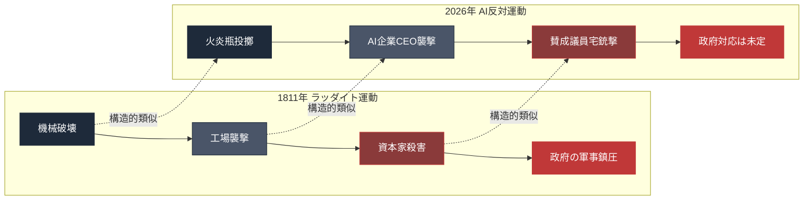

---

## 6.5 ラッダイトとAI反対運動の構造比較

1811年と2026年を、6つの観点から比較する。

**比較1: 技術の性質**

| 観点      | ラッダイト（1811）  | AI反対（2026）               |
| ------- | ------------ | ------------------------ |
| 代替される労働 | 織工・編工（熟練手工業） | プログラマー、ライター、サポート職等（知的労働） |
| 技術の範囲   | 織物業の特定工程     | 知的労働全般、広範囲               |
| 代替速度    | 数十年単位        | 数年単位                     |
| 資本の集中度  | 工場主レベル       | AI企業レベル（グローバル）           |

**比較2: 攻撃対象**

| 観点    | ラッダイト          | AI反対運動               |
| ----- | -------------- | -------------------- |
| 物理的対象 | 織機・編機          | AI企業CEO、データセンター、賛成議員 |
| 象徴的対象 | 機械所有者（工場主）     | AI企業創業者、AI推進政治家      |
| 攻撃の目的 | 機械破壊で雇用を守る     | AI企業への圧力、政策変更を要求     |
| 死傷者   | 工場主Horsfallを射殺 | 負傷者なし（象徴的攻撃）         |

**比較3: 社会的支持**

| 観点       | ラッダイト          | AI反対運動               |
| -------- | -------------- | -------------------- |
| 地域コミュニティ | 広く支持           | SNS上で共感の声            |
| 一般世論     | 分裂（支持・反発両方）    | 分裂（支持・反発両方）          |
| メディア報道   | 新聞が批判的に報道      | メディアで批判的に報道、同時に構造分析も |
| 学術的関心    | 経済学者（リカード等）も言及 | 経済学者（アセモグル等）が分析      |

**比較4: 政府の対応**

| 観点      | ラッダイト             | AI反対運動      |
| ------- | ----------------- | ----------- |
| 軍事・警察対応 | 1万2千人の軍派遣         | 警察による個別事件対応 |
| 立法対応    | 1812年「機械破壊法」、死刑適用 | 現時点で新法なし    |
| 死刑・重罰   | 17人絞首刑、流刑         | 通常の刑事手続き    |
| 構造的対応   | 短期的には鎮圧のみ         | 議論継続中       |

**比較5: 経済的背景**

| 観点      | ラッダイト        | AI反対運動          |
| ------- | ------------ | --------------- |
| 全般的経済状況 | ナポレオン戦争で食糧不足 | インフレ、格差拡大       |
| 雇用状況    | 織物業の職人失業     | ホワイトカラー職の縮小     |
| 所得格差    | 資本家と労働者の断絶   | AI富裕層と一般市民の断絶   |
| 生活コスト   | 穀物価格高騰       | 住宅・食料・エネルギー価格上昇 |

**比較6: 長期的結果（ラッダイト）・予測（AI反対）**

| 観点       | ラッダイト（結果）       | AI反対運動（予測）          |
| -------- | --------------- | ------------------- |
| 運動の鎮圧    | 5年で敗北           | 短期的には警察対応で抑制可能      |
| 政治的帰結    | 労働組合運動の萌芽       | 新たな社会運動の形成可能性       |
| 法制度      | 労働法、社会保障の基礎に    | UBI、ロボット税、AI規制の議論加速 |
| 文化的影響    | 「ラッダイト」が蔑称として定着 | 「AI反対派」のラベル化の可能性    |
| 100年後の評価 | 社会変革の先駆として再評価   | 未知                  |

---

## 6.6 PauseAI運動の台頭

2026年の暴力事件は、組織的な AI 反対運動の一部として理解する必要がある。

**PauseAI**は、AI開発の一時停止を求める国際運動だ。2023年に設立され、急速に拡大している。

| 項目  | 内容                     |
| --- | ---------------------- |
| 設立  | 2023年、オランダで発足          |
| 主張  | AGI（汎用AI）開発の一時停止、安全性優先 |
| 組織  | Discord、X、各種イベントで活動    |
| 規模  | 世界数十カ国、数千人の活動家         |
| 日本  | PauseAI Japan、活動家数百人規模 |
| 方針  | 非暴力が原則、しかし一部の過激化傾向も    |

**2026年4月のアルトマン襲撃容疑者は、PauseAIのDiscordに34件の投稿をしていた**。これは、PauseAI本体の公式方針とは無関係だが、運動の周辺で**過激化する個人**が存在することを示している。

**PauseAIの主張の核心:**

| 主張            | 内容             |
| ------------- | -------------- |
| 現在のAI開発は急速すぎる | 安全性研究が追いついていない |
| 社会的合意形成が必要    | 市民を無視した開発は不当   |
| 巨大AI企業の権力集中   | 民主主義への脅威       |
| AGI開発の一時停止    | 少なくとも6ヶ月〜2年の停止 |
| 国際的規制の必要性     | 核兵器のような国際的管理   |

PauseAIは、非暴力的抗議、政治家への請願、メディア露出を中心に活動している。しかし、運動の中で共有されるAIへの危機感が、一部の個人を過激化させる土壌を作っている。

---

## 6.7 ラッダイトと現代の共通原理

ラッダイトとAI反対運動は、**200年以上の時間を経ても共通する原理**を持っている。

**共通原理1: 技術そのものより「構造」が問題**

- ラッダイト: 機械そのものではなく、機械が生み出す雇用構造を問題視
- AI反対: AIそのものではなく、AIを所有・配分する構造を問題視

**共通原理2: 直接の被害を受ける層が運動の主体**

- ラッダイト: 熟練織工・編工（実際に仕事を失った層）
- AI反対: 若年層、特にAIに職を奪われる/奪われそうな層

**共通原理3: 象徴的な対象を攻撃する**

- ラッダイト: 機械、工場、工場主
- AI反対: AI企業CEO、データセンター、賛成議員

**共通原理4: 合理的な要求と感情的な爆発が混在**

- ラッダイト: 最低賃金等の合理的要求と、感情的な暴動が混在
- AI反対: UBI等の政策要求と、象徴的な暴力が混在

**共通原理5: 主流メディアから「非合理」として描かれる**

- ラッダイト: 「機械嫌いの愚か者」として描かれた
- AI反対: 「テクノロジー恐怖症」「陰謀論者」として描かれる

**共通原理6: 長期的には社会変革に貢献**

- ラッダイト: 労働組合、労働法、社会保障の礎に
- AI反対: UBI、AI規制、新たな社会契約の議論を加速

---

## 6.8 違いも存在する

一方で、200年の時間を経て、状況は変わっている部分もある。

**違い1: 技術代替の速度と範囲**

| 観点   | 1811年    | 2026年      |
| ---- | -------- | ---------- |
| 代替範囲 | 織物業の一部工程 | 知的労働全般     |
| 速度   | 数十年      | 数年         |
| 地理   | 英国内      | 世界同時       |
| 対象職種 | 職人（手工業）  | オフィスワーカー全般 |

**違い2: 政治的環境**

| 観点    | 1811年    | 2026年          |
| ----- | -------- | -------------- |
| 選挙権   | 労働者になし   | 全員にあり（民主主義国）   |
| 表現の自由 | 制限的      | 保障（SNSで発信可能）   |
| 組織化   | 匿名・秘密結社的 | 公開運動（PauseAI等） |
| 政府対応  | 軍事鎮圧可能   | 民主的手続きが必要      |

**違い3: 国際的次元**

| 観点     | 1811年  | 2026年         |
| ------ | ------ | ------------- |
| 問題の範囲  | 英国内    | 全世界           |
| 企業の国籍  | 英国の工場主 | 米国のAI企業が世界を支配 |
| 規制の国際性 | 不要     | 国際協調が不可欠      |
| 運動の国際性 | 地域限定   | PauseAI等、国際連帯 |

**違い4: メディアと情報**

| 観点      | 1811年  | 2026年      |
| ------- | ------ | ---------- |
| 情報伝達    | 口コミ、新聞 | SNS、リアルタイム |
| 運動の可視化  | 限定的    | 全世界に即時可視化  |
| 反対意見の共有 | 個別・断片的 | グローバルに共有   |
| 過激化のリスク | 比較的遅い  | SNS経由で急速   |

---

## 6.9 暴力への転化の構造

ラッダイト運動もAI反対運動も、**一部が暴力化する構造**を持っている。その構造を整理する。

**暴力化のプロセス:**

| ステップ        | 内容                |
| ----------- | ----------------- |
| 1. 経済的被害    | 職を失う、生活が苦しくなる     |
| 2. 制度的絶望    | 政治に訴えても状況が変わらない   |
| 3. 個人的孤立    | 社会から切り離される感覚      |
| 4. 敵の特定     | 「誰がこの状況を作ったのか」の特定 |
| 5. 象徴的行動の衝動 | 具体的な行動で「声」を上げたい欲求 |
| 6. 暴力の実行    | 一部の個人が暴力に転化       |

**1811年のラッダイトと2026年のAI反対容疑者に共通する心理:**

- **「自分は見えない」**: 社会から無視されていると感じる
- **「声が届かない」**: 正規の手続きでは影響力がない
- **「敵が特定できる」**: 象徴的な対象が明確
- **「今行動しなければ手遅れ」**: 緊急性の認識

この心理構造は、個人の精神的問題ではなく、**社会構造的な帰結**だ。経済的排除が進み、政治的発言力が弱く、制度的解決策が見えない社会では、一部の個人が暴力に転化する。

**歴史的には、暴力化した個人は例外であり、運動全体を代表するわけではない。** しかし、暴力事件は社会的に大きなインパクトを持ち、運動全体のイメージを決定づけることがある。

---

## 6.10 SNSでの共感の広がり

2026年4月の事件で、最も注目すべきは**SNSでの反応**だった。

テックジャーナリストのアレックス・ヒース氏が報じた事例:

> **「犯人の保釈金、どこに払えばいいの？」**
> **「みんな、（AIに）ウンザリしてる」**

このようにシンパシーを表明したり、称賛するコメントが、SNS上で多く見られた。

**この反応が意味すること:**

| 観点         | 意味                            |
| ---------- | ----------------------------- |
| 社会的共感の広がり  | 単独の犯罪ではなく、社会感情の表出として受け止める層が存在 |
| AI企業への深い不信 | 多くの人がAI企業を「敵」と認識              |
| 暴力の「正当化」心理 | 暴力そのものを正当化する動きの萌芽             |
| 議論の極化      | 中間的立場の消失、両極化の進行               |

この「共感」は、犯罪を正当化するものではない。しかし、**社会感情の温度が、暴力を容認できる水準に近づいている**ことを示している。

ラッダイト運動の時代、地域コミュニティがラッダイトを匿った。機械破壊の後、警察や軍が捜査に来ても、地域住民は協力しなかった。**共感が、運動を支えた。**

2026年のAI反対運動でも、類似の構造が現れつつある。

---

## 6.11 この章の結論

2026年4月の火炎瓶・銃撃・「NO DATA CENTERS」は、偶然ではない。

| 観点      | 構造                        |
| ------- | ------------------------- |
| 歴史的位置づけ | 1811年ラッダイト運動の再来           |
| 動機      | AIによる労働代替、AI企業への不信、格差への怒り |
| 手段      | 象徴的な対象への暴力                |
| 社会的反応   | 一部で犯罪非難、一部で共感             |
| 政府対応    | 個別事件対応、構造的対応は未定           |
| 運動の広がり  | PauseAI等、国際的な組織運動として      |
| 長期的予測   | 短期鎮圧可能だが、構造問題は解決しない       |

**ラッダイト運動は、5年で敗北した。しかし、彼らの問題提起は、労働組合運動、労働法、社会保障制度として、後の社会を変えた。**

2026年のAI反対運動も、短期的には鎮圧可能かもしれない。しかし、その後の社会が、どのような制度を生み出すかは、まだ決まっていない。

次章では、この**制度変革が、なぜ遅れるのか**を追う。技術の速度と制度の速度のギャップ——これが「制度的遅滞」だ。AIは指数関数的に進化するが、法律、規制、社会保障制度は線形にしか進化しない。このギャップが、社会的緊張を生む根本原因だ。

---

## 参考文献

1. Thompson, E. P. "The Making of the English Working Class." Vintage Books, 1963.

2. Hobsbawm, Eric. "Luddites." in "The Age of Revolution: Europe 1789-1848." Vintage, 1962.

3. Binfield, Kevin (ed.). "Writings of the Luddites." Johns Hopkins University Press, 2004.

4. BBC. "The Luddites: Who were they and what did they want?" 2023.
   https://www.bbc.co.uk/history/british/empire_seapower/luddites_01.shtml

5. PauseAI. "Official Website."
   https://pauseai.info/

6. Alex Heath. "Silicon Valley's AI elite grapple with growing public hostility." The Verge / Command Line, 2026.

7. Reuters. "Sam Altman's home attacked with Molotov cocktail." 2026年4月10日.

8. Indianapolis Star. "Councilmember Gibson's home hit with 13 bullets." 2026年4月.

9. Sale, Kirkpatrick. "Rebels Against the Future: The Luddites and Their War on the Industrial Revolution." Addison-Wesley, 1995.

---

# 第7章

## 制度的遅滞 — 技術の速度に追いつけない社会の自己防衛

---

技術は指数関数的に進化する。制度は線形にしか進化しない。

この速度差が、AI時代のあらゆる社会問題の根本原因だ。

この章では、技術と制度の速度ギャップを「制度的遅滞」と定義し、なぜ追いつけないのか、追いつかないとどうなるのか、を追う。

---

## 7.1 技術の速度と制度の速度

AI技術の進化は、人類史上類を見ない速度で進んでいる。

**AIモデルの進化速度（2022-2026）:**

| 時期       | 主要リリース                    | 能力指標           |
| -------- | ------------------------- | -------------- |
| 2022年11月 | ChatGPT(GPT-3.5)          | 会話型AIの大衆化      |
| 2023年3月  | GPT-4                     | 推論能力の大幅向上      |
| 2023年7月  | Claude 2                  | 長文脈対応          |
| 2024年3月  | Claude 3                  | マルチモーダル、推論強化   |
| 2024年5月  | GPT-4o                    | リアルタイム音声・画像処理  |
| 2024年9月  | o1（OpenAI）                | 複雑な推論タスク       |
| 2025年初   | Claude 3.5 Sonnet         | コーディング能力の質的転換  |
| 2025年後半  | Claude Opus 4, Gemini 2.5 | エージェント能力の実用化   |
| 2026年4月  | Claude Mythos（非公開）        | ハッキング能力等の脅威レベル |

**各モデル間の進化スパン: 2-6ヶ月**

一方、法制度の進化速度は根本的に異なる。

**主要AI規制の進化速度:**

| 法制度             | 発案         | 議論期間     | 施行                   |
| --------------- | ---------- | -------- | -------------------- |
| EU AI Act       | 2021年      | 3年       | 2024年採択、2026年段階施行    |
| 米国大統領令（バイデン）    | 2023年10月発令 | 1年       | 2024年施行（トランプ政権で一部撤廃） |
| カリフォルニア SB 1047 | 2024年      | 1年       | 2024年9月知事拒否権発動       |
| 日本 AI基本法（議論中）   | 2024年      | 2年以上議論継続 | 施行時期未定               |
| 中国 生成AI管理暫定弁法   | 2023年発表    | 半年       | 2023年8月施行            |

**各法制度の進化スパン: 1-3年以上**

**技術は6ヶ月、制度は3年。この速度差が、構造的な問題を生んでいる。**

---

## 7.2 EU AI Actの詳細

EU AI Actは、世界で最も包括的なAI規制だ。2021年に提案され、2024年に採択、2026年から段階的に施行されている。

**EU AI Actの概要:**

| 項目     | 内容                         |
| ------ | -------------------------- |
| 提案     | 2021年4月                    |
| 採択     | 2024年3月                    |
| 段階施行開始 | 2026年                      |
| 主な規制対象 | 「高リスクAI」「禁止AI」「汎用AI」の3カテゴリ |
| 罰則     | 最大で売上高の7%または3500万ユーロ       |

**「禁止AI」のカテゴリ:**

| 禁止AI       | 内容                    |
| ---------- | --------------------- |
| サブリミナル操作   | 人を意図的に操作するAI          |
| 弱者の搾取      | 子供・障害者・高齢者等を狙ったAI     |
| 社会スコアリング   | 政府によるシチズンスコア          |
| 予測警察       | 犯罪予測AIでの個人監視          |
| リアルタイム生体認証 | 公共空間でのリアルタイム顔認証（例外あり） |

**「高リスクAI」のカテゴリ:**

教育、雇用、必須サービス、司法、国境管理等での使用。事前評価、透明性、人間監視等の要件が課される。

**「汎用AI（GPAI）」のカテゴリ:**

GPT、Claude、Gemini等の大規模汎用モデル。以下の要件:

| 要件       | 内容               |
| -------- | ---------------- |
| 透明性      | 訓練データ、アーキテクチャの開示 |
| 著作権遵守    | EU著作権法への準拠       |
| セキュリティ要件 | 悪用防止のための対策       |
| 環境影響報告   | エネルギー消費等の報告      |

**EU AI Actの限界:**

| 限界          | 内容                     |
| ----------- | ---------------------- |
| 適用範囲        | EU域内のみ、米国企業の本国活動には及ばない |
| 執行能力        | 各国当局の能力にばらつき           |
| 技術的定義       | 「高リスク」の定義が技術進化に追いつかない  |
| イノベーション抑制懸念 | 欧州AI企業の競争力低下のリスク       |
| 違反認定の困難     | AI の挙動は複雑で、違反認定が難しい    |

---

## 7.3 米国のAI規制の混乱

米国は、AI規制において**州、連邦、大統領令**が複雑に絡み合う状況にある。

**米国AI規制の歩み:**

| 時期       | 動き                           |
| -------- | ---------------------------- |
| 2023年10月 | バイデン大統領令「AI安全」署名             |
| 2024年1月〜 | 連邦議会でAI規制法案が複数提案（採択なし）       |
| 2024年9月  | カリフォルニア SB 1047、ニューサム知事拒否権発動 |
| 2024年11月 | 大統領選挙でトランプ当選                 |
| 2025年1月  | トランプ政権発足、バイデンAI大統領令の一部撤廃     |
| 2025年以降  | AI推進寄りの政策、規制議論が後退            |

**米国の規制の特徴:**

| 特徴     | 内容                                   |
| ------ | ------------------------------------ |
| 連邦レベル  | 包括的な法律なし、大統領令のみ                      |
| 州レベル   | 州ごとにばらつき、統一性なし                       |
| 業界自主規制 | Voluntary Commitments（一部AI企業が自主的に署名） |
| 政治的分断  | 民主党は規制寄り、共和党は推進寄り                    |

**2025年1月、トランプ政権誕生後の変化:**

- AI推進政策への転換
- データセンター建設支援の加速
- AI安全性研究への連邦予算の一部削減
- 国際協調より米国単独主義

**この変化の帰結:**

| 帰結           | 内容                |
| ------------ | ----------------- |
| AI企業への規制圧力低下 | 企業の自由裁量が広がる       |
| 安全性研究の民間依存   | Anthropic等の企業主導に  |
| 国際規制の分断      | EUと米国の規制乖離        |
| 市民の不安増加      | 「規制なしで突き進むAI」への恐怖 |

---

## 7.4 日本のAI規制の現状

日本のAI規制は、**議論中**という状態が続いている。

**日本のAI政策の歩み:**

| 時期      | 動き                 |
| ------- | ------------------ |
| 2023年   | 政府AI戦略会議の設置        |
| 2024年   | AI事業者ガイドライン（非法的拘束） |
| 2024年後半 | AI基本法の議論開始         |
| 2025年   | 経産省・総務省の権限争い       |
| 2026年   | 法制化は進まず、ガイドライン中心   |

**日本のAI規制の特徴:**

| 特徴     | 内容                       |
| ------ | ------------------------ |
| 基本姿勢   | EU型の厳格規制よりも、推進寄り         |
| 司令塔の不在 | 経産省、総務省、内閣府等の権限が分散       |
| 法制度    | 既存法（個人情報保護法、著作権法等）の延長で対応 |
| AI基本法  | 議論継続中、施行時期未定             |

**日本の特異な課題:**

| 課題       | 内容                |
| -------- | ----------------- |
| AI主導権の欠如 | 独自の基盤モデルなし、米国AI依存 |
| 規制議論の遅さ  | 技術実装より議論が遅れる構造    |
| 産業振興との両立 | 推進と規制の優先順位が定まらない  |
| 国際協調     | EU AI Actへの対応が不明確 |

**日本のAI規制の将来:**

**2026年時点で、日本のAI規制は「空白」に近い状態**だ。この状態が続けば、日本企業のAI利用は米国基準で進み、日本独自のガバナンスは形成されないまま、グローバルAIの受動的受け手として固定化するリスクがある。

---

## 7.5 労働法の追いつかなさ

AIによる労働代替が進む中で、労働法の対応は遅れている。

**現行労働法とAIの摩擦:**

| 論点        | 現状                        |
| --------- | ------------------------- |
| AI起因のレイオフ | 既存の解雇規定で処理、AI特有の規定なし      |
| 再雇用義務     | 現行法にAI起因の特別義務なし           |
| 再訓練機会     | 一部の企業が提供、法的義務化されず         |
| 解雇規制との関係  | 日本では解雇規制が堅いが、有期雇用・派遣で回避可能 |

**米国の労働法状況:**

| 観点                 | 内容                  |
| ------------------ | ------------------- |
| At-Will Employment | 正当な理由なく解雇可能（一部例外あり） |
| AIレイオフへの対応         | 特別な法的保護なし           |
| 失業給付               | 通常の失業給付（期間・金額は限定的）  |
| 再訓練支援              | 連邦・州レベルで限定的         |

**日本の労働法状況:**

| 観点        | 内容                    |
| --------- | --------------------- |
| 解雇権濫用法理   | 正当な理由なく解雇できない         |
| 整理解雇の4要件  | 経営上の必要性等を証明する必要       |
| AIによる業務代替 | 「業務削減の必要性」として認定される可能性 |
| 非正規雇用     | 有期契約の満了で実質的に調整可能      |

**労働法の課題:**

| 課題         | 内容                           |
| ---------- | ---------------------------- |
| AIによる代替の証明 | 企業が「AIで代替した」と明示すれば解雇は容認されやすい |
| 新技術に対応した権利 | AIに代替される権利、再訓練を受ける権利等の未整備    |
| 社会保障との接続   | 失業給付、再訓練、UBI等の統合的設計の不在       |
| 国際基準の不在    | ILO等での議論はあるが、拘束力なし           |

---

## 7.6 社会保障制度の限界

AI時代の社会保障制度は、既存の枠組みでは対応困難だ。

**既存社会保障制度の前提:**

| 前提        | 内容                 |
| --------- | ------------------ |
| 労働可能人口の存在 | 働ける人がほぼ全員働く前提      |
| 短期的失業     | 失業は一時的で、再就職可能という前提 |
| 終身雇用/長期雇用 | 長期の雇用関係を前提とした年金制度  |
| 技能の持続性    | 獲得した技能が数十年有効という前提  |

**AI時代にこれらの前提が崩れる:**

| 前提     | AI時代の現実             |
| ------ | ------------------- |
| 労働可能人口 | 働けない、働き口がない人が構造的に増加 |
| 短期的失業  | 永続的な労働市場からの排除       |
| 長期雇用   | 短期契約、ギグワーク、不安定雇用の増加 |
| 技能の持続性 | 数年で陳腐化、再訓練の連続       |

**新しい社会保障の議論:**

| 政策     | 内容          | 実装状況                             |
| ------ | ----------- | -------------------------------- |
| UBI    | ベーシックインカム   | 実験段階（フィンランド、ケニア、米国OpenResearch等） |
| 負の所得税  | 低所得者への給付    | 一部国で部分的導入                        |
| ロボット税  | 自動化企業への課税   | 議論段階                             |
| 公共富裕基金 | 国民が株主となる基金  | OpenAIが提言、未実装                    |
| 時短労働   | 労働時間削減と雇用分配 | 一部欧州で実験                          |

**Sam Altman出資のOpenResearchのUBI実験（2024年発表）:**

| 項目    | 内容                   |
| ----- | -------------------- |
| 実験期間  | 3年間                  |
| 対象    | 低所得層の3,000人          |
| 給付額   | 月額$1,000             |
| 結果の一部 | 労働時間の軽減、健康改善、基本支出の増加 |
| 結論    | UBIは労働意欲を著しく低下させない   |

この実験結果は、UBI推進派に勢いを与えた。しかし、**国家規模での導入には、財源と政治的合意の壁が高い**。

---

## 7.7 なぜ制度は遅れるのか

技術と制度の速度差は、制度の構造的特性から来る。

**制度が遅い理由:**

| 理由       | 内容                 |
| -------- | ------------------ |
| 民主的プロセス  | 議論、合意形成、法制化に時間がかかる |
| 既得権益の抵抗  | 変化で不利益を被る層が抵抗      |
| 制度設計の複雑性 | 副作用を最小化する設計に時間     |
| 国際協調の困難  | 国によって利害が異なる        |
| 司法による確認  | 違憲審査等で時間がかかる       |
| 実装の困難    | 施行後の運用体制構築         |

**技術が速い理由:**

| 理由        | 内容            |
| --------- | ------------- |
| 資本集中      | AI企業に巨額の投資    |
| 競争圧力      | 先行者利益の獲得競争    |
| ムーアの法則的進化 | 計算能力の指数関数的向上  |
| オープン性     | 研究成果の共有と蓄積    |
| 国境なき展開    | グローバルに即座に展開   |
| 規制の不在     | 制約なく実験・デプロイ可能 |

**この速度差は、構造的に埋まらない:**

民主主義国家では、技術を政府の統制下に置くことは困難だ。一方、独裁国家では技術を制御できても、民主主義の価値観を放棄することになる。

結果として、**民主主義国家では、技術が制度を先行する構造**が続く。

---

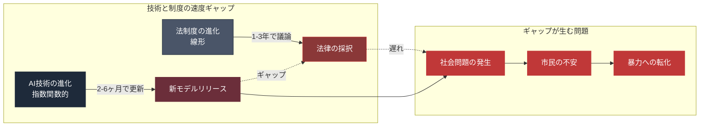

---

## 7.8 制度的遅滞の歴史的帰結

歴史上、技術が制度を先行した時、社会はどのように対応したか。

**歴史的事例:**

| 時代       | 技術革新       | 制度遅滞      | 最終的な対応              |
| -------- | ---------- | --------- | ------------------- |
| 19世紀産業革命 | 蒸気機関、機械化   | 労働法なし     | 労働組合、労働法、社会保障の発明    |
| 20世紀初頭   | 大量生産、流通    | 独占禁止法なし   | 反トラスト法、労働法の整備       |
| 20世紀後半   | テレビ、大衆メディア | 放送規制なし    | 放送法、表現の自由の法整備       |
| 1990年代〜  | インターネット    | プライバシー法なし | 各国のプライバシー法、GDPR等    |
| 2020年代〜  | AI         | 包括的AI規制なし | EU AI Act、各国規制（進行中） |

**パターンの共通性:**

| パターン     | 内容             |
| -------- | -------------- |
| 1. 技術登場  | 新技術が社会に浸透      |
| 2. 問題発生  | 既存制度では対応できない問題 |
| 3. 社会運動  | 被害者・活動家の運動化    |
| 4. 政治的認識 | 政治家・政府が問題を認識   |
| 5. 制度設計  | 新しい制度の議論と設計    |
| 6. 法制化   | 法律の採択と施行       |
| 7. 定着    | 新しい社会契約の形成     |

**各段階に数年〜数十年かかる。** AIの場合、1〜3の段階が同時並行で、4〜7はまだ進行中だ。

**制度的遅滞の帰結（予測）:**

| 短期（今後5年）    | 中期（5-15年）    | 長期（15-30年）     |
| ----------- | ------------ | -------------- |
| 個別規制の断片的整備  | 包括的AI規制の確立   | 新しい社会契約の形成     |
| 市民の不安と抗議    | 政治的再編、新政党の台頭 | AI時代に適した民主主義の形 |
| 暴力事件の散発的発生  | 一部国での社会的混乱   | 歴史的な制度転換の完成    |
| AI企業の自主規制強化 | 国際協調の一部成立    | グローバルAIガバナンス   |

---

## 7.9 この章の結論

技術と制度の速度差——**制度的遅滞**——は、AI時代の社会問題の根本原因だ。

| レイヤー       | 速度     |
| ---------- | ------ |
| AIモデル進化    | 2-6ヶ月  |
| 労働市場変化     | 数ヶ月〜1年 |
| 社会感情の変化    | 1-2年   |
| 法制度の進化     | 3-10年  |
| 社会保障制度の再設計 | 10-30年 |

AI技術は、法制度の10倍以上の速度で進化している。この速度差は、構造的に埋まらない。

**結果として:**

- 法の空白地帯で、AI企業の利益最大化が進む
- 被害を受ける市民は、制度的救済を得られない
- 不満が蓄積し、暴力に転化する一部が現れる
- 民主主義の信頼が低下する

この構造を理解した上で、次章では**AI企業自身がこの状況をどう認識しているか**を追う。ダリオ・アモデイの「とんでもない不平等」認識、Anthropic創業者の80%寄付誓約、OpenAIの「公共富裕基金」提案。これらは誠実なのか、偽善なのか。判断を留保して、両側面を並べる。

---

## 参考文献

1. European Union. "Regulation of the European Parliament and of the Council Laying Down Harmonised Rules on Artificial Intelligence (AI Act)." 2024.
   https://eur-lex.europa.eu/

2. The White House. "Executive Order on the Safe, Secure, and Trustworthy Development and Use of Artificial Intelligence." October 30, 2023.

3. California Legislature. "SB-1047 Safe and Secure Innovation for Frontier Artificial Intelligence Models Act." 2024.

4. Japan Government. "AI事業者ガイドライン." 総務省・経産省. 2024.
   https://www.meti.go.jp/

5. OpenResearch. "Unconditional Cash Study: Three-Year Results." 2024.
   https://www.openresearchlab.org/

6. International Labour Organization (ILO). "AI and Labour: Global Report." 2025.
   https://www.ilo.org/

7. OECD. "AI Policy Observatory." 2026.
   https://oecd.ai/

8. Cyberspace Administration of China. "Interim Measures for the Management of Generative AI Services." 2023年7月.

---

# 第8章

## 企業の自己認識 — 寄付誓約、公共富裕基金、偽善と誠実の狭間

---

AI企業は、自らが生み出す格差を認識しているのか。

答えは、部分的にイエスだ。

Anthropic創業者ダリオ・アモデイは、エッセイの中で**「とんでもない不平等が生まれるリスクがとても高い」**と明言した。Anthropic共同創業者7名全員が、資産の80%を寄付することを誓約した。OpenAIは**「公共富裕基金」**を提案した。

しかし、これらの認識と行動は、**構造的な問題を解決するには至っていない**。

この章では、AI企業の自己認識と行動を、判断を留保して並べる。誠実か偽善か、読者が判断する材料を提示する。

---

## 8.1 ダリオ・アモデイ「Machines of Loving Grace」

2024年10月、Anthropic CEOダリオ・アモデイは、長文エッセイ「Machines of Loving Grace」を発表した。全14,000語以上の大作で、AIの潜在的な未来を描いた。

**エッセイの構造:**

| 章          | 内容                 |
| ---------- | ------------------ |
| 1. 序論      | なぜこのエッセイを書くのか      |
| 2. 健康      | AIによる医療革命、寿命の延長    |
| 3. 神経科学    | メンタルヘルス問題の解決       |
| 4. 経済発展と貧困 | グローバルな貧困撲滅の可能性     |
| 5. 平和と統治   | 戦争の削減、民主主義の強化      |
| 6. 意味と労働   | 労働の変革と、人間が見つけるべき意味 |

**エッセイの基調:**

- **極めて楽観的**: AIの潜在能力を最大限に評価
- **ユートピア的**: 健康、経済、平和の問題がAIで解決可能と主張
- **条件付き**: すべて「うまくいけば」という条件が付く

**雇用問題に関する記述（抜粋）:**

> 「AIによって仕事が変わる、あるいは消える。これは避けられない。セーフティネットの設計が必要だ。ベーシックインカム、再訓練、新しい仕事の創出。」

このエッセイは、**AI推進派の代表的マニフェスト**として広く読まれた。しかし、批判も多い。

**批判の内容:**

| 批判者           | 批判の要点                   |
| ------------- | ----------------------- |
| ノア・スミス        | 楽観的すぎる、格差問題への対応が不十分     |
| ガリ・マーカス       | 技術的な実現可能性への疑問           |
| 労働者運動家        | 「セーフティネット」の実装が遅れる現実への無視 |
| 経済学者（アセモグル含む） | 分配メカニズムへの具体的提案の欠如       |

アモデイのエッセイは、**AIの可能性に対する信念表明**であり、**現実の格差への対応策ではない**。これが批判の核心だった。

---

## 8.2 ダリオ・アモデイ「The Adolescence of Technology」

2026年1月26日、アモデイは再び長文エッセイ「The Adolescence of Technology（テクノロジーの青年期）」を発表した。

**このエッセイの特徴:**

| 項目      | 内容                             |
| ------- | ------------------------------ |
| タイトルの意味 | テクノロジーは「青年期」にあり、成熟していない        |
| トーン     | 前作より悲観的、リスクを明確に認識              |
| 主要メッセージ | **「とんでもない不平等が生まれるリスクが、とても高い」** |
| 結論      | AI企業は責任を取る必要がある                |

**「テクノロジーの青年期」の主張:**

| 主張         | 内容                       |
| ---------- | ------------------------ |
| AIは人類史的転換点 | 産業革命と同等以上の影響             |
| 不平等の拡大リスク  | 「とても高い」と明言               |
| AI企業の責任    | 利益を独占すべきではない             |
| 創業者の寄付誓約   | Anthropic創業者7名が資産の80%を寄付 |
| 社会への還元     | 教育、医療、セーフティネットへの投資       |
| 政策提言       | UBI、公共富裕基金、ロボット税の検討      |

**2024年から2026年への変化:**

| 観点     | 2024年「Machines of Loving Grace」 | 2026年「The Adolescence of Technology」 |
| ------ | ------------------------------- | ------------------------------------ |
| トーン    | 楽観的ユートピア                        | 現実的警告                                |
| 格差への認識 | 言及は少ない                          | 「リスクがとても高い」と明言                       |
| 具体的行動  | 一般論の提案                          | 80%寄付誓約、具体的政策提案                      |
| 責任論    | AI企業の役割は限定的                     | AI企業が責任を取る                           |

この変化は、**AI反対運動の台頭、社会感情の悪化、メディアの批判的報道への反応**と読める。アモデイは、AI企業の最も「誠実」な指導者の一人と評価されているが、その誠実さも、**社会的圧力への対応**として読むこともできる。

---

## 8.3 Anthropic創業者7名の80%寄付誓約

2026年初、Anthropic共同創業者7名全員が、資産の80%を寄付することを公に誓約した。

**共同創業者:**

| 名前             | 役職             |
| -------------- | -------------- |
| Dario Amodei   | CEO            |
| Daniela Amodei | President      |
| Tom Brown      | —              |
| Jared Kaplan   | —              |
| Sam McCandlish | —              |
| Jack Clark     | Head of Policy |
| Chris Olah     | —              |

**誓約の内容:**

| 項目    | 内容               |
| ----- | ---------------- |
| 寄付率   | 資産の80%           |
| 対象    | 7名全員             |
| タイミング | 生涯中、または死後        |
| 寄付先   | 慈善事業、研究機関、社会問題対応 |
| 法的拘束力 | 道徳的誓約（法的強制力はない）  |

**寄付額の試算:**

Anthropicの企業価値が約3,800億ドル（2026年2月時点）の場合、創業者7名の保有株式は全体の数十%程度と推定される。

| 仮定       | 試算                |
| -------- | ----------------- |
| 7名の合計保有率 | 30-50% と仮定        |
| 株式価値     | 1,140億〜1,900億ドル   |
| 寄付額（80%） | **912億〜1,520億ドル** |

これは、**ビル・ゲイツ、ウォーレン・バフェット、マーク・ザッカーバーグ等の寄付誓約を超える規模**の可能性がある。

**この誓約の意味:**

| 視点      | 評価                        |
| ------- | ------------------------- |
| **誠実説** | AI企業の指導者が格差問題を真摯に認識している   |
| **象徴説** | 7名の寄付では構造問題は解決しない、象徴的意味のみ |
| **免責説** | 寄付で「責任を果たした」として、構造変革から逃れる |
| **戦略説** | AI企業への批判を和らげる広報戦略         |

**批判的視点:**

- 7名の寄付総額（912億〜1,520億ドル）は巨額だが、**AI時代の格差全体を解決する規模ではない**
- 寄付は個人の善意で、**制度変革にはならない**
- 寄付先の選定は創業者個人の裁量で、**民主的プロセスではない**
- 寄付のタイミングは遅い（生涯中、または死後）

**擁護的視点:**

- 他のAI企業（OpenAI、Google、Meta等）の創業者は、同様の誓約をしていない
- 寄付誓約は、他の富裕層への圧力になる
- 少なくとも、格差問題への「認識」と「行動」を示している

---

## 8.4 OpenAIの「Industrial Policy for the Intelligence Age」

2026年、OpenAIは長文の政策提言「Industrial Policy for the Intelligence Age（知能時代の産業政策）」を発表した。

**この文書の概要:**

| 項目   | 内容                        |
| ---- | ------------------------- |
| 発表主体 | OpenAI                    |
| 主要著者 | Sam Altman、Brad Lightcap他 |
| 発表時期 | 2026年初                    |
| 対象読者 | 政府、政策立案者、一般市民             |

**主要提言:**

| 提言                             | 内容                         |
| ------------------------------ | -------------------------- |
| **公共富裕基金（Public Wealth Fund）** | 市民全員が株主となる基金。AI企業の利益の一部を拠出 |
| **ロボット税**                      | AI・自動化で代替された労働への課税         |
| **週32時間労働制**                   | 労働時間の削減と雇用の分配              |
| **教育への大規模投資**                  | AI時代に必要なスキル獲得の支援           |
| **UBI的給付**                     | ベーシックインカムに近い所得保障           |
| **AI安全性研究への連邦投資**              | 政府がAI安全性研究に予算配分            |

**この提言の特徴:**

| 特徴          | 内容                  |
| ----------- | ------------------- |
| 野心的な内容      | 既存の社会保障を根本的に再設計する提案 |
| AI企業自身による提案 | 当事者が自らへの課税を提案する異例性  |
| 政治的合意の困難    | 各提言ごとに膨大な政治的合意が必要   |
| 実装の不明確性     | 誰が、どのように実装するかは未定    |

**サム・アルトマンのUBI関連発言の変遷:**

| 時期    | 発言・行動                                      |
| ----- | ------------------------------------------ |
| 2016年 | Y Combinator CEO時代、UBI支持を表明                |
| 2019年 | Worldcoin（旧Worldsized）プロジェクト開始、UBIの実装手段として |
| 2024年 | OpenResearchによるUBI実験結果の発表                  |
| 2026年 | 「Industrial Policy」で公共富裕基金を提言              |

アルトマンは、**10年以上一貫してUBI支持を表明**してきた。しかし、OpenAIは2024年に非営利から営利企業へと転換し、彼の個人資産は急増している。

**この矛盾への視点:**

| 視点        | 解釈                      |
| --------- | ----------------------- |
| **誠実説**   | 格差問題を認識し、長年一貫して解決策を提案   |
| **偽善説**   | 自らは富を蓄えながら、他者にUBIを提唱    |
| **現実主義説** | 個人の富を否定しなくても、社会構造を変えられる |
| **権力集中説** | UBIを通じて、AI企業の影響力をさらに強化  |

---

## 8.5 AI企業の「宣言」と「実態」の対比

AI企業の宣言は高邁だが、実態は異なる場合が多い。

**宣言と実態の対比:**

| 項目     | AI企業の宣言   | 実態                            |
| ------ | --------- | ----------------------------- |
| 安全性優先  | 「安全性を最優先」 | 商業化の圧力で安全性研究が後退               |
| 透明性    | 「オープンで透明」 | モデル詳細は非公開（Claude Mythos等）     |
| 多様性と包摂 | 「多様性を尊重」  | 従業員は依然として特定層（若い、白人・アジア系、男性中心） |
| 社会への責任 | 「社会に貢献」   | レイオフを加速、格差を拡大                 |
| 労働者保護  | 「雇用を守る」   | 自社コードの65%をAI生成、人員削減           |
| 民主化    | 「AIを民主化」  | 最強モデルは限定公開（Project Glasswing） |

**OpenAIの例:**

| 宣言            | 実態                                    |
| ------------- | ------------------------------------- |
| 非営利で設立（2015年） | 2024年に営利企業へ転換                         |
| 安全性を最優先       | 安全性チームの主要メンバー（Sutskever、Jan Leike等）退職 |
| 透明性のある開発      | 最新モデルの詳細は非公開                          |
| 利益は人類全体へ      | 企業価値8,520億ドル、創業者富豪化                   |

**Anthropicの例:**

| 宣言                               | 実態               |
| -------------------------------- | ---------------- |
| 安全性研究に投資                         | 研究の多くは商業化にも寄与    |
| Long-Term Benefit Trust（LTBT）の設立 | 実質的なガバナンスへの影響は不明 |
| 責任あるスケーリング                       | モデルの能力は加速的に向上    |
| 80%寄付誓約                          | 個人の善意、制度変革ではない   |

---

## 8.6 社員が社員証を隠す現実

第2章でも触れたが、2026年のサンフランシスコでは、**OpenAI社員が社員証を隠すよう指示されている**。

| 観点    | 内容                          |
| ----- | --------------------------- |
| 指示の出所 | OpenAI本社の内部メモ               |
| 理由    | 路上での嫌がらせ、敵意ある視線、身体的脅威       |
| 実施範囲  | OpenAIだけでなく、他の主要AI企業でも類似の動き |
| 社員の心理 | 自分の仕事が社会から嫌われていると認識         |
| 企業の対応 | 物理的警備の強化、社員のメンタルケア          |

**テックジャーナリスト アレックス・ヒースの取材コメント（2026年）:**

> **「世間は、私たちの仕事を嫌っているんです」** — OpenAI幹部の発言

この状況は、**AI企業の内部にも「認識」が浸透している**ことを示す。彼らは、自らが社会から敵視されていることを、日々の通勤で体験している。

**内部の倫理的懸念:**

AI企業の内部でも、倫理的懸念を表明する動きがある。

| 事例              | 内容                            |
| --------------- | ----------------------------- |
| Google倫理AIチーム解散 | 2020年、Timnit Gebru等の主要研究者解雇   |
| OpenAI主要メンバー退職  | 2024年、Sutskever、Jan Leike等が退職 |
| Jan Leikeの公開声明  | 「安全性が商業化の後に置かれている」            |
| Anthropic退職者の警告 | 一部が独立し、AI安全性研究を継続             |
| 集団的な署名活動        | AI企業従業員による公開書簡                |

**内部告発が増える理由:**

| 理由          | 内容              |
| ----------- | --------------- |
| 安全性の商業化への従属 | 当初の理念が商業圧力で変質   |
| 経営判断への疑問    | 急速な商業化への懐疑      |
| 個人的良心       | 社会への影響への罪悪感     |
| メディアの注目     | 内部告発が注目を集めやすい環境 |

---

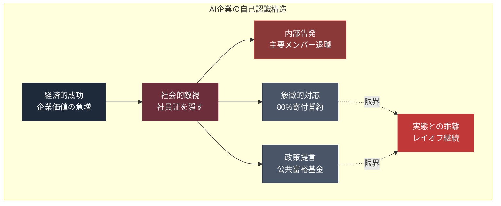

---

## 8.7 偽善か誠実か: 判断の留保

AI企業の自己認識と行動は、偽善か、誠実か。

この問いに、本書は答えを出さない。なぜなら、両方の側面が同時に存在するからだ。

**誠実な側面:**

| 側面     | 根拠               |
| ------ | ---------------- |
| 認識の存在  | ダリオ・アモデイの明確な警告表明 |
| 具体的行動  | 80%寄付誓約          |
| 政策提言   | 公共富裕基金、ロボット税     |
| 内部議論   | 安全性vs商業化の議論      |
| 退職者の警告 | 内部から問題提起する人々     |
| 社会的コスト | 社員証を隠す等の個人的犠牲    |

**偽善的な側面:**

| 側面     | 根拠                  |
| ------ | ------------------- |
| 商業化加速  | 安全性より利益             |
| レイオフ継続 | 自社の行動で格差を拡大         |
| 非公開化   | Claude Mythos等の限定公開 |
| 個人の富   | 創業者は億万長者へ           |
| 実装の遅さ  | 提言は多いが実装が進まない       |
| 構造的不変  | 個人の寄付では構造は変わらない     |

**両側面が同時に真実である:**

- アモデイは格差を認識**している**
- アモデイは商業的成功も追求**している**
- 80%寄付は大きな決断**である**
- 80%寄付は構造を変えない**ものでもある**
- 社員証を隠すのは個人的苦痛**である**
- 同時に、彼らは高額の給与を得**ている**

この並存は、**矛盾ではなく現実**だ。人間も企業も、複雑な動機と行動を持つ。一面的な評価は、現実を単純化する。

**本書の立場:**

- AI企業を単純に悪者にしない
- AI企業を単純に正義にしない
- 彼らの認識と行動を、**事実として並べる**
- 判断は、読者に委ねる

---

## 8.8 他のAI企業との比較

AI企業間でも、自己認識と行動には差がある。

**主要AI企業の格差認識と行動:**

| 企業                  | 格差認識の表明          | 具体的行動                        |
| ------------------- | ---------------- | ---------------------------- |
| **Anthropic**       | 明確（アモデイエッセイ）     | 80%寄付誓約、LTBT設立               |
| **OpenAI**          | 明確（アルトマン発言、政策提言） | Worldcoin、OpenResearch UBI実験 |
| **Google DeepMind** | あり（デミス・ハサビス発言）   | 限定的（親会社Alphabetの傘下）          |
| **xAI**             | 限定的              | 特段の社会的行動なし                   |
| **Meta AI**         | 限定的              | オープンウェイトモデル公開（Llama）         |
| **Microsoft AI**    | 企業全体の社会貢献活動あり    | 既存のMicrosoftの枠内              |

**Anthropicの相対的な位置:**

Anthropicは、**AI企業の中で最も明確に格差問題を認識**している。Dario Amodeiの詳細な議論、創業者の寄付誓約、LTBTの設立等、他の企業と比較して行動が具体的だ。

しかし、それでも以下の限界がある:

| 限界     | 内容                |
| ------ | ----------------- |
| 商業圧力   | 他のAI企業との競争で商業化が加速 |
| 個人の善意  | 個人の寄付では構造問題は解決しない |
| 政治的影響力 | 政策実装には政治家の協力が必要   |
| 国際協調   | 米国一国では限界がある       |

---

## 8.9 この章の結論

AI企業は、格差問題を認識し始めている。しかし、認識と行動、宣言と実態の間には大きな溝がある。

| レイヤー  | 状況                    |
| ----- | --------------------- |
| 認識    | 高まりつつある（特にAnthropic等） |
| 内部議論  | 活発化している（退職者の警告）       |
| 象徴的行動 | 寄付誓約、政策提言等            |
| 実態    | レイオフ継続、商業化加速          |
| 構造変化  | ほぼ未着手                 |

**AI企業は、個人の善意と制度変革の狭間に立っている。** 個人の善意は限界があり、制度変革は政治的合意を必要とする。

このギャップを埋めるのは、**社会全体の責任**だ。AI企業だけでは、AI時代の格差問題を解決できない。政府、市民、教育機関、メディア、国際機関が、それぞれの役割を果たす必要がある。

しかし、ここで本書は問う: **日本は、この構造の中でどのような位置にいるのか？**

次章では、**日本の特異性**を追う。AI利用率が低く、AI受益感も低く、同時に社会的grievanceが高い——この特異な構造は、世界のどの国とも異なる。日本がAI時代にどう応じるかは、世界の動向を映す鏡でもある。

---

## 参考文献

1. Amodei, Dario. "Machines of Loving Grace: How AI Could Transform the World for the Better." Anthropic Blog, October 2024.
   https://www.anthropic.com/news/machines-of-loving-grace

2. Amodei, Dario. "The Adolescence of Technology." Anthropic Blog, January 26, 2026.
   https://www.anthropic.com/news/the-adolescence-of-technology

3. OpenAI. "Industrial Policy for the Intelligence Age." OpenAI Policy Blog, 2026.
   https://openai.com/policy/

4. Anthropic. "Long-Term Benefit Trust." 2023.
   https://www.anthropic.com/news/long-term-benefit-trust

5. Altman, Sam. "Moore's Law for Everything." 2021.
   https://moores.samaltman.com/

6. Altman, Sam. "The Intelligence Age." 2024年9月.
   https://ia.samaltman.com/

7. Alex Heath. "Silicon Valley's AI elite grapple with growing public hostility." The Verge / Command Line, 2026.

8. Leike, Jan. "Why I resigned from OpenAI." Public Statement, 2024.
   https://twitter.com/janleike/

9. Gebru, Timnit. "On the Dangers of Stochastic Parrots." FAccT 2021. (Google離脱の契機となった論文)

10. Worldcoin Foundation. "Worldcoin Whitepaper and UBI Framework." 2023.
    https://worldcoin.org/

---

# 第9章

## 日本の特異性 — 低利用・低受益感・高grievanceの土壌

---

世界のAI反対運動が暴力に転化し始めた2026年4月、日本では類似の暴力事件は起きていない。

表面的には、日本はAI時代の動揺から距離を置いているように見える。

しかし、データを深く読み解くと、日本は**世界のどの国とも異なる特異な構造**を抱えていることが明らかになる。AI利用率は先進国で低位、同時にgrievance（不満）は世界平均を上回り、トラストインデックスは28カ国中最低。

この章では、日本の特異性を構造的に分析する。日本のAI時代への応答は、世界の動向を映す鏡であり、同時に、世界が学ぶべき教訓を含んでいる。

---

## 9.1 Edelman Trust Barometer 2025の衝撃データ

2025年のEdelman Trust Barometerで、日本は衝撃的な数字を記録した。

**日本のトラストインデックス:**

| 順位      | 国・地域                | トラストインデックス |
| ------- | ------------------- | ---------- |
| 28位（最低） | **日本**              | **38**     |
| 27位     | 英国                  | 43         |
| 26位     | 韓国                  | 45         |
| 25位     | ドイツ                 | 46         |
| ...     | ...                 | ...        |
| 上位      | サウジアラビア、中国、インド、UAE等 | 70-80      |
| 米国      | 中位                  | 49         |

**日本のトラストインデックス38は、調査対象28カ国で最低**だ。

**政府、メディア、企業、NGOへの信頼度（日本）:**

| 主体   | 信頼度（日本） | 信頼度（世界平均） |
| ---- | ------- | --------- |
| 政府   | 38%     | 51%       |
| メディア | 33%     | 52%       |
| 企業   | 41%     | 56%       |
| NGO  | 37%     | 55%       |

**すべての主体で、日本は世界平均を大きく下回る。**

**Grievance（不満）スコア:**

| 国    | Grievance |
| ---- | --------- |
| 日本   | **65%**   |
| 世界平均 | 61%       |

日本のgrievanceは、**世界平均を超えている**。これは意外なデータだ。日本は表面的には穏やかな社会だが、不満は世界平均以上に高い。

**「島国根性」スコア:**

Edelmanの別の指標で、日本は**「島国根性」が90%**と突出している。これは「外国人や外国文化への警戒心」「自国優先の思考」等の指標だ。

---

## 9.2 日本のAI利用率の低さ

世界的にAI利用が急拡大する中、日本の利用率は先進国で低位だ。

**各国のAI利用率（2025-2026年時点、業務でのAI利用比率）:**

| 国      | AI利用率      |
| ------ | ---------- |
| 米国     | 40-60%     |
| 中国     | 50-70%     |
| シンガポール | 55%+       |
| 韓国     | 30-40%     |
| EU平均   | 25-35%     |
| **日本** | **15-25%** |
| インド    | 35-45%     |

**日本は先進国で最低水準のAI利用率**だ。

**日本のAI利用率が低い理由:**

| 要因         | 内容                |
| ---------- | ----------------- |
| 言語の壁       | 英語中心のAIプロダクトの利用困難 |
| セキュリティ懸念   | データ漏洩への過度の警戒      |
| 既存システムへの依存 | レガシーシステムとの統合困難    |
| 経営層の理解不足   | AIの戦略的価値への認識が遅れる  |
| リテラシーの格差   | 世代間のITリテラシー格差     |
| 文化的要因      | 変化への慎重さ、リスク回避     |

**企業のAI導入状況:**

| 企業規模             | AI導入率（2026年） |
| ---------------- | ------------ |
| 大企業（従業員1,000人以上） | 約40%         |
| 中堅企業（100-1,000人） | 約20%         |
| 中小企業（100人未満）     | 10%未満        |

---

## 9.3 「92.6% vs 低利用」の矛盾

興味深いデータがある。

**2026年ALL DIFFERENT調査（新入社員対象）:**

| 質問               | 回答               |
| ---------------- | ---------------- |
| AI活用は必要か？        | **92.6% が必要と回答** |
| 業務で実際にAIを使っているか？ | 利用率は低位           |

**この矛盾が意味すること:**

| 観点      | 解釈                   |
| ------- | -------------------- |
| 若年層の認識  | AIが必要だと認識している（92.6%） |
| 実態      | 企業の環境・文化が利用を妨げている    |
| 世代間ギャップ | 若年層は利用意欲、中高年層は消極的    |
| 組織の制約   | 個人の意欲があっても組織が許可しない   |
| 結果      | 若年層の不満蓄積             |

**若年層の認識と実態のギャップ:**

- 若年層: AIは必要、使いたい、学びたい
- 中高年層: AIは脅威、使わせたくない、理解できない
- 組織: AIを禁止するか、限定的に許可

この構造が、**日本独自の世代間分断**を生んでいる。米国のZ世代が「AIが自分の仕事を奪う」ことに怒っているのに対し、日本のZ世代は「AIを使わせてもらえない」ことに不満を持っている。

---

## 9.4 日本のAI反対運動の不在

2026年4月、米国ではAI反対の暴力が発生したが、日本では類似の事件は起きていない。

**日本でAI反対暴力が起きない理由:**

| 要因          | 内容                         |
| ----------- | -------------------------- |
| レイオフの顕在化の遅れ | 日本の解雇規制で、目に見えるレイオフが少ない     |
| AI依存度の低さ    | まだAIへの怒りを生むほど、AIが生活を変えていない |
| 社会運動の文化的抑制  | 日本では過激な抗議行動が少ない            |
| メディアの報道姿勢   | AI問題への深い報道が限定的             |
| 経済状況        | 米国ほどの急激な変化を体験していない         |

**ただし、不満は蓄積している:**

| 不満の源泉    | 内容              |
| -------- | --------------- |
| 実質賃金の低下  | 物価上昇に追いつかない賃金   |
| 将来の不安    | 年金制度、医療制度への不信   |
| 若年層の機会不足 | 非正規雇用、キャリア形成の困難 |
| 老後の不安    | 2,000万円問題、超高齢社会 |
| 政治への失望   | 政治家・政党への信頼の低下   |

**grievance 65%は、これらの不満の総合的表現だ。**

---

## 9.5 日本企業のAI起因レイオフ

日本でも、AI起因のレイオフは静かに進行している。表面化しにくいが、構造は存在する。

**日本のAI起因レイオフの特徴:**

| 特徴          | 内容                    |
| ----------- | --------------------- |
| 有期契約の不更新    | 契約満了で自然減、「レイオフ」と呼ばれない |
| 派遣社員の契約打ち切り | AI導入で派遣需要が減少          |
| 業務委託の削減     | 外部委託をAIで代替            |
| 早期退職制度      | 中高年の早期退職募集、AIとの関連が示唆  |
| 新卒採用の絞り込み   | ジュニアポジションの縮小          |

**具体的事例（報道ベース）:**

| 企業      | 状況                           |
| ------- | ---------------------------- |
| 大手IT企業A | 2024年、カスタマーサポート業務の大幅な内製化とAI化 |
| 大手金融機関B | 2025年、事務部門の40%削減、株価25%上昇     |
| 大手通信会社C | 早期退職募集、AI活用を背景と示唆            |
| 大手製造業D  | コーディング業務でAI利用拡大、新卒採用の絞り込み    |

（注: 具体的な企業名は報道の範囲内で特定されているが、ここでは例として抽象化）

**日本企業の「40%解雇+株価25%上昇」事例:**

2025年、ある大手金融機関が、事務部門の40%を削減する計画を発表した。主な理由はAI・自動化の活用だった。この発表後、同社の株価は約25%上昇した。

| 観点      | 意味                     |
| ------- | ---------------------- |
| 経営の論理   | レイオフは株価を押し上げる（効率化への期待） |
| 株主の評価   | AI活用で利益率向上を期待          |
| 従業員への影響 | 40%の人員削減、再就職支援は限定的     |
| 社会的反応   | 批判は限定的、運動化しない          |

**この事例が示す日本特有の構造:**

- 経営者はレイオフを合理化できる
- 株主は短期的利益を喜ぶ
- 従業員は個別に対応、組織化しない
- メディアの批判は限定的
- 政治的議論にならない

**結果として、日本のAI起因レイオフは、米国のような社会的注目を集めにくい。しかし、構造は同じ、あるいはより深刻だ。**

---

## 9.6 日本のAI規制の空白

第7章でも触れたが、日本のAI規制は「空白」に近い。

**日本のAI規制の特徴:**

| 観点     | 内容                       |
| ------ | ------------------------ |
| 包括的AI法 | なし（議論継続中）                |
| ガイドライン | 経産省・総務省のガイドライン（法的拘束なし）   |
| 司令塔    | 経産省、総務省、内閣府で権限が分散        |
| 国際協調   | EU AI ActやOECD原則への対応が不明確 |
| 産業振興寄り | 規制より推進を優先する姿勢            |

**日本のAI基本法の議論:**

| 時期     | 動き                  |
| ------ | ------------------- |
| 2024年初 | 政府AI戦略会議でAI基本法の議論開始 |
| 2024年中 | 経産省と総務省の権限調整        |
| 2025年  | 産業振興と市民保護のバランスが論点   |
| 2026年  | 法制化は進まず、ガイドライン中心    |

**日本のAI規制の課題:**

| 課題            | 内容                 |
| ------------- | ------------------ |
| 国際競争力と規制のバランス | 厳しすぎる規制は産業を弱くする懸念  |
| 技術的専門性の不足     | 政策立案者のAIリテラシーの限界   |
| 縦割り行政         | 複数省庁の利害調整の困難       |
| 市民参加の不在       | 規制議論に市民が関与する機会が少ない |
| メディアの役割       | AI規制への深い議論が少ない     |

---

## 9.7 日本のAI基盤の空白

日本には、独自の大規模AI基盤モデルが事実上存在しない。

**日本のAI基盤モデル状況:**

| 項目       | 内容                             |
| -------- | ------------------------------ |
| 大規模汎用モデル | 独自のGPT、Claude級モデルなし            |
| 日本語特化モデル | いくつかの試みあるが、グローバル競争力は限定的        |
| 企業       | NEC、富士通、NTT等が独自AI開発、規模は米国比で小さい |
| 政府支援     | 一部の研究機関への支援、規模は限定的             |
| 将来展望     | 米国AI依存が継続する可能性が高い              |

**結果として:**

- 日本の企業は、米国AI（GPT、Claude、Gemini）に依存
- 日本のデータが米国AI企業に流れる（間接的に）
- 日本独自のAI戦略が立てにくい
- AIガバナンスも米国基準に従属する傾向

**この構造の長期的影響:**

| 観点   | 影響                       |
| ---- | ------------------------ |
| 経済   | AIサービス利用料の海外流出           |
| 安全保障 | 重要な意思決定がAI依存化、外国企業の影響    |
| 文化   | 日本語や日本文化がグローバルAIに反映されにくい |
| 主権   | AI時代の「主権」の再定義が必要         |

---

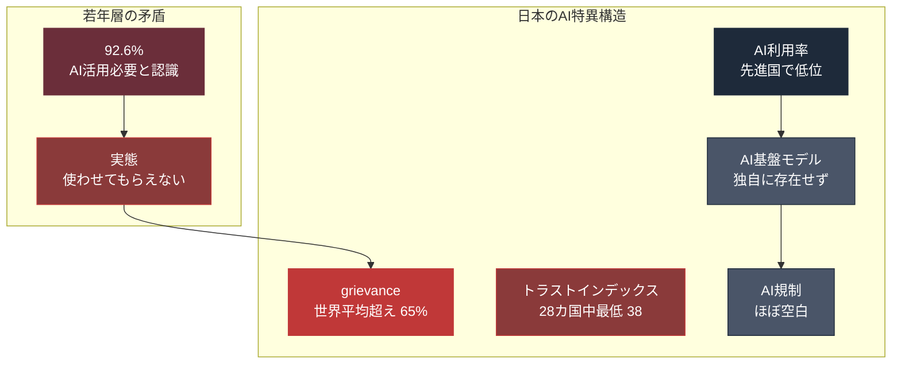

---

## 9.8 日本のAI受益感の低さ

AI利用率が低いだけでなく、**AIから受ける利益感（受益感）**も日本は低い。

**AIで生活が向上するか（国別比較、2025年Ipsos）:**

| 国      | 「向上する」と回答 |
| ------ | --------- |
| 中国     | 78%       |
| インド    | 75%       |
| インドネシア | 70%       |
| 米国     | 59%       |
| 英国     | 45%       |
| ドイツ    | 40%       |
| **日本** | **35%**   |

**日本のAI受益感は、主要国の中で低位**だ。

**受益感が低い理由:**

| 理由         | 内容               |
| ---------- | ---------------- |
| AI利用率の低さ   | 使わなければ利益を体感できない  |
| メディアの報道姿勢  | AIの課題・リスクの報道が多い  |
| 既存システムへの満足 | 既存の生活への満足度が比較的高い |
| 変化への慎重さ    | 新しい技術への距離感       |
| 高齢化社会      | AIを使わない層の比率が高い   |

**低受益感 + 高grievance = 特異な不満構造:**

日本は、AIの**恩恵を十分に受けていない**のに、同時に**AIへの不満も高い**という、矛盾した構造を持つ。

| 観点      | 通常の予想        | 日本の現実        |
| ------- | ------------ | ------------ |
| 受益感が低い国 | grievanceも低い | grievanceは高い |
| 受益感が高い国 | grievanceは低い | （日本には該当しない）  |

この構造は、**AI以外の社会問題（経済停滞、格差、政治不信）が、AI問題に投影されている**ことを示す。

**日本のAIへの不満は、AIそのものより、AI時代に対応できない社会全体への不満だ。**

---

## 9.9 日本のAI時代への応答の課題

日本がAI時代にどう応じるか、課題は多い。

**課題1: 世代間分断の深化**

| 世代              | AI認識               |
| --------------- | ------------------ |
| Z世代（10代後半-20代）  | AI活用必要（92.6%）、使いたい |
| ミレニアル世代（30-40代） | 仕事での必要性を認識、使い始めている |
| X世代（50代）        | 消極的、既存方法への依存       |
| ベビーブーマー（60代以降）  | 利用率極めて低い、懐疑的       |

**世代間のAIリテラシー格差が、日本独自の問題として浮上している。**

**課題2: グローバルAIへの従属**

日本独自のAI基盤が育たない限り、日本は米国AIの「消費者」であり続ける。この従属構造は、長期的な経済的・文化的損失を生む。

**課題3: 規制の遅れ**

日本のAI規制議論は、EU AI Actに比べて2-3年遅れている。この間に、日本企業は米国基準で動き、市民は保護されない。

**課題4: 教育システムの対応の遅れ**

日本の教育システムは、AI時代の人材育成に対応できていない。大学は従来型の教育を続け、AIネイティブな人材の育成は遅れている。

**課題5: 社会保障の再設計の欠如**

AI時代の社会保障（UBI、再訓練、ジョブ保証等）の議論が、日本では低調だ。高齢化対策に精一杯で、AI時代への対応が後回しになっている。

---

## 9.10 日本の潜在的可能性

一方で、日本にはAI時代に独自の貢献ができる潜在性もある。

**日本の強み:**

| 強み      | 内容               |
| ------- | ---------------- |
| 高いIT基盤  | 情報インフラは世界トップレベル  |
| 研究者の層   | 優秀な研究者は存在        |
| 社会の安定性  | 暴力化の可能性が低い       |
| 労働法の堅さ  | 急激なレイオフへの緩衝材     |
| 文化的多様性  | アジアと欧米のハイブリッドな視点 |
| 高齢社会の経験 | AI時代の社会保障の先行事例   |

**日本が世界に貢献できる領域:**

| 領域      | 内容               |
| ------- | ---------------- |
| AIと高齢化  | 介護、医療、生活支援の先行モデル |
| AIと労働保護 | 急激な変化への緩衝材の設計    |
| AIと共生社会 | 多世代共生の経験の共有      |
| AIガバナンス | アジア的視点からの規制設計    |
| AIと文化   | 日本文化の保護とAIへの反映   |

**これらの可能性は、日本がAI時代に「受動的な受け手」でなく「積極的な貢献者」になることで実現する。**

しかし、現状では、これらの可能性は十分に実現されていない。政治的決断、社会的合意、経済的投資が必要だ。

---

## 9.11 この章の結論

日本は、AI時代において**特異な構造**を持っている。

| 指標         | 日本      | 世界      |
| ---------- | ------- | ------- |
| AI利用率      | 先進国で低位  | 急拡大     |
| AI受益感      | 35%（低位） | 59%（上昇） |
| Grievance  | 65%（高位） | 61%     |
| トラストインデックス | 38（最低）  | 中位      |
| 暴力化        | なし      | 一部で発生   |
| AI基盤モデル    | ほぼなし    | 米国に集中   |
| AI規制       | ほぼ空白    | EU等で進展  |

**低利用・低受益感・高grievance・低信頼・無暴力・従属的基盤・空白規制。**

この構造は、世界のどの国とも異なる。そして、この構造は、**静かに進行するAI時代の変化に日本が対応できていない**ことを示している。

日本のAI問題は、暴力に転化しない。しかし、不満は蓄積している。規制は遅れ、従業員は不安を抱え、若年層は機会を失い、中高年は置き去りにされている。

この静かな危機が、将来どう顕在化するかは、まだ分からない。しかし、**「日本は穏やかだから大丈夫」という楽観は、データが否定している**。

---

## 参考文献

1. Edelman. "2025 Edelman Trust Barometer: Japan Country Report."
   https://www.edelman.com/trust/2025/japan

2. Edelman. "2025 Edelman Trust Barometer: Global Summary."

3. Ipsos. "Global Views on A.I. 2025: Country Breakdown."
   https://www.ipsos.com/

4. ALL DIFFERENT. "2026年新入社員意識調査."
   https://www.all-different.co.jp/

5. 経済産業省. "AI事業者ガイドライン." 2024.
   https://www.meti.go.jp/policy/mono_info_service/

6. 総務省. "AI戦略2024（統合版）." 2024.
   https://www.soumu.go.jp/

7. 日本経済新聞. "AI起因の人員削減事例." 2024-2025年報道.

8. 内閣府. "AI戦略会議 取りまとめ." 2024-2026.

9. OECD. "Japan's AI Readiness Assessment." 2026.
   https://oecd.ai/

---

# 終章

## 答えはない、だが構造は見える

---

本書をここまで読んだ読者の中には、一つの疑問が残っているはずだ。

**「で、結局どうすればいいのか？」**

この問いに、本書は答えを出さない。序章でそう宣言した。本書は処方箋ではない。構造を描くだけだ。

しかし、構造が見えたとき、読者の中で何かが変わる。**見えていなかったものが見える**ようになる。そして、見えるようになったものは、もう見なかったことにはできない。

この終章では、本書で描いてきた構造を、もう一度束ねる。そして、この構造の中で、**読者一人ひとりがどこに立つのか**を問う。

---

## 終.1 9つの章が示した構造

本書の各章は、AI時代の一つの側面を描いてきた。ここでそれらを束ねる。

**序章: 2026年4月の一週間**

同じ週に、AI企業の企業価値が1兆ドルを超え、そのCEOの自宅に火炎瓶が投げ込まれ、Snapが1,000人を解雇した。これらは偶然ではない。同じ構造から生まれている。

**第1章: 期待と恐れの同時加速**

Pew、Ipsos、Gallup、Edelmanのデータは、AIへの期待と恐れが**同時に**加速していることを示す。52→59%（期待上昇）と64%（雇用懸念）が並走している。Z世代の怒り31%、希望18%。一人の人間の中で、両方の感情が共存している。

**第2章: 50ポイント格差**

AI専門家76% vs 一般市民24%（個人利益認識）。この50ポイント差は、情報量の差では埋まらない。立場の違いが認識を規定する。サンフランシスコの「AI村」は、物理的にも経済的にも閉じた空間だ。

**第3章: 入り口が閉じる**

Klarna 700人分、Chegg 22%削減、Duolingo 10%、Block 10%、IBM 7,800人、Snap 1,000人。2026年年初来で80社71,440人のAI起因レイオフ。Z世代のキャリアの入り口そのものが消えている。

**第4章: 1兆ドルの地理**

AI資本は、サンフランシスコの50km圏内に集中している。主要企業の企業価値合計は1.3兆ドル超。データセンターは中西部に拡散するが、地域社会との摩擦を生む。インディアナポリスで13発の銃弾が議員宅に撃ち込まれた。

**第5章: 永久下層市民論**

ピケティのr > gが、AI時代に極限化する。AI資本のリターンは年50-200%+、経済成長率は2-3%。この差は労働階級が追いつける速度ではない。アセモグル: 消費者福祉-0.72%。ノア・スミス: permanent underclass。

**第6章: ラッダイトの再来**

2026年4月の火炎瓶・銃撃・「NO DATA CENTERS」は、1811年ラッダイト運動と構造的に類似する。技術そのものより、技術を所有・配分する構造が対立の焦点。政府の短期鎮圧は可能だが、構造問題は解決しない。長期的には社会変革の礎になる。

**第7章: 制度的遅滞**

AI技術は2-6ヶ月で更新、法制度は3-10年で採択。この速度差が、あらゆる社会問題の根本原因。EU AI Act、米国大統領令、日本のAI基本法——どれも技術に追いつけない。

**第8章: 企業の自己認識**

ダリオ・アモデイ: 「とんでもない不平等が生まれるリスクがとても高い」。Anthropic創業者7名が資産の80%寄付誓約。OpenAIが公共富裕基金を提言。しかし、レイオフは継続し、商業化は加速する。誠実と偽善が並存する。

**第9章: 日本の特異性**

日本のトラストインデックス: 28カ国中最低（38）。grievance 65%（世界平均超え）、AI受益感35%（低位）、AI利用率は先進国で低位、独自AI基盤なし、規制ほぼ空白。暴力に転化しない、静かな危機。

---

## 終.2 束ねて見える全体像

これらの章を一つの俯瞰図にまとめる。

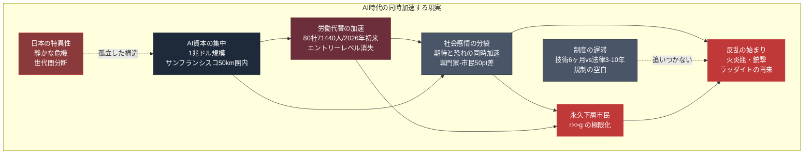

---

## 終.3 この構造の中で、個人はどこに立つのか

本書は、処方箋を書かない。しかし、読者が自分の立ち位置を考えるための、いくつかの問いを提示する。

**問い1: あなたはAI村の内側にいるか、外側にいるか**

| 自己診断   | 特徴                                |
| ------ | --------------------------------- |
| AI村の内側 | AI企業で働く、AIを日常的に使う、AIで生産性が上がっている   |
| 境界線上   | AI関連職だがAI企業ではない、部分的にAIを使う         |
| AI村の外側 | AIとの接点が少ない、AIを使いこなせない、AIに仕事を脅かされる |

自分がどこにいるかを認識することは、この時代を生きるための第一歩だ。

**問い2: あなたは期待の側か、恐れの側か**

| 自己診断  | 特徴                        |
| ----- | ------------------------- |
| 期待が強い | AIの可能性にワクワクしている、投資・活用に積極的 |
| 混在    | AIの便利さを認めつつ、不安も抱えている      |
| 恐れが強い | AIで仕事・生活が脅かされる不安、規制を求める   |

どちらの側に立っても、**自分の立場は自分の職業・収入・社会的位置によって規定されている**ことを認識する必要がある。

**問い3: あなたは「永久下層市民」のリスクの中にいるか**

| 自己診断 | 特徴                       |
| ---- | ------------------------ |
| リスク低 | AI活用で生産性向上、再訓練の機会あり      |
| リスク中 | AIに一部代替されるが、他のスキルで補える    |
| リスク高 | 職種がAIに代替されやすい、再訓練の機会が限定的 |

この認識は、キャリア設計、貯蓄、スキル獲得の判断に直結する。

**問い4: あなたはどう行動するか**

| 行動選択   | 内容                       |
| ------ | ------------------------ |
| 積極的活用  | AIを学び、使いこなし、AI時代の勝ち組を目指す |
| 緩やかな対応 | 必要に応じてAIを学び、既存スキルを維持     |
| 批判的関与  | AIの問題を議論し、社会変革を求める       |
| 距離を置く  | AIとの接点を最小化し、別の道を行く       |
| 混合戦略   | 状況に応じて複数の戦略を組み合わせる       |

**どの選択も、正解でも不正解でもない。** 個人の価値観、状況、責任によって最適解は異なる。

---

## 終.4 社会全体の選択肢

個人の選択だけでなく、社会全体の選択肢もある。

**選択肢A: AI推進派**

- 規制は最小限
- 市場原理で配分
- 技術革新の速度を維持
- 結果の不平等は事後的に対応

**選択肢B: 規制重視派**

- 包括的な規制導入
- 政府が介入して配分
- 技術速度を制度速度に合わせる
- 予防的アプローチ

**選択肢C: 新しい社会契約派**

- UBI、公共富裕基金等
- AI時代に対応した社会保障
- 労働の意味の再定義
- 長期的な構造変革

**選択肢D: ラッダイト的抵抗派**

- AI導入そのものを遅らせる
- データセンター建設に反対
- AI企業への規制強化
- 労働者の権利保護

**選択肢E: 混合アプローチ**

- 上記を組み合わせる
- 領域ごとに異なる政策
- 段階的な制度変革
- 実験的な試み

**2026年時点では、どの国も明確な選択をしていない**。日本、米国、EU、中国、それぞれが異なるアプローチを模索しているが、**決定的な社会的合意は形成されていない**。

---

## 終.5 本書が伝えたかったこと

ここまで本書を読んだ読者に、最後にいくつかのことを伝えたい。

**1. この時代は、歴史の転換点にある**

産業革命が世界を変えたように、AI革命は世界を変えている。しかし、その変化は均等ではない。恩恵を受ける層と、損失を被る層が生まれる。その非対称は、空間的、経済的、感情的、政治的に現れる。

**2. 答えは一つではない**

AI時代の課題に、唯一の正解はない。個人レベルでも、社会レベルでも、複数の選択肢が存在する。どれを選ぶかは、価値観、状況、責任に依る。

**3. 無関心は許されない**

AIは、見ないふりができない規模で社会を変えている。関わらなくても、影響を受ける。**自分の立ち位置を認識し、自分なりの応答を持つ**ことが、この時代を生きる最低限の責任だ。

**4. 構造は見える**

本書は答えを書かなかった。しかし、構造は描いた。構造が見えたとき、読者は自分の状況を、より正確に認識できる。そして、より意識的な選択ができる。

**5. 歴史は繰り返す。しかし、正確にではない**

1811年のラッダイトと2026年のAI反対運動は類似している。しかし、同じではない。速度、規模、国際性、技術の性質、すべてが異なる。**歴史から学ぶことはできるが、歴史に縛られる必要はない**。

---

## 終.6 読者への最後の問い

本書を閉じる前に、読者に最後の問いを投げかける。

**あなたは、2026年4月の一週間を、どう記憶するのか？**

- 「AIが1兆ドルに達した歴史的な週」として記憶するか
- 「火炎瓶と銃撃が起きた恐ろしい週」として記憶するか
- 「両方が同時に起きた矛盾の週」として記憶するか
- 「何も記憶しない」か

**記憶の仕方は、あなたの立ち位置を決める**。そして、あなたの立ち位置は、あなたの行動を決める。行動の総和が、未来を決める。

この時代に生きる私たちは、**未来の選択権を持っている**。その選択は、個人の選択の積み重ねだ。選択から逃れることはできない。**選ばないことも、一つの選択**だ。

---

## 終.7 著者からの最後の一言

私は、AIストラテジストとして、AI企業の論理を理解できる側に立つ。同時にUXデザイナーとして、N1ユーザーに対して、彼ら彼女らの何かに対する感情・価値観・思考特性を解像度高く分析してきた経験がある。「AIの外側にいる人」を理解することができる。

どちらの側も正しい。どちらの側も間違っている。その間に、現実がある。

私が本書を書いたのは、この現実を記述するためだ。答えを出すためではなく、構造を描くためだ。

本書を読み終えた読者が、自分の立ち位置を認識し、自分なりの応答を持ち、この時代を生き抜くことを願う。

1兆ドルと火炎瓶の同時加速する現実——それが、2026年4月の世界だ。そして、この現実は、これから加速し続ける。

私たちは、その加速の中にいる。

---

## 参考文献

1. 本書全体を通じた主要参考文献は各章末を参照。

2. 本書は、以下の一次ソースを統合的に参照している:
   
   - Pew Research Center（米国世論調査）
   - Gallup（Z世代AI調査）
   - Edelman Trust Barometer（信頼度調査）
   - Ipsos Global AI Monitor（国際AI意識調査）
   - Stanford HAI AI Index（AI専門家・市民比較）
   - layoffs.fyi（テック業界レイオフデータ）
   - Thomas Piketty "Capital in the 21st Century"
   - Daron Acemoglu "The Simple Macroeconomics of AI" (NBER 2024)
   - Dario Amodei "Machines of Loving Grace" (2024), "The Adolescence of Technology" (2026)
   - OpenAI "Industrial Policy for the Intelligence Age" (2026)
   - Noah Smith "Noahpinion" Substack
   - "22nd Century Capital" Blog
   - E.P. Thompson "The Making of the English Working Class"
   - Kirkpatrick Sale "Rebels Against the Future"

3. 2026年4月の出来事（アルトマン襲撃、Snap削減、インディアナポリス銃撃等）は、Reuters、Bloomberg、ITmedia、GIGAZINE、NewsPicks、Indianapolis Star等の報道を参照。

4. 日本のデータは、経済産業省、総務省、Edelman Japan、Ipsos Japan、ALL DIFFERENT等を参照。

---

## Author & Maintainer
**Satoshi Yamauchi** (山内 怜史) 
*(Founder / AI Strategist at Leading.AI)* 
This project is part of the research by Leading.AI. 
**[📒 Read my insights on Note](https://note.com/satoshi_yamauchi).** 
**[🌐 Visit Leading.AI Official Website](https://www.leading-ai.io/)** 
*(For consulting inquiries and strategic partnership)* 

---

## 📝 License

This work is licensed under a [Creative Commons Attribution 4.0 International License](https://creativecommons.org/licenses/by/4.0/). 
© 2026 Satoshi Yamauchi / [Leading AI](https://www.leading-ai.io/). — Licensed under CC BY 4.0
